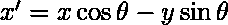

# Python 中的图形绘制|第 3 集

> 原文:[https://www.geeksforgeeks.org/graph-plotting-python-set-3/](https://www.geeksforgeeks.org/graph-plotting-python-set-3/)

[Python 图形绘制|第 1 集](https://www.geeksforgeeks.org/graph-plotting-in-python-set-1/)
[Python 图形绘制|第 2 集](https://www.geeksforgeeks.org/graph-plotting-python-set-2/)

Matplotlib 是一个相当广泛的库，它也支持图形的**动画**。动画工具以 **matplotlib.animation** 基类为中心，该基类提供了构建动画功能的框架。主要界面有**时间提醒**和**功能动画**，其中**功能动画**使用最方便。

**安装:**

*   **Matplotlib** :参考 Python 中的[图形绘制|第 1 集](https://www.geeksforgeeks.org/graph-plotting-in-python-set-1/)
*   **Numpy:** 您可以使用以下 pip 命令安装 Numpy 模块:

    ```py
    pip install numpy
    ```

*   **FFMPEG** :只需将动画保存为视频即可。可执行文件可从[这里](https://ffmpeg.org/download.html)下载。

**实施:**

```py
# importing required modules
import matplotlib.pyplot as plt
import matplotlib.animation as animation
import numpy as np

# create a figure, axis and plot element
fig = plt.figure()
ax = plt.axes(xlim=(-50, 50), ylim=(-50, 50))
line, = ax.plot([], [], lw=2)

# initialization function
def init():
    # creating an empty plot/frame
    line.set_data([], [])
    return line,

# lists to store x and y axis points
xdata, ydata = [], []

# animation function
def animate(i):
    # t is a parameter
    t = 0.1*i

    # x, y values to be plotted
    x = t*np.sin(t)
    y = t*np.cos(t)

    # appending new points to x, y axes points list
    xdata.append(x)
    ydata.append(y)

    # set/update the x and y axes data
    line.set_data(xdata, ydata)

    # return line object
    return line,

# setting a title for the plot
plt.title('A growing coil!')
# hiding the axis details
plt.axis('off')

# call the animator    
anim = animation.FuncAnimation(fig, animate, init_func=init,
                               frames=500, interval=20, blit=True)

# save the animation as mp4 video file
anim.save('animated_coil.mp4', writer = 'ffmpeg', fps = 30)

# show the plot
plt.show()
```

下面是输出动画的样子:

现在，让我们试着理解代码的片段:

*   ```py
    fig = plt.figure()
    ax = plt.axes(xlim=(-50, 50), ylim=(-50, 50))
    line, = ax.plot([], [], lw=2)
    ```

    在这里，我们首先创建一个图形，即一个顶层容器，用于所有子场景。
    然后我们创建一个 axes 元素 **ax** 作为子剧情。x 轴和 y 轴的范围/限制也是在创建 axes 元素时定义的。
    最后我们创建**剧情**元素，命名为**线**。最初，x 轴和 y 轴点被定义为空列表，线宽 **(lw)** 被设置为 2。

*   ```py
    def init():
        line.set_data([], [])
        return line,
    ```

    现在，我们声明一个初始化函数 **init** 。动画师调用这个函数来创建第一帧。

*   ```py
    def animate(i):
        # t is a parameter
        t = 0.1*i

        # x, y values to be plotted
        x = t*np.sin(t)
        y = t*np.cos(t)

        # appending new points to x, y axes points list
        xdata.append(x)
        ydata.append(y)

        # set/update the x and y axes data
        line.set_data(xdata, ydata)

        # return line object
        return line,
    ```

    这是上述程序最重要的功能。 **animate()** 函数被动画师一次又一次的调用来创建每一帧。调用该函数的次数由帧数决定，帧数作为**帧数**参数传递给动画师。
    **animate()** 函数以 ith frame 的索引为自变量。

    ```py
    t = 0.1*i
    ```

    这里，我们巧妙地利用当前帧的索引作为参数！

    ```py
    x = t*np.sin(t)
    y = t*np.cos(t)
    ```

    现在，由于我们有了参数 **t** ，我们可以很容易地绘制任何参数方程。例如，在这里，我们使用它的参数方程绘制一条螺旋线。

    ```py
    line.set_data(xdata, ydata)
    return line,
    ```

    最后用 **set_data()** 函数设置 x、y 数据，然后返回出图对象，**行**。

*   ```py
    anim = animation.FuncAnimation(fig, animate, init_func=init,
                                   frames=500, interval=20, blit=True)
    ```

    现在，我们创建功能动画对象**动画**。需要各种论据解释如下:
    **图**:待标图。
    **动画化**:每帧重复调用的功能**。**
    **init_func** :用于绘制清晰框架的函数。它在第一帧之前被调用一次。
    **帧数**:帧数。(注:**框架**也可以是可重复或发生器。)
    **间隔**:帧间持续时间(以毫秒计)
    **blit** :设置 blit=True 表示只绘制那些已经改变的部分。

*   ```py
    anim.save('animated_coil.mp4', writer = 'ffmpeg', fps = 30)
    ```

    现在，我们使用 **save()** 功能将动画师对象保存为视频文件。你需要一个电影编剧来保存动画视频。在这个例子中，我们使用了 FFMPEG 电影编剧。于是，**作家**被设定为‘ffmpeg’。
    **fps** 代表每秒帧数。

**例 2**

这个例子展示了如何通过应用一些简单的数学来制作旋转曲线！

```py
# importing required modules
import matplotlib.pyplot as plt
import matplotlib.animation as animation
import numpy as np

# create a figure, axis and plot element
fig = plt.figure()
ax = plt.axes(xlim=(-25, 25), ylim=(-25, 25))
line, = ax.plot([], [], lw=2)

# initialization function
def init():
    # creating an empty plot/frame
    line.set_data([], [])
    return line,

# set of points for a star (could be any curve)
p = np.arange(0, 4*np.pi, 0.1)
x = 12*np.cos(p) + 8*np.cos(1.5*p)
y = 12*np.sin(p) - 8*np.sin(1.5*p)

# animation function
def animate(i):
    # t is a parameter
    t = 0.1*i

    # x, y values to be plotted
    X = x*np.cos(t) - y*np.sin(t)
    Y = y*np.cos(t) + x*np.sin(t)

    # set/update the x and y axes data
    line.set_data(X, Y)

    # return line object
    return line,

# setting a title for the plot
plt.title('A rotating star!')
# hiding the axis details
plt.axis('off')

# call the animator    
anim = animation.FuncAnimation(fig, animate, init_func=init,
                               frames=100, interval=100, blit=True)

# save the animation as mp4 video file
anim.save('basic_animation.mp4', writer = 'ffmpeg', fps = 10)

# show the plot
plt.show()
```

以上程序的输出是这样的:

这里，我们用了一些简单的数学来旋转一条给定的曲线。

*   The star shape is obtained by putting k = 2.5 and 0<t<4*pi in the parametric equation given below:

    ![ x= [a-b]\cos (t) + b\cos [t(\frac{a}{b}-1)] ](img/c77e73a435693ef9cc100c2c6ebc8ff2.png "Rendered by QuickLaTeX.com")

    ![ y= [a-b]\sin (t) - b\sin [t(\frac{a}{b}-1)] , k= \frac{a}{b} ](img/38b3f66afe43a7ce23b946e8fc5ea78f.png "Rendered by QuickLaTeX.com")

    同样的情况也适用于此:

    ```py
    p = np.arange(0, 4*np.pi, 0.1)
    x = 12*np.cos(p) + 8*np.cos(1.5*p)
    y = 12*np.sin(p) - 8*np.sin(1.5*p)
    ```

*   Now, in each frame, we rotate the star curve using concept of rotation in complex numbers. Let x, y be two ordinates. Then after rotation by angle theta, the new ordinates are:

    

    

    同样的情况也适用于此:

    ```py
    X = x*np.cos(t) - y*np.sin(t)
    Y = y*np.cos(t) + x*np.sin(t)
    ```

总之，动画是一个伟大的工具，创造惊人的东西，并可以创造更多的东西使用它们。

这就是使用 Matplotlib 生成和保存动画图的方法。

本文由**尼克尔·库马尔**供稿。如果你喜欢极客博客并想投稿，你也可以用 contribute.geeksforgeeks.org 写一篇文章或者把你的文章邮寄到 contribute@geeksforgeeks.org。看到你的文章出现在极客博客主页上，帮助其他极客。

如果你发现任何不正确的地方，或者你想分享更多关于上面讨论的话题的信息，请写评论。