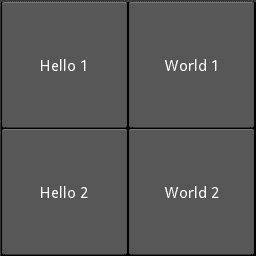
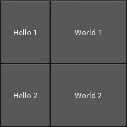
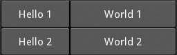

# Kivy | Python 中的网格布局

> 原文:[https://www.geeksforgeeks.org/gridlayouts-in-kivy-python/](https://www.geeksforgeeks.org/gridlayouts-in-kivy-python/)

Kivy 是一个独立的平台，因为它可以在安卓、IOS、Linux 和视窗等平台上运行。Kivy 为您提供了一次性编写代码并在不同平台上运行的功能。它基本上是用来开发安卓应用的，但并不意味着它不能在桌面应用上使用。

使用此命令安装 [kivy](https://www.geeksforgeeks.org/kivy-tutorial/) :

```
pip install kivy
```

> [Kivy 教程–通过示例学习 Kivy](https://www.geeksforgeeks.org/kivy-tutorial/)。

**网格布局**是创建子节点并以矩阵形式排列它们的函数。它占用可用空间(正方形)，并将该空间分成行和列，然后将小部件相应地添加到结果单元格或网格中。
我们不能明确地将小部件放置在特定的列/行中。每个子对象被分配一个特定的位置，该位置由布局配置和子对象列表中的子对象索引自动确定。网格布局必须至少包含输入约束，即列和行。如果我们没有为它指定列或行，布局会给你一个例外。

#### 列和行–

现在，像矩阵一样，列代表宽度，行代表高度。

*   初始大小由 col_default_width 和 row_default_height 属性给出。我们可以通过设置 col_force_default 或 row_force_default 属性来强制默认大小。这将强制布局忽略子级的宽度和*大小 _ 提示*属性，并使用默认大小。
*   若要自定义单个列或行的大小，请使用 cols_minimum 或 rows _ minimum。
*   没有必要同时给出行和列，这取决于需求。我们可以相应地提供两者之一或任何一个。

在下面给出的例子中，所有的小部件将具有相同或相等的大小。默认情况下，大小为(1，1)，因此子代将采用父代的全部大小。

## 蟒蛇 3

```
# main.py
# import the kivy module
import kivy

# It’s required that the base Class
# of your App inherits from the App class.
from kivy.app import App
from kivy.uix.gridlayout import GridLayout

# This class stores the info of .kv file
# when it is called goes to my.kv file
class MainWidget(GridLayout):
    pass

# we are defining the Base Class of our Kivy App
class myApp(App):
    def build(self):
        # return a MainWidget() as a root widget
        return MainWidget()

if __name__ == '__main__':

    # Here the class MyApp is initialized
    # and its run() method called.
    myApp().run()
```

**注:**了解如何使用。kv 文件，只是[访问本](https://kivy.org/doc/stable/guide/lang.html)。

**代码#1:**

## 蟒蛇 3

```
# my.kv file code here
<MainWidget>:

    cols: 2 
    rows: 2

    Button:       
         text: 'Hello 1'
    Button:
        text: 'World 1'
    Button:
        text: 'Hello 2'
    Button:       
        text: 'World 2'

```

**输出:**



**注意:**要运行这段代码，您必须为上面的 python 代码创建 main.py python 文件，并创建另一个文件 my.kv 文件。

**代码#2:**
现在让我们将按钮的大小固定为 100px，而不是默认的 *size_hint_x = 1* 。

## 蟒蛇 3

```
# just do change in the above my.kv
# (code #1) file else all are same.
<MainWidget>:

    cols: 2 
    rows: 2

    Button:       
        text: 'Hello 1'
        size_hint_x: None
        width: 100
    Button:
        text: 'World 1'
    Button:
        text: 'Hello 2'
        size_hint_x: None
        width: 100
    Button:       
        text: 'World 2'

```

**输出:**



**代码#3:**
我们还可以将行高固定为特定的大小。

## 蟒蛇 3

```
# just do change in the above my.kv
# (code #1)file else all are same.

<MainWidget>:

    cols: 2 
    rows: 2
    row_force_default: True
    row_default_height: 40
    Button:       
        text: 'Hello 1'
        size_hint_x: None
        width: 100
    Button:
        text: 'World 1'
    Button:
        text: 'Hello 2'
        size_hint_x: None
        width: 100
    Button:       
        text: 'World 2'

```

**输出:**

