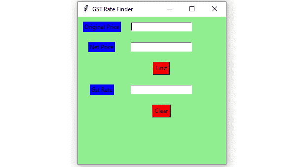

# 使用 Python-Tkinter 的商品及服务税税率查找器图形用户界面

> 原文:[https://www . geesforgeks . org/GST-rate-finder-GUI-using-python-tkinter/](https://www.geeksforgeeks.org/gst-rate-finder-gui-using-python-tkinter/)

**先决条件:**[tkinter 简介](https://www.geeksforgeeks.org/python-gui-tkinter/) | [计算商品及服务税的程序](https://www.geeksforgeeks.org/calculate-gst-review/)
Python 为开发图形用户界面提供了多个选项。在所有的 GUI 方法中，Tkinter 是最常用的方法。在本文中，我们将学习如何使用 Tkinter 创建 GST Rate Finder GUI 应用程序，并提供一步一步的指导。

要创建 Tkinter:

*   导入模块–tkinter
*   创建主窗口(容器)
*   向主窗口添加任意数量的小部件。
*   在小部件上应用事件触发器。

以下是图形用户界面的外观:



让我们创建一个基于图形用户界面的商品及服务税税率查找应用程序:

**下面是实现:**

## 蟒蛇 3

```
# import all functions/classes from the tkinter   
from tkinter import *

# Function for finding GST rate
def findGst() :

    # take a value from the respective entry boxes
    # get method returns current text as string
    org_cost= int(org_priceField.get())

    N_price = int(net_priceField.get())

    # calculate GST rate
    gst_rate = ((N_price - org_cost) * 100) / org_cost;

    # insert method inserting the  
    # value in the text entry box.
    gst_rateField.insert(10, str(gst_rate) + " % ")

# Function for clearing the  
# contents of all text entry boxes
def clearAll():

    # deleting the content from the entry box
    org_priceField.delete(0, END)

    net_priceField.delete(0, END)

    gst_rateField.delete(0, END)

# Driver Code
if __name__ == "__main__" :

    # Create a GUI window
    gui = Tk()

    # Set the background colour of GUI window  
    gui.configure(background = "light green")

    # set the name of tkinter GUI window 
    gui.title("GST Rate Finder")

    # Set the configuration of GUI window
    gui.geometry("300x300")

    # Create a Original Price: label 
    org_price = Label(gui, text = "Original Price",
                      bg = "blue")

    # Create a Net Price : label
    net_price = Label(gui, text = "Net Price",
                      bg = "blue")

    # Create a Find Button and attached to
    # findGst function
    find = Button(gui, text = "Find", fg = "Black",
                  bg = "Red",
                  command = findGst)

    # Create a Gst Rate : label 
    gst_rate = Label(gui, text = "Gst Rate", bg = "blue")

    # Create a Clear Button and attached to
    # clearAll function
    clear = Button(gui, text = "Clear", fg = "Black",
                   bg = "Red",
                   command = clearAll)

    # grid method is used for placing  
    # the widgets at respective positions  
    # in table like structure .

    # padx attributed provide x-axis margin 
    # from the root window to the widget.

    # pady attributed provide y-axis
    # margin from the widget.
    org_price.grid(row = 1, column = 1,padx = 10,pady = 10)

    net_price.grid(row = 2, column = 1, padx = 10, pady = 10)

    find.grid(row = 3, column = 2,padx = 10,pady = 10)

    gst_rate.grid(row = 4, column = 1,padx = 10, pady = 10)

    clear.grid(row = 5, column = 2, padx = 10, pady = 10)

    # Create a text entry box for filling or typing the information.  
    org_priceField = Entry(gui)

    net_priceField = Entry(gui)

    gst_rateField = Entry(gui)

    # grid method is used for placing  
    # the widgets at respective positions  
    # in table like structure .
    org_priceField.grid(row = 1, column = 2 ,padx = 10,pady = 10)

    net_priceField.grid(row = 2, column = 2, padx = 10,pady = 10)

    gst_rateField.grid(row = 4, column = 2, padx = 10,pady = 10)

    # Start the GUI
    gui.mainloop()
```

**输出:**

<video class="wp-video-shortcode" id="video-419611-1" width="640" height="360" preload="metadata" controls=""><source type="video/mp4" src="https://media.geeksforgeeks.org/wp-content/uploads/20210114114133/FreeOnlineScreenRecorderProject4.mp4?_=1">[https://media.geeksforgeeks.org/wp-content/uploads/20210114114133/FreeOnlineScreenRecorderProject4.mp4](https://media.geeksforgeeks.org/wp-content/uploads/20210114114133/FreeOnlineScreenRecorderProject4.mp4)</video>