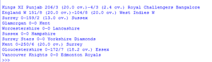
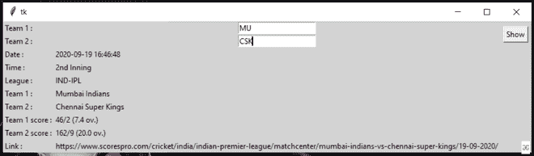

# 使用 Python 的板球实况记分板图形用户界面应用程序

> 原文:[https://www . geeksforgeeks . org/GUI-直播板球应用-记分牌-使用-python/](https://www.geeksforgeeks.org/gui-application-for-live-cricket-scoreboard-using-python/)

在本文中，我们将看到 sports.py 模块是如何导入和实现的，以生成特定运动(如棒球、篮球、板球等)的记分牌以及该运动的其他详细信息。以下文本中的代码示例围绕板球展开，您可以对任何其他运动执行相同的操作。

Sport.py 从以下来源收集数据:

*   scorespro.com
*   pro-football-reference.com
*   baseball-reference.com
*   basketball-reference.com
*   hockey-reference.com

本模块并不支持所有的运动，下面列出了所有受支持的运动及其各自的 python 代码，以供参考:

<figure class="table">

| 

#### Exercise

 | 

#### PYTHON 参考

 |
| 棒球 | 运动。棒球 |
| 篮球 | 运动。篮球 |
| 板球 | 运动。板球 |
| 手球 | 运动。手球 |
| 足球 | 运动。足球 |
| 曲棍球 | 运动。曲棍球 |
| 橄榄球联盟 | 运动。橄榄球 |
| 橄榄球联盟 | 运动。橄榄球 |
| 足球 | 运动。足球 |
| 网球 | 运动。网球 |
| 排球 | 运动。排球 |

</figure>

### 装置

首先，我们需要安装这个模块，为此只需在您的终端中运行以下代码:

```
pip install sports.py
```

### 履行

*   导入模块
*   使用 get_match()获取单个匹配项

**语法-**

```
get_match(sport, team1, team2)
```

get_match()返回一个包含以下属性的 match 对象:

<figure class="table">

| 

#### Property

 | 

#### Description

 |
| 运动 | 运动名称 |
| 联盟 | 比赛联盟 |
| 主场球队 | 主队 |
| 客场球队 | 客场球队 |
| 家庭分数 | 主队得分 |
| 客场得分 | 客场得分 |
| 匹配时间 | 当前匹配时间 |
| 匹配日期 | 比赛的日期 |
| 匹配链接 | 链接到包含匹配数据的 XML 文件 |

</figure>

**例 1:**

## 蟒蛇 3

```
# import module
import sports

# setting sport
sports.get_match(sports.CRICKET, 'KINGS XI PUNJAB' , 'ROYAL CHALLENGERS BANGALORE')
```

**输出:**


**例 2:**

打印所有现场板球比赛的程序。

## 蟒蛇 3

```
# import module
import sports

# extracting information
matches = sports.get_sport(sports.CRICKET)

#printing all matches
for item in matches:
    print(item)
```

**输出:**



**例 3:**

使用图形用户界面格式的 tkinter 生成板球实况比分的应用程序。

## 蟒蛇 3

```
# import modules
from tkinter import *
import sports
from tkinter import messagebox

def cricket_info():

    try:
        match = sports.get_match(sports.CRICKET, e1.get() , e2.get())
        date.set(match.match_date)
        time.set(match.match_time)
        league.set(match.league)
        team1.set(match.home_team)
        team2.set(match.away_team)
        team1_score.set(match.away_score)
        team2_score.set(match.home_score)
        link.set(match.match_link)
    except:
        messagebox.showerror("showerror", "No match found")

# object of tkinter
# and background set for light grey
master = Tk()
master.configure(bg='light grey')

# Variable Classes in tkinter
date = StringVar();
time = StringVar();
league = StringVar();
team1 = StringVar();
team2 = StringVar();
team1_score = StringVar();
team2_score = StringVar();
link = StringVar();

# Creating label for each information
# name using widget Label
Label(master, text="Team 1 :" , bg = "light grey").grid(row=0, sticky=W)
Label(master, text="Team 2 :" , bg = "light grey").grid(row=1, sticky=W)
Label(master, text="Date :" , bg = "light grey").grid(row=2, sticky=W)
Label(master, text="Time :", bg = "light grey").grid(row=3, sticky=W)
Label(master, text="League :", bg = "light grey").grid(row=4, sticky=W)
Label(master, text="Team 1 :", bg = "light grey").grid(row=5, sticky=W)
Label(master, text="Team 2 :", bg = "light grey").grid(row=6, sticky=W)
Label(master, text="Team 1 score :", bg = "light grey").grid(row=7, sticky=W)
Label(master, text="Team 2 score :", bg = "light grey").grid(row=8, sticky=W)
Label(master, text="Link :", bg = "light grey").grid(row=9, sticky=W)

# Creating label for class variable
# name using widget Entry
Label(master, text="", textvariable= date ,bg = "light grey").grid(row=2,column=1, sticky=W)
Label(master, text="", textvariable= time ,bg = "light grey").grid(row=3,column=1, sticky=W)
Label(master, text="", textvariable= league ,bg = "light grey").grid(row=4,column=1, sticky=W)
Label(master, text="", textvariable= team1 ,bg = "light grey").grid(row=5,column=1, sticky=W)
Label(master, text="", textvariable= team2 ,bg = "light grey").grid(row=6,column=1, sticky=W)
Label(master, text="", textvariable= team1_score ,bg = "light grey").grid(row=7,column=1, sticky=W)
Label(master, text="", textvariable= team2_score ,bg = "light grey").grid(row=8,column=1, sticky=W)
Label(master, text="", textvariable= link ,bg = "light grey").grid(row=9,column=1, sticky=W)

e1 = Entry(master)
e1.grid(row=0, column=1)

e2 = Entry(master)
e2.grid(row=1, column=1)

# creating a button using the widget 
# Button that will call the submit function
b = Button(master, text="Show", command=cricket_info )
b.grid(row=0, column=2,columnspan=2, rowspan=2,padx=5, pady=5)

mainloop()
```

**输出:**

