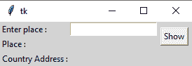

# 使用 Python 从给定的州或城市名称中搜索国家名称的图形用户界面应用程序

> 原文:[https://www . geesforgeks . org/GUI-应用程序-使用 python 从给定的州或城市名称中搜索国家名称/](https://www.geeksforgeeks.org/gui-application-to-search-a-country-name-from-a-given-state-or-city-name-using-python/)

在这些文章中，我们将编写 python 脚本来从给定的州或城市名称中搜索一个国家，并将其与 GUI 应用程序绑定。我们将使用地理模块。GeoPy 模块使定位地址、城市、国家、地标和邮编的坐标变得更加容易。

在开始之前，我们需要安装 GeoPy 模块，所以让我们在您的终端上运行这个命令。

```
pip install geopy
```

**进场:**

*   导入模块
*   使用提名应用编程接口访问相应的坐标集
*   geocode()获取给定地点的位置

图形用户界面如下所示:



**注意:**nominam 使用 OpenStreetMap 数据通过名称和地址(地理编码)来查找地球上的位置。

**下面是实现:**

## 蟒蛇 3

```
from geopy.geocoders import Nominatim

geolocator = Nominatim(user_agent = "geoapiExercises")
location = geolocator.geocode("Delhi")
print("Country Name: ", location)
```

**输出:**

> 国家名称:德里，德里市中心科特瓦利特希尔，印度德里，110006

**应用程序使用 Tkinter 从给定的城市/州搜索国家:**该脚本将上述实现实现到图形用户界面中。

## 蟒蛇 3

```
# importing the modules
from geopy.geocoders import Nominatim
from tkinter import *
from tkinter import messagebox

def getinfo():
    geolocator = Nominatim(user_agent = "geoapiExercises")
    place = e.get()
    place_res.set(place)
    location = geolocator.geocode(place)
    res.set(location)

# object of tkinter
# and background set for light grey
master = Tk()
master.configure(bg = 'light grey')

# variable Classes in tkinter
place_res = StringVar();
res = StringVar();

# creating label for each information
# name using widget Label
Label(master, text = "Enter place :" ,
      bg = "light grey").grid(row = 0, sticky = W)
Label(master, text = "Place :" ,
      bg = "light grey").grid(row = 1, sticky = W)
Label(master, text = "Country Address :" ,
      bg = "light grey").grid(row = 2, sticky = W)

# creating label for class variable
# name using widget Entry
Label(master, text = "", textvariable = place_res,
      bg = "light grey").grid(row = 1, column = 1, sticky = W)
Label(master, text = "", textvariable = res,
      bg = "light grey").grid(row = 2, column = 1, sticky = W)

e = Entry(master)
e.grid(row = 0, column = 1)

# creating a button using the widget 
# Button that will call the submit function
b = Button(master, text = "Show", command = getinfo )
b.grid(row = 0, column = 2, columnspan = 2,
       rowspan = 2, padx = 5, pady = 5)

mainloop()
```

**输出:**

<video class="wp-video-shortcode" id="video-490432-1" width="640" height="360" preload="metadata" controls=""><source type="video/mp4" src="https://media.geeksforgeeks.org/wp-content/uploads/20210118173723/FreeOnlineScreenRecorderProject7.mp4?_=1">[https://media.geeksforgeeks.org/wp-content/uploads/20210118173723/FreeOnlineScreenRecorderProject7.mp4](https://media.geeksforgeeks.org/wp-content/uploads/20210118173723/FreeOnlineScreenRecorderProject7.mp4)</video>