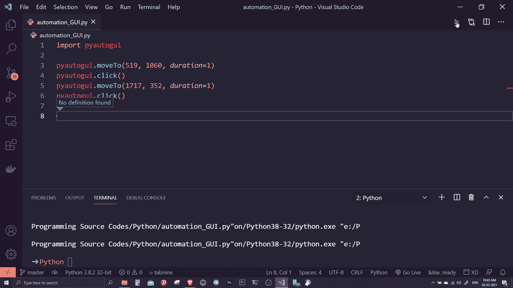

# 使用 Python 的图形用户界面自动化

> 原文:[https://www.geeksforgeeks.org/gui-automation-using-python/](https://www.geeksforgeeks.org/gui-automation-using-python/)

在本文中，我们将探索如何使用 Python 实现图形用户界面自动化。有很多模块可以做这些事情，但是在本文中，我们将使用一个名为 **PyAutoGUI** 的模块，使用 python 执行 GUI 和桌面自动化。

我们将探讨两个部分–

*   如何自动使用鼠标指针执行某些任务，如移动光标、点击屏幕上的某个点等
*   此外，我们将探索如何使键盘击键自动化。

## 装置

本模块没有预装 Python。要安装它，请在终端中键入以下命令。

```py
pip install pyautogui # for windows
or 
pip3 install pyautogui #for linux and Macos
```

## 入门指南

在进行任何自动化操作之前，我们应该知道我的设备的屏幕大小。幸运的是，PyautoGUI 帮助我们使用。size()函数。它返回一个 size 对象，该对象有两个值，分别表示屏幕的宽度和高度。实现如下。

> **语法:**pyautoui . size()
> 
> **参数:**该函数不接受任何额外的参数
> 
> **返回类型:**它以像素为单位返回当前屏幕在一个 size 对象中的大小

**下面是实现:**

## 蟒蛇 3

```py
# importing modules
import pyautogui

# returns a size object with
# width and height of the screen
print(pyautogui.size())
```

**输出:**

```py
Size(width=1920, height=1080)
```

## 自动化鼠标移动

### 获取鼠标光标的当前位置:

首先，我们要知道当前我的鼠标光标在哪里，为此我们可以使用。position()函数。该函数再次返回一个具有 x 和 y 值的点对象，该对象获取鼠标的当前位置。

> **语法:**pyautoui . position()
> 
> **参数:**该函数不接受任何额外的参数
> 
> **返回类型:**它向我们返回鼠标光标在点对象中的位置

**下面是实现:**

## 蟒蛇 3

```py
import pyautogui

# returns a point  object with
# x and y values
print(pyautogui.position())
```

**输出:**

```py
Point(x=1710, y=81)
```

### 移动光标并点击特定位置:

现在，我们将尝试移动鼠标光标，点击特定的位置，并执行打开和关闭应用程序。为了移动鼠标指针，我们可以使用。moveto()并指定 x、y 值以及它将执行操作的持续时间。函数的作用是:点击鼠标指针现在所在的位置。代码基本上将鼠标光标移动到(519，1060) (x，y)值，然后使用。单击光标现在所在的位置()，然后我们再次使用 move to()移动到位置(1717，352)，并再次模拟单击。

> **语法:** pyautogui.moveTo()和 pyautogui.click()
> 
> **参数:**这个 moveTo 函数有两个必选参数和一个可选参数，x 和 y 的前两个值是必选值，而 duration 是一个额外的参数，它在指定给 duration 参数的秒数上模拟鼠标的移动。示例中的 click 方法不使用任何参数，但是可以使用一对可选参数来单击键盘上的特定位置。
> 
> **返回类型:**这些函数不返回任何东西，而是将光标移动到特定点，然后以编程方式单击该点。

**下面是实现:**

## 蟒蛇 3

```py
import pyautogui

# moves to (519,1060) in 1 sec
pyautogui.moveTo(519, 1060, duration = 1)

# simulates a click at the present
# mouse position
pyautogui.click()

# moves to (1717,352) in 1 sec
pyautogui.moveTo(1717, 352, duration = 1)

# simulates a click at the present
# mouse position
pyautogui.click()
```

**输出:**



现在我们将探索另外两种方法，即。moveRel()帮助我们相对于现在的位置移动，最后我们将看到如何使用 pyAutoGUI 模拟右键单击。我们从导入包开始，刺激光标从当前位置向下移动 498 像素。然后我们使用 click()方法来模拟左键点击。然后我们使用。moveTo()方法。现在我们再次点击光标的当前位置，但是这次我们通过传递 button =“right”参数(默认为 button =“left”)来指示模拟右键单击而不是左键单击。然后我们可以移动到一个指定的位置，并在那里左键点击。

> **语法:**pyautoui . move El()
> 
> **参数:**这个 moveRel 函数还有两个必选参数和一个可选参数，x 和 y 的前两个值是必选值，而 duration 是一个额外的参数，它在指定给 duration 参数的秒数上模拟鼠标的移动。此外，我们为 pyautogui.click()函数使用了一个额外的参数，我们使用了 button="right "来模拟右键单击，而不是默认的左键单击。
> 
> **返回类型:**这些函数不返回任何东西，但是执行将光标从当前位置向左移动 498 像素&向下移动 998 像素，然后以编程方式模拟右键单击的任务。

**下面是实现:**

## 蟒蛇 3

```py
import pyautogui

# moving the cursor left 498 px & down
# 998px from it's current position
pyautogui.moveRel(-498,996, duration = 1)

# clicks at the present location
pyautogui.click()

# moves to the specified location
pyautogui.moveTo(1165,637, duration = 1)

# right clicks at the present cursor
# location
pyautogui.click(button="right")

# moves to the specified location
pyautogui.moveTo(1207,621, duration = 1)

# clicks at the present location
pyautogui.click()
```