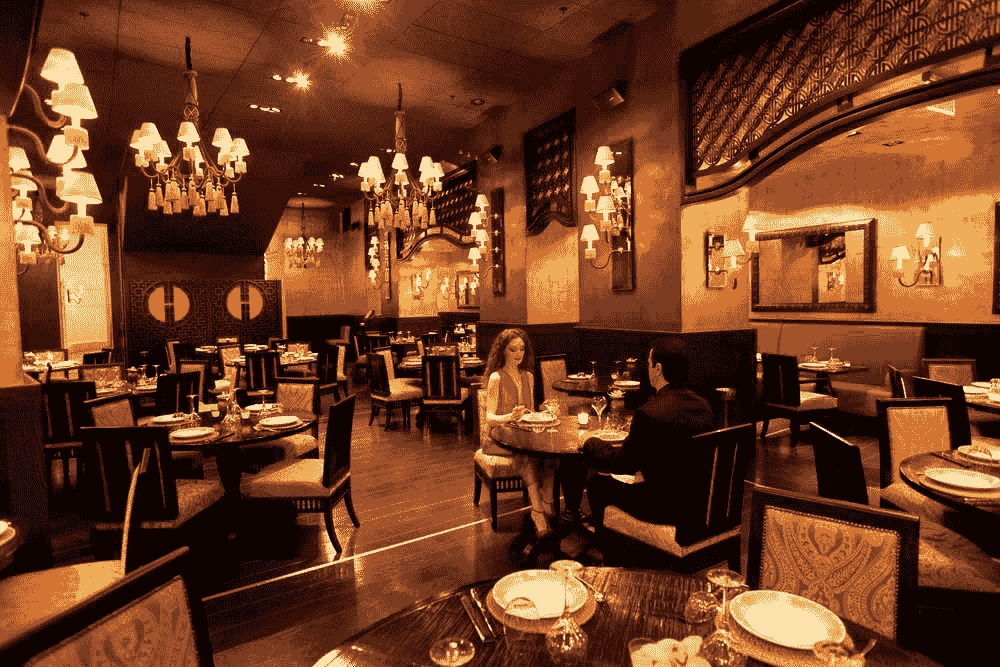
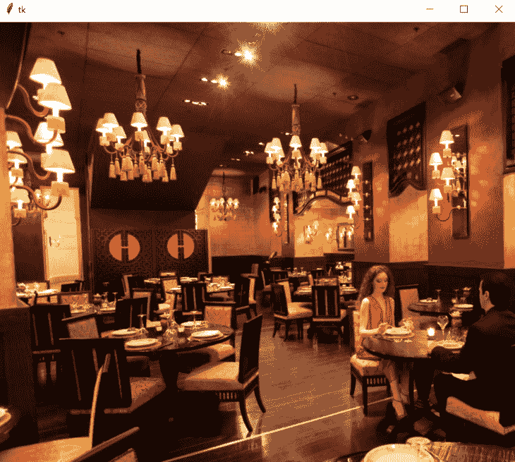
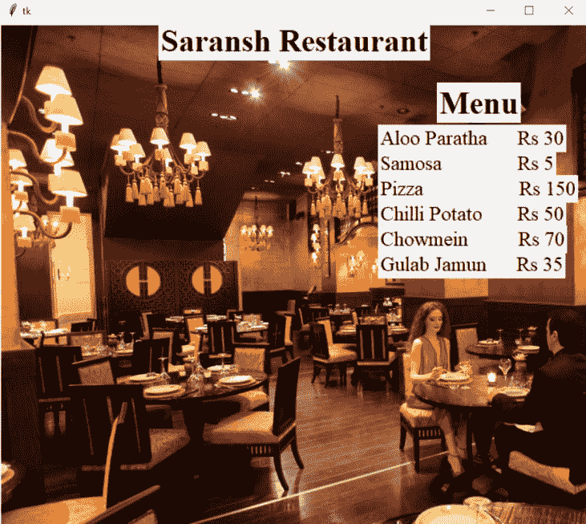
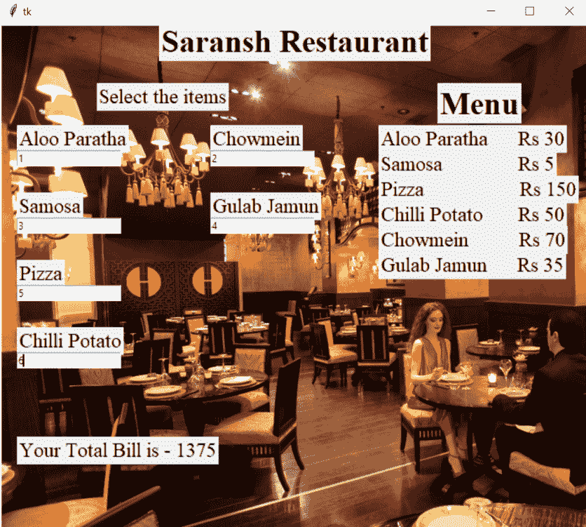
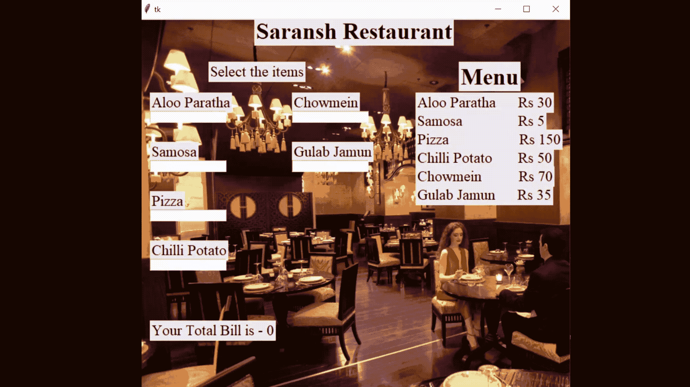

# 使用 Python 的 GUI 计费系统和菜单卡

> 原文:[https://www . geesforgeks . org/GUI-计费-系统-菜单-卡片-使用-python/](https://www.geeksforgeeks.org/gui-billing-system-and-menu-card-using-python/)

所以想象一下，我们正在开一家新餐馆，或者被任命为一家餐馆公司的员工之一，我们发现没有快速的方法来为顾客记账，通常我们需要花费时间来计算顾客必须支付的金额。这对我们和顾客来说都是非常烦人和费时的事情。那么现在该怎么办？下面是 python 的救援，因为我们知道它，所以它只需要几秒钟的工作。

因此，在本文中，我们将借助 python 的模块 [Tkinter](https://www.geeksforgeeks.org/python-gui-tkinter/) 来构建一个 GUI 计费系统和一个菜单卡。

**第一步:导入 tkinter 包**

```py
from tkinter import *
```

**第二步:下载所需文件**

这里只有一个文件，我们必须安装在这个项目，这将作为我们的图形用户界面计费系统的背景图像工作，或者我们可以选择任何其他图像。下载后，确保我们正在创建的 python 程序和这些资产在同一个文件夹中。

**使用的图像:**



**第三步:制作 tkinter 窗口并设置背景**

现在我们制作 tkinter 窗口，并设置图形用户界面的背景

## 蟒蛇 3

```py
# import tkinter module
from tkinter import *

# make a window
window = Tk()

# specify it's size
window.geometry("700x600")

# take a image for background
bg = PhotoImage(file='bg.png')

# label it in the background
label17 = Label(window, image=bg)

# position the image as well
label17.place(x=0, y=0)

# closing the main loop
window.mainloop()
```

**输出:**



**第四步:添加标题和菜单卡**

现在我们将借助“[标签](https://www.geeksforgeeks.org/python-tkinter-label/)()”功能为 GUI 计费系统添加标题和菜单卡。Tkinter Label 是一个小部件，用于实现显示框，我们可以在其中放置文本或图像。开发人员可以随时更改此小部件显示的文本。它还用于执行任务，如给文本部分加下划线和跨多行文本。需要注意的是，一个标签一次只能使用一种字体来显示文本。要使用标签，我们只需要指定在标签中显示什么(可以是文本、位图或图像)。

> **语法:** w =标签(主，选项，…)
> 
> **参数:**
> 
> *   主窗口:这代表父窗口
> *   选项:这些选项可以用作由逗号分隔的键值对

## 蟒蛇 3

```py
# main title
label8 = Label(window, text="Saransh Restaurant",
               font="times 28 bold")
label8.place(x=350, y=20, anchor="center")

# Menu Card
label1 = Label(window, text="Menu",
               font="times 28 bold")
label1.place(x=520, y=70)

label2 = Label(window, text="Aloo Paratha Rs 30",
               font="times 18")
label2.place(x=450, y=120)

label3 = Label(window, text="Samosa  Rs 5",
               font="times 18")
label3.place(x=450, y=150)

label4 = Label(window, text="Pizza   Rs 150",
               font="times 18")
label4.place(x=450, y=180)

label5 = Label(window, text="Chilli Potato  Rs 50",
               font="times 18")
label5.place(x=450, y=210)

label6 = Label(window, text="Chowmein   Rs 70",
               font="times 18")
label6.place(x=450, y=240)

label7 = Label(window, text="Gulab Jamun  Rs 35",
               font="times 18")
label7.place(x=450, y=270)

# closing the main loop
window.mainloop()
```

**输出:**



**第五步:增加计费部分**

现在，我们将通过使用相同的标签小部件和条目小部件来添加计费部分。[输入](https://www.geeksforgeeks.org/python-tkinter-entry-widget/)小部件是一个用于输入或显示单行文本的 Tkinter 小部件。此外，Label.place(x，y)指示标签在 tkinter 窗口中的位置。

> **语法:**条目= tk。条目(父，选项)
> 
> **参数:**
> 
> *   父窗口:这代表父窗口
> *   选项:这些选项可以用作由逗号分隔的键值对

## 蟒蛇 3

```py
#------billing section---------
label9=Label(window,text="Select the items",
             font="times 18")
label9.place(x=115,y=70)

label10=Label(window,text="Aloo Paratha",
              font="times 18")
label10.place(x=20,y=120)

e1=Entry(window)
e1.place(x=20,y=150)

label11=Label(window,text="Samosa",
              font="times 18")
label11.place(x=20,y=200)

e2=Entry(window)
e2.place(x=20,y=230)

label12=Label(window,text="Pizza",
              font="times 18")
label12.place(x=20,y=280)

e3=Entry(window)
e3.place(x=20,y=310)

label13=Label(window,text="Chilli Potato",
              font="times 18")
label13.place(x=20,y=360)

e4=Entry(window)
e4.place(x=20,y=390)

label14=Label(window,text="Chowmein",
              font="times 18")
label14.place(x=250,y=120)

e5=Entry(window)
e5.place(x=250,y=150)

label15=Label(window,text="Gulab Jamun",
              font="times 18")
label15.place(x=250,y=200)

e6=Entry(window)
e6.place(x=250,y=230)

# closing the main loop
window.mainloop()
```

**输出:**


**第六步:计算账单并刷新窗口**

之后，我们必须添加计算函数，该函数将每秒执行一次。在计算函数中，我们必须进行简单的数学运算，如果 e.get()返回一个空字符串，那么这意味着没有为该特定食物选择数量，否则如果 e.get()中存在任何值，那么由于它是字符串类型，我们将其转换为 int 类型，并将该食物数量乘以该食物的价格。食物变量及其数量和价格保存在字典中。我们在字典中查找每个关键字，并相应地增加我们的“总计”变量。之后，我们制作另一个标签，使用总变量的值来显示订购的食物总量。然后我们发出命令，每 1000 毫秒后，我们刷新窗口，再次计算订购的食物总量，这将更新我们的图形用户界面。此外，总量标签通过销毁前一个标签并每秒更新一个新标签来更新。

## 蟒蛇 3

```py
# function to calculate the
# price of all the orders

def calculate():

   # dic for storing the food quantity and price
    dic = {'aloo_partha': [e1, 30],
           'samosa': [e2, 5],
           'pizza': [e3, 150],
           'chilli_potato': [e4, 50],
           'chowmein': [e5, 70],
           'gulab_jamun': [e6, 35]}
    total = 0

    for key, val in dic.items():
        if val[0].get() != "":
            total += int(val[0].get())*val[1]
    label16 = Label(window,
                    text="Your Total Bill is - "+str(total),
                    font="times 18")

    # position
    label16.place(x=20, y=490)

    # it will update the label with a new one
    label16.after(1000, label16.destroy)

    # refreshing the window
    window.after(1000, calculate)

# execute calculate function after 1 second
window.after(1000, calculate)
window.mainloop()
```

**输出:**



**以下是完整实现:**

## 蟒蛇 3

```py
# import tkinter module
from tkinter import *

# make a window
window = Tk()

# specify it's size
window.geometry("700x600")

# take a image for background
bg = PhotoImage(file='bg.png')

# label it in the background
label17 = Label(window, image=bg)

# position the image as well
label17.place(x=0, y=0)

# function to calculate the
# price of all the orders
def calculate():

        # dic for storing the
    # food quantity and price
    dic = {'aloo_partha': [e1, 30],
           'samosa': [e2, 5],
           'pizza': [e3, 150],
           'chilli_potato': [e4, 50],
           'chowmein': [e5, 70],
           'gulab_jamun': [e6, 35]}
    total = 0
    for key, val in dic.items():
        if val[0].get() != "":
            total += int(val[0].get())*val[1]

    label16 = Label(window,
                    text="Your Total Bill is - "+str(total),
                    font="times 18")

    # position it
    label16.place(x=20, y=490)
    label16.after(1000, label16.destroy)
    window.after(1000, calculate)

label8 = Label(window,
               text="Saransh Restaurant",
               font="times 28 bold")
label8.place(x=350, y=20, anchor="center")

label1 = Label(window,
               text="Menu",
               font="times 28 bold")

label1.place(x=520, y=70)

label2 = Label(window, text="Aloo Paratha  \
Rs 30", font="times 18")

label2.place(x=450, y=120)

label3 = Label(window, text="Samosa    \
Rs 5", font="times 18")

label3.place(x=450, y=150)

label4 = Label(window, text="Pizza        \
Rs 150", font="times 18")
label4.place(x=450, y=180)

label5 = Label(window, text="Chilli Potato  \
Rs 50", font="times 18")

label5.place(x=450, y=210)

label6 = Label(window, text="Chowmein   \
Rs 70", font="times 18")

label6.place(x=450, y=240)

label7 = Label(window, text="Gulab Jamun  \
Rs 35", font="times 18")

label7.place(x=450, y=270)

# billing section
label9 = Label(window, text="Select the items",
               font="times 18")
label9.place(x=115, y=70)

label10 = Label(window,
                text="Aloo Paratha",
                font="times 18")
label10.place(x=20, y=120)

e1 = Entry(window)
e1.place(x=20, y=150)

label11 = Label(window, text="Samosa",
                font="times 18")
label11.place(x=20, y=200)

e2 = Entry(window)
e2.place(x=20, y=230)

label12 = Label(window, text="Pizza",
                font="times 18")
label12.place(x=20, y=280)

e3 = Entry(window)
e3.place(x=20, y=310)

label13 = Label(window,
                text="Chilli Potato",
                font="times 18")
label13.place(x=20, y=360)

e4 = Entry(window)
e4.place(x=20, y=390)

label14 = Label(window,
                text="Chowmein",
                font="times 18")
label14.place(x=250, y=120)

e5 = Entry(window)
e5.place(x=250, y=150)

label15 = Label(window,
                text="Gulab Jamun",
                font="times 18")

label15.place(x=250, y=200)

e6 = Entry(window)
e6.place(x=250, y=230)

# execute calculate function after 1 second
window.after(1000, calculate)

# closing the main loop
window.mainloop()
```

**输出:**

