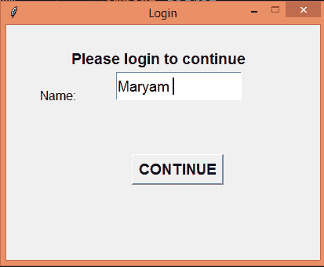
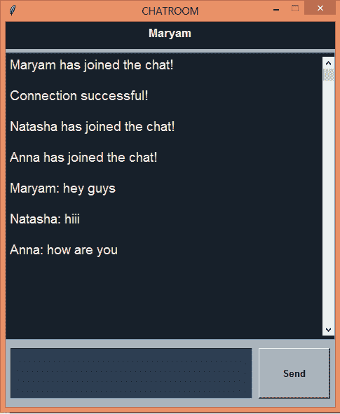
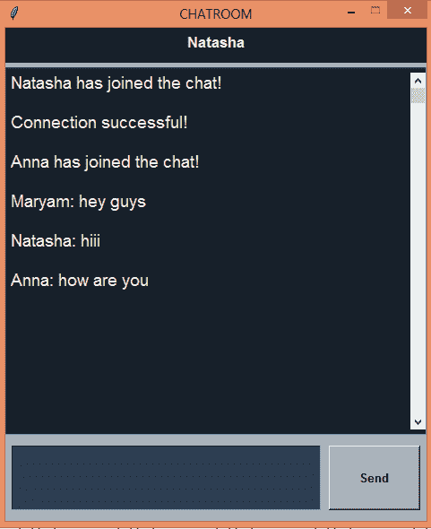
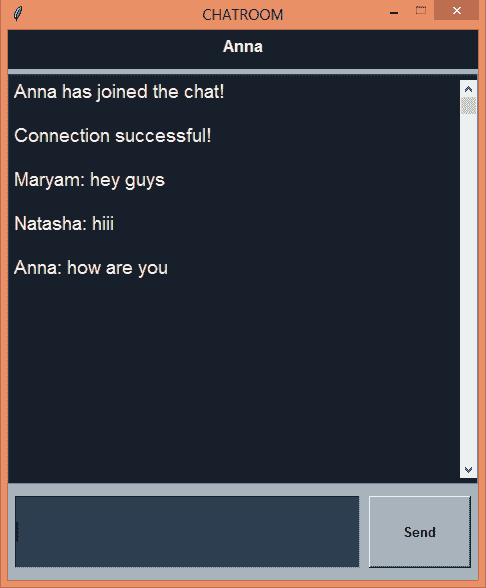
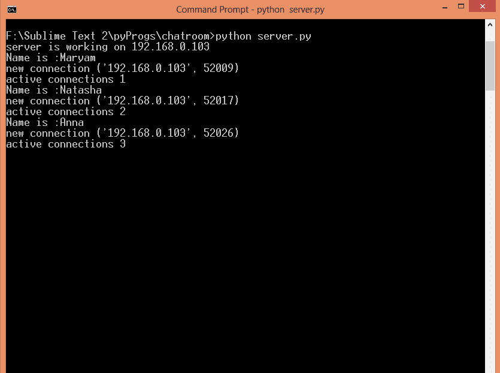

# Python 中使用 Tkinter 的 GUI 聊天应用

> 原文:[https://www . geesforgeks . org/GUI-chat-application-use-tkinter-in-python/](https://www.geeksforgeeks.org/gui-chat-application-using-tkinter-in-python/)

**先决条件:**[Tkinter](https://www.geeksforgeeks.org/python-gui-tkinter/)[套接字编程](https://www.geeksforgeeks.org/socket-programming-multi-threading-python/)[和多线程](https://www.geeksforgeeks.org/socket-programming-multi-threading-python/)

这是一个简单的图形用户界面聊天应用程序，其中多个用户可以在客户端-服务器架构中相互连接，即客户端将在服务器的帮助下进行交互。

**服务器端脚本:**这个脚本文件名是‘client . py’(比如说)。
由于只有客户端会交互，服务器脚本没有图形用户界面

## 蟒蛇 3

```
# import socket library
import socket

# import threading library
import threading

# Choose a port that is free
PORT = 5000

# An IPv4 address is obtained
# for the server.  
SERVER = socket.gethostbyname(socket.gethostname())

# Address is stored as a tuple
ADDRESS = (SERVER, PORT)

# the format in which encoding
# and decoding will occur
FORMAT = "utf-8"

# Lists that will contains
# all the clients connected to
# the server and their names.
clients, names = [], []

# Create a new socket for
# the server
server = socket.socket(socket.AF_INET,
                       socket.SOCK_STREAM)

# bind the address of the
# server to the socket
server.bind(ADDRESS)

# function to start the connection
def startChat():

    print("server is working on " + SERVER)

    # listening for connections
    server.listen()

    while True:

        # accept connections and returns
        # a new connection to the client
        #  and  the address bound to it
        conn, addr =  server.accept()
        conn.send("NAME".encode(FORMAT))

        # 1024 represents the max amount
        # of data that can be received (bytes)
        name = conn.recv(1024).decode(FORMAT)

        # append the name and client
        # to the respective list
        names.append(name)
        clients.append(conn)

        print(f"Name is :{name}")

        # broadcast message
        broadcastMessage(f"{name} has joined the chat!".encode(FORMAT))

        conn.send('Connection successful!'.encode(FORMAT))

        # Start the handling thread
        thread = threading.Thread(target = handle,
                                  args = (conn, addr))
        thread.start()

        # no. of clients connected
        # to the server
        print(f"active connections {threading.activeCount()-1}")

# method to handle the
# incoming messages
def handle(conn, addr):

    print(f"new connection {addr}")
    connected = True

    while connected:
          # receive message
        message = conn.recv(1024)

        # broadcast message
        broadcastMessage(message)

    # close the connection
    conn.close()

# method for broadcasting
# messages to the each clients
def broadcastMessage(message):
    for client in clients:
        client.send(message)

# call the method to
# begin the communication
startChat()
```

**客户端脚本:**

## 蟒蛇 3

```
# import all the required  modules
import socket
import threading
from tkinter import *
from tkinter import font
from tkinter import ttk

# import all functions /
#  everything from chat.py file
from chat import *

PORT = 5050
SERVER = "192.168.0.103"
ADDRESS = (SERVER, PORT)
FORMAT = "utf-8"

# Create a new client socket
# and connect to the server
client = socket.socket(socket.AF_INET,
                      socket.SOCK_STREAM)
client.connect(ADDRESS)

# GUI class for the chat
class GUI:
    # constructor method
    def __init__(self):

        # chat window which is currently hidden
        self.Window = Tk()
        self.Window.withdraw()

        # login window
        self.login = Toplevel()
        # set the title
        self.login.title("Login")
        self.login.resizable(width = False,
                             height = False)
        self.login.configure(width = 400,
                             height = 300)
        # create a Label
        self.pls = Label(self.login,
                       text = "Please login to continue",
                       justify = CENTER,
                       font = "Helvetica 14 bold")

        self.pls.place(relheight = 0.15,
                       relx = 0.2,
                       rely = 0.07)
        # create a Label
        self.labelName = Label(self.login,
                               text = "Name: ",
                               font = "Helvetica 12")

        self.labelName.place(relheight = 0.2,
                             relx = 0.1,
                             rely = 0.2)

        # create a entry box for
        # tyoing the message
        self.entryName = Entry(self.login,
                             font = "Helvetica 14")

        self.entryName.place(relwidth = 0.4,
                             relheight = 0.12,
                             relx = 0.35,
                             rely = 0.2)

        # set the focus of the cursor
        self.entryName.focus()

        # create a Continue Button
        # along with action
        self.go = Button(self.login,
                         text = "CONTINUE",
                         font = "Helvetica 14 bold",
                         command = lambda: self.goAhead(self.entryName.get()))

        self.go.place(relx = 0.4,
                      rely = 0.55)
        self.Window.mainloop()

    def goAhead(self, name):
        self.login.destroy()
        self.layout(name)

        # the thread to receive messages
        rcv = threading.Thread(target=self.receive)
        rcv.start()

    # The main layout of the chat
    def layout(self,name):

        self.name = name
        # to show chat window
        self.Window.deiconify()
        self.Window.title("CHATROOM")
        self.Window.resizable(width = False,
                              height = False)
        self.Window.configure(width = 470,
                              height = 550,
                              bg = "#17202A")
        self.labelHead = Label(self.Window,
                             bg = "#17202A",
                              fg = "#EAECEE",
                              text = self.name ,
                               font = "Helvetica 13 bold",
                               pady = 5)

        self.labelHead.place(relwidth = 1)
        self.line = Label(self.Window,
                          width = 450,
                          bg = "#ABB2B9")

        self.line.place(relwidth = 1,
                        rely = 0.07,
                        relheight = 0.012)

        self.textCons = Text(self.Window,
                             width = 20,
                             height = 2,
                             bg = "#17202A",
                             fg = "#EAECEE",
                             font = "Helvetica 14",
                             padx = 5,
                             pady = 5)

        self.textCons.place(relheight = 0.745,
                            relwidth = 1,
                            rely = 0.08)

        self.labelBottom = Label(self.Window,
                                 bg = "#ABB2B9",
                                 height = 80)

        self.labelBottom.place(relwidth = 1,
                               rely = 0.825)

        self.entryMsg = Entry(self.labelBottom,
                              bg = "#2C3E50",
                              fg = "#EAECEE",
                              font = "Helvetica 13")

        # place the given widget
        # into the gui window
        self.entryMsg.place(relwidth = 0.74,
                            relheight = 0.06,
                            rely = 0.008,
                            relx = 0.011)

        self.entryMsg.focus()

        # create a Send Button
        self.buttonMsg = Button(self.labelBottom,
                                text = "Send",
                                font = "Helvetica 10 bold",
                                width = 20,
                                bg = "#ABB2B9",
                                command = lambda : self.sendButton(self.entryMsg.get()))

        self.buttonMsg.place(relx = 0.77,
                             rely = 0.008,
                             relheight = 0.06,
                             relwidth = 0.22)

        self.textCons.config(cursor = "arrow")

        # create a scroll bar
        scrollbar = Scrollbar(self.textCons)

        # place the scroll bar
        # into the gui window
        scrollbar.place(relheight = 1,
                        relx = 0.974)

        scrollbar.config(command = self.textCons.yview)

        self.textCons.config(state = DISABLED)

    # function to basically start the thread for sending messages
    def sendButton(self, msg):
        self.textCons.config(state = DISABLED)
        self.msg=msg
        self.entryMsg.delete(0, END)
        snd= threading.Thread(target = self.sendMessage)
        snd.start()

    # function to receive messages
    def receive(self):
        while True:
            try:
                message = client.recv(1024).decode(FORMAT)

                # if the messages from the server is NAME send the client's name
                if message == 'NAME':
                    client.send(self.name.encode(FORMAT))
                else:
                    # insert messages to text box
                    self.textCons.config(state = NORMAL)
                    self.textCons.insert(END,
                                         message+"\n\n")

                    self.textCons.config(state = DISABLED)
                    self.textCons.see(END)
            except:
                # an error will be printed on the command line or console if there's an error
                print("An error occured!")
                client.close()
                break

    # function to send messages
    def sendMessage(self):
        self.textCons.config(state=DISABLED)
        while True:
            message = (f"{self.name}: {self.msg}")
            client.send(message.encode(FORMAT))   
            break   

# create a GUI class object
g = GUI()
```

**输出:**

**登录窗口:**



**客户端 1 :**



**客户端 2 :**



**客户端 3 :**



**SERVER :**

