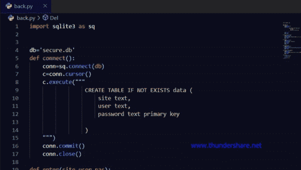

# 使用 Python 在 SQLite 中生成和存储密码的 GUI

> 原文:[https://www . geesforgeks . org/GUI-使用 python 在 sqlite 中生成和存储密码/](https://www.geeksforgeeks.org/gui-to-generate-and-store-passwords-in-sqlite-using-python/)

在本世纪，有许多社交媒体账户、网站或任何在线账户需要安全密码。我们经常对多个账户使用同一个密码，这样做的基本缺点是，如果有人知道你的密码，那么他/她就可以访问你的所有账户。很难记住所有不同的密码。我们可以通过使用*****Tkinter***和 ***SQLite*** 创建一个简单的 GUI 程序来实现这一点。**

**该应用程序将根据用户输入的所需长度生成密码。它还会将密码以及帐户用户 id 和网站名称保存到数据库中。你甚至可以更新你的旧密码或用户名。**

## **入门指南**

**用户将指定他们想要生成的密码的长度。程序将使用随机函数生成指定长度的随机字符串。用户将提供与帐户相关的用户 ID 和站点名称的详细信息，并点击保存到数据库按钮，这将触发本文后半部分给出的后端. py 文件的 insert()函数。因此，无需编写任何 SQL 命令就可以将数据保存到数据库中。**

## **使用的模块:**

*   ****网络浏览器:**该模块用于在记事本中显示 help.txt 文件。**
*   ****Tkinter:** Tkinter 是 python 中的 GUI 或图形用户界面包。它用于在 python 中创建图形用户界面应用程序。**
*   ****SQLite3:** Sqlite 是一个轻量级且易于使用的数据库引擎，它遵循与 Postgres SQL 相似的语法。python 中的 SQLite3 模块帮助我们使用 python 代码执行 SQL 命令。**
*   ****ttkbootsrtap:** 该模块改变了 GUI 应用的外观。它类似于 web 开发中的 bootstrap，用于给网页一个有希望的外观。该模块可以通过以下方式安装:**

****语法:****

> **pip 安装 ttkbootstrap**

*   ****csv:** 该模块有助于将数据库的数据保存为. csv 格式，以后可以在 excel 中查看。**

****语法:****

> **pip 安装 python-csv**

**首先，导入所有必需的模块。然后在类窗口中初始化 4 个列表来表示小写字母、大写字母和符号，作为类变量。然后，在 [__init__](https://www.geeksforgeeks.org/__init__-in-python/) 函数下创建应用程序的整个布局，以便在声明类窗口的对象时创建所有这些 Tkinter 对象。**

**Ttkbootstrap 包允许你改变 Tkinter 对象的风格，这包括了 Tkinter 所能提供的一切。这将基本上改变应用程序的主题。它有许多内置的主题。电子人，黑暗等。**

****带 ttkbootstrap 的语法:****

> **win=Style.theme('theme_name ')。掌握**

****没有 ttkbootstrap 的早期语法:****

> **win =Tk()**

**密码生成器函数生成器()为选定的密码长度/4 运行一个循环。用户给出的长度总是 4 的倍数，因为这些是下拉菜单中给出的唯一选项。每次迭代使用随机函数从创建的类变量中选择一个随机字符。前任。a0 =随机. choice(list_name)。从 4 个不同的列表(类变量)中选择字符并将其存储到 4 个合适数据类型的变量中后，将这 4 个变量连接起来，并将总和存储在另一个变量中。**

**下面是实现:**

****程序:**窗口生成密码**

## **蟒蛇 3**

```
import random
import webbrowser
from tkinter import *
from tkinter import ttk
from tkinter import messagebox
import back
import csv
from ttkbootstrap import *

class window:
    # these are lists of initialized characters
    digits = ['0', '1', '2', '3', '4', '5', '6', '7', '8', '9']

    lc = ['a', 'b', 'c', 'd', 'e', 'f', 'g', 'h', 'i', 'j', 'k',
          'm', 'n', 'o', 'p', 'q',
          'r', 's', 't', 'u', 'v', 'w', 'x', 'y', 'z']

    uc = ['A', 'B', 'C', 'D', 'E', 'F', 'G', 'H',
          'I', 'J', 'K', 'M', 'N', 'O', 'p', 'Q',
          'R', 'S', 'T', 'U', 'V', 'W', 'X', 'Y', 'Z']

    sym = ['@', '#', '{content}apos;, '%', '=', ':', '?', '.', '/', '|',
           '~', '>', '*', '<']

    def __init__(self, root, geo, title) -> None:
        self.root = root
        self.root.title(title)
        self.root.geometry(geo)
        self.root.resizable(width=False, height=False)

        Label(self.root, text='Your Password').grid(
            row=0, column=0, padx=10, pady=10)
        Label(self.root, text='Corresponding User_id').grid(
            row=1, column=0, padx=10, pady=10)
        Label(self.root, text='Of').grid(row=2, column=0, padx=10, pady=10)
        self.pa = StringVar()
        self.user_id = StringVar()
        self.site = StringVar()
        ttk.Entry(self.root, width=30, textvariable=self.pa
                 ).grid(row=0, column=1, padx=10, pady=10)
        ttk.Entry(self.root, width=30, textvariable=self.user_id
                 ).grid(row=1, column=1, padx=10, pady=10)
        ttk.Entry(self.root, width=30, textvariable=self.site
                 ).grid(row=2, column=1, padx=10, pady=10)
        self.length = StringVar()

        e = ttk.Combobox(self.root, values=['4', '8', '12', '16', '20', '24'],
                         textvariable=self.length)
        e.grid(row=0, column=2)
        e['state'] = 'readonly'
        self.length.set('Set password length')

        ttk.Button(self.root, text='Generate', padding=5,
                   style='success.Outline.TButton', width=20,
                   command=self.generate).grid(row=1, column=2)

        ttk.Button(self.root, text='Save to Database', style='success.TButton',
                   width=20, padding=5, command=self.save).grid(row=3, column=2)

        ttk.Button(self.root, text='Delete', width=20, style='danger.TButton',
                   padding=5, command=self.erase).grid(row=2, column=2)

        ttk.Button(self.root, text='Show All', width=20, padding=5,
                   command=self.view).grid(row=3, column=0)

        ttk.Button(self.root, text='Update', width=20, padding=5,
                   command=self.update).grid(row=3, column=1)

        # ========self.tree view=============
        self.tree = ttk.Treeview(self.root, height=5)
        self.tree['columns'] = ('site', 'user', 'pas')
        self.tree.column('#0', width=0, stretch=NO)
        self.tree.column('site', width=160, anchor=W)
        self.tree.column('user', width=140, anchor=W)
        self.tree.column('pas', width=180, anchor=W)
        self.tree.heading('#0', text='')
        self.tree.heading('site', text='Site name')
        self.tree.heading('user', text='User Id')
        self.tree.heading('pas', text='Password')
        self.tree.grid(row=4, column=0, columnspan=3, pady=10)
        self.tree.bind("<ButtonRelease-1>", self.catch)
        # this command will call the catch function

        # this is right click pop-up menu
        self.menu = Menu(self.root, tearoff=False)
        self.menu.add_command(label='Refresh', command=self.refresh)
        self.menu.add_command(label='Insert', command=self.save)
        self.menu.add_command(label='Update', command=self.update)
        self.menu.add_separator()
        self.menu.add_command(label='Show All', command=self.view)
        self.menu.add_command(label='Clear Fields', command=self.clear)
        self.menu.add_command(label='Clear Table', command=self.table)
        self.menu.add_command(label='Export', command=self.export)
        self.menu.add_separator()
        self.menu.add_command(label='Delete', command=self.erase)
        self.menu.add_command(label='Help', command=self.help)
        self.menu.add_separator()
        self.menu.add_command(label='Exit', command=self.root.quit)
        # this binds the button 3 of the mouse with
        self.root.bind("<Button-3>", self.poppin)
        # poppin function

    def help(self):
        # this function will open the help.txt in
        # notepad when called
        webbrowser.open('help.txt')

    def refresh(self):
        # this function basically refreshes the table
        # or tree view
        self.table()
        self.view()

    def table(self):
        # this function will clear all the values
        # displayed in the table
        for r in self.tree.get_children():
            self.tree.delete(r)

    def clear(self):
        # this function will clear all the entry
        # fields
        self.pa.set('')
        self.user_id.set('')
        self.site.set('')

    def poppin(self, e):
        # it triggers the right click pop-up menu
        self.menu.tk_popup(e.x_root, e.y_root)

    def catch(self, event):
        # this function will take all the selected data
        # from the table/ tree view and will fill up the
        # respective entry fields
        self.pa.set('')
        self.user_id.set('')
        self.site.set('')
        selected = self.tree.focus()
        value = self.tree.item(selected, 'value')
        self.site.set(value[0])
        self.user_id.set(value[1])
        self.pa.set(value[2])

    def update(self):
        # this function will update database with new
        # values given by the user
        selected = self.tree.focus()
        value = self.tree.item(selected, 'value')
        back.edit(self.site.get(), self.user_id.get(), self.pa.get())
        self.refresh()

    def view(self):
        # this will show all the data from the database
        # this is similar to "SELECT * FROM TABLE" sql
        # command
        if back.check() is False:
            messagebox.showerror('Attention Amigo!', 'Database is EMPTY!')
        else:
            for row in back.show():
                self.tree.insert(parent='', text='', index='end',
                                 values=(row[0], row[1], row[2]))

    def erase(self):
        # this will delete or remove the selected tuple or
        # row from the database
        selected = self.tree.focus()
        value = self.tree.item(selected, 'value')
        back.Del(value[2])
        self.refresh()

    def save(self):
        # this function will insert all the data into the
        # database
        back.enter(self.site.get(), self.user_id.get(), self.pa.get())
        self.tree.insert(parent='', index='end', text='',
                         values=(self.site.get(), self.user_id.get(), self.pa.get()))

    def generate(self):
        # this function will produce a random string which
        # will be used as password
        if self.length.get() == 'Set password length':
            messagebox.showerror('Attention!', "You forgot to SELECT")
        else:
            a = ''
            for x in range(int(int(self.length.get())/4)):
                a0 = random.choice(self.uc)
                a1 = random.choice(self.lc)
                a2 = random.choice(self.sym)
                a3 = random.choice(self.digits)
                a = a0+a1+a2+a3+a
                self.pa.set(a)

    def export(self):
        # this function will save all the data from the
        # database in a csv format which can be opened
        # in excel
        pop = Toplevel(self.root)
        pop.geometry('300x100')
        self.v = StringVar()
        Label(pop, text='Save File Name as').pack()
        ttk.Entry(pop, textvariable=self.v).pack()
        ttk.Button(pop, text='Save', width=18,
                   command=lambda: exp(self.v.get())).pack(pady=5)

        def exp(x):
            with open(x + '.csv', 'w', newline='') as f:
                chompa = csv.writer(f, dialect='excel')
                for r in back.show():
                    chompa.writerow(r)
            messagebox.showinfo("File Saved", "Saved as " + x + ".csv")

if __name__ == '__main__':
    win = Style(theme='darkly').master
    name = 'Password Generator'
    dimension = '565x320'

    app = window(win, dimension, name)
    win.mainloop()
```

****使用 SQLite 的后端程序:**[python 的 Sqlite3](https://www.geeksforgeeks.org/introduction-to-sqlite-in-python/) 模块允许我们使用 Python 执行 sol 命令。以下是语法**

*   **它将连接到 SQLite 数据库文件**

> **con = SQLite 3 . connect(' database . db ')**

*   **数据集遍历的游标**

> **c=conn.cursor()**

*   **要执行 SQL 命令**

> **c . execute(“SQL 代码”)**

*   **提交或保存所做的更改**

> **conn.commit()**

*   **这用于关闭用 SQLite 数据库文件创建的连接**

> **conn.close()**

****注意:**这里密码已经作为主键。因此，要更改密码，您需要插入新密码，并从数据库中删除旧密码。**

****程序:**后端程序使用SQLite:**

## **蟒蛇 3**

```
import sqlite3 as sq

db = 'secure.db'

def connect():

    # used to connect to the secure.db database
    conn = sq.connect(db)

    # defined a cursor to retrieve one data/tuple at
    # a time
    c = conn.cursor()

    # execute will execute the entire sql command as
    # it is
    c.execute("""
                 CREATE TABLE IF NOT EXISTS data (
                     site text,
                     user text,
                     password text primary key

                 )             
    """)

    # to commit the sql command, it will commit the
    # current transaction or
    conn.commit()
    conn.close()

def enter(site, user, pas):
    conn = sq.connect(db)
    c = conn.cursor()
    c.execute("INSERT INTO data VALUES(?,?,?)", (site, user, pas))
    conn.commit()
    conn.close()

def show():
    conn = sq.connect(db)
    c = conn.cursor()
    c.execute("SELECT * FROM data")

    # this will store all the data from the table to
    # the variable i in the form of 2d list
    i = c.fetchall()
    conn.commit()
    conn.close()
    return i

def Del(password):
    conn = sq.connect(db)
    c = conn.cursor()
    c.execute("DELETE FROM data WHERE password=(?)", (password,))
    conn.commit()
    conn.close()

def edit(site, user, password):
    conn = sq.connect(db)
    c = conn.cursor()
    c.execute("UPDATE data SET site=?, user=(?) WHERE password=(?) ",
              (site, user, password))
    conn.commit()
    conn.close()

def check():
    # this function will check whether the database
    # is empty or not
    if len(show()) == 0:
        return False
    else:
        return True

# calling the connect function to create a table and
# database if it doesn't exists
connect()
```

****输出**:**

****