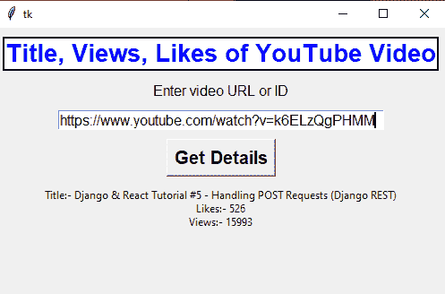

# 使用 Python 中的 YouTube API 获取 YouTube 视频的视图、赞和标题的 GUI

> 原文:[https://www . geesforgeks . org/GUI-to-get-view-like-title-a-YouTube-video-use-YouTube-API-in-python/](https://www.geeksforgeeks.org/gui-to-get-views-likes-and-title-of-a-youtube-video-using-youtube-api-in-python/)

**先决条件:**[YouTube API](https://www.geeksforgeeks.org/youtube-data-api-set-1/)[Tkinter](https://www.geeksforgeeks.org/python-gui-tkinter/)

Python 为开发图形用户界面提供了多个选项。在所有的 GUI 方法中，Tkinter 是最常用的方法。它是 Python 附带的 Tk 图形用户界面工具包的标准 Python 接口。Python 搭配 Tkinter 是创建 GUI 应用程序最快最简单的方法。

在本文中，我们将学习如何使用 Python 中的 YouTube API 从任何 YouTube 视频中获取数据(如标题、视图、好恶等)。

**下面是要创建的 GUI:**



**分步方法:**

在继续之前，你应该通过 [YouTube 应用编程接口](https://www.geeksforgeeks.org/youtube-data-api-set-1/)来安装所需的模块，并启用文章中提到的所需功能。

*   导入所需模块。

## 蟒蛇 3

```py
# Import Module
from tkinter import *
from googleapiclient.discovery import build
```

*   我们将使用 **build()** 、 **list()** 、 **execute()** 方法，它会给出视频细节。
*   在**列表**方法中，在**部分**属性和**视频标识**属性中传递**视频标识**的**视频网址。**

## 蟒蛇 3

```py
# creating youtube resource object 
youtube = build('youtube','v3', developerKey="Enter API Key") 

# retrieve youtube video results 
video_request=youtube.videos().list(
  part='snippet,statistics',
  id="Enter Video ID"
)

video_response = video_request.execute()
```

*   从**视频 _ 回应获取标题、观点、喜欢。**

## 蟒蛇 3

```py
title = video_response['items'][0]['snippet']['title']
likes = video_response['items'][0]['statistics']['likeCount']
views = video_response['items'][0]['statistics']['viewCount']
```

*   创建 Tkinter 窗口；添加按钮、标签等..

## 蟒蛇 3

```py
# Create Object
root = Tk()

# Set Geometry
root.geometry("500x300")

# Add Label, Entry Box and Button
Label(root, text="Title, Views, Likes of YouTube Video", fg="blue",
      font=("Helvetica 20 bold"), relief="solid", bg="white").pack(pady=10)
Label(root, text="Enter video URL or ID", font=("10")).pack()

video_url = Entry(root, width=40, font=("15"))
video_url.pack(pady=10)

Button(root, text="Get Details", font=("Helvetica 15 bold")).pack()

details = Label(root, text="")
details.pack(pady=10)

# Execute Tkinter
root.mainloop()
```

**以下是基于上述方法的实现:**

## 蟒蛇 3

```py
# Import Module
from tkinter import *
from googleapiclient.discovery import build

def video_details():
    if "youtube" in video_url.get():
        video_id = video_url.get()[len("https://www.youtube.com/watch?v="):]
    else:
        video_id = video_url.get()

    # creating youtube resource object 
    youtube = build('youtube','v3',developerKey='Enter API Key')

    # retrieve youtube video results
    video_request=youtube.videos().list(
        part='snippet,statistics',
        id=video_id
    )

    video_response = video_request.execute()

    title = video_response['items'][0]['snippet']['title']
    likes = video_response['items'][0]['statistics']['likeCount']
    views = video_response['items'][0]['statistics']['viewCount']

    details.config(text=f"Title:- {title}\nLikes:- {likes}\nViews:- {views}")

# Create Object
root = Tk()

# Set Geometry
root.geometry("500x300")

# Add Label, Entry Box and Button

Label(root,text="Title, Views, Likes of YouTube Video", fg="blue",
    font=("Helvetica 20 bold"),relief="solid",bg="white").pack(pady=10)
Label(root,text="Enter video URL or ID", font=("10")).pack()

video_url = Entry(root,width=40,font=("15"))
video_url.pack(pady=10)

Button(root,text="Get Details" ,font=("Helvetica 15 bold"),command=video_details).pack()

details = Label(root,text="")
details.pack(pady=10)

# Execute Tkinter
root.mainloop()
```

**输出:**

<video class="wp-video-shortcode" id="video-550024-1" width="640" height="360" preload="metadata" controls=""><source type="video/mp4" src="https://media.geeksforgeeks.org/wp-content/uploads/20210127104802/FreeOnlineScreenRecorderProject2.mp4?_=1">[https://media.geeksforgeeks.org/wp-content/uploads/20210127104802/FreeOnlineScreenRecorderProject2.mp4](https://media.geeksforgeeks.org/wp-content/uploads/20210127104802/FreeOnlineScreenRecorderProject2.mp4)</video>