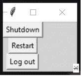

# 使用 Python 关闭、重启和注销电脑的图形用户界面

> 原文:[https://www . geesforgeks . org/GUI-关闭-重启-使用 python 从 pc 注销/](https://www.geeksforgeeks.org/gui-to-shutdown-restart-and-logout-from-the-pc-using-python/)

在本文中，我们将编写一个 python 脚本来关闭、重启或注销您的系统，并将其与图形用户界面应用程序绑定。

Python 中的 **OS 模块**提供了与操作系统交互的功能。OS 是一个内置的 python 库。

**语法:**

> **关闭系统:**操作系统(“关闭/s /t 1”)
> 
> **重启系统:** os.system(“关机/r /t 1”)
> 
> **注销您的系统:**操作系统(“关机-1”)

**使用 Tkinter 实现 GUI 应用:**

## 蟒蛇 3

```py
# import modules
from tkinter import *
import os

# user define function
def shutdown():
    return os.system("shutdown /s /t 1")

def restart():
    return os.system("shutdown /r /t 1")

def logout():
    return os.system("shutdown -l")

# tkinter object
master = Tk()

# background set to grey
master.configure(bg='light grey')

# creating a button using the widget
# Buttons that will call the submit function
Button(master, text="Shutdown", command=shutdown).grid(row=0)
Button(master, text="Restart", command=restart).grid(row=1)
Button(master, text="Log out", command=logout).grid(row=2)

mainloop()
```

**输出:**



**注意:** *在 IDLE 上运行此代码之前，请确保保存并关闭所有*程序*，因为此程序会立即关闭并重启您的计算机。*