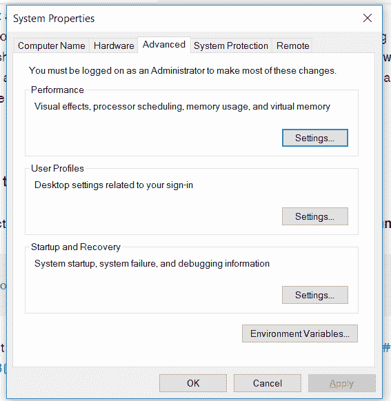
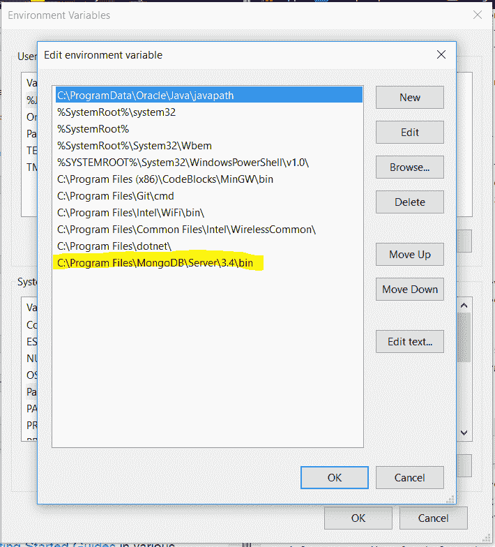
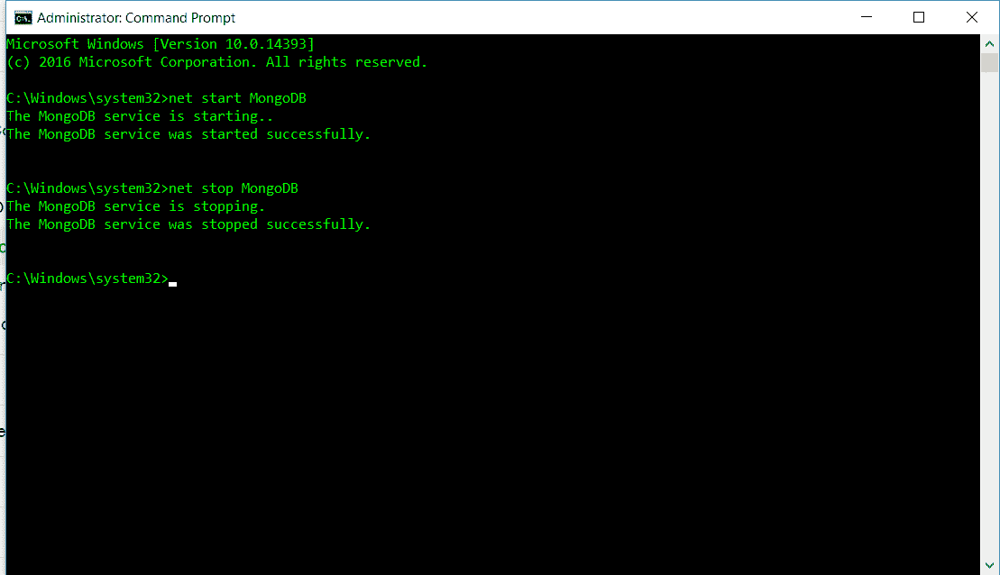
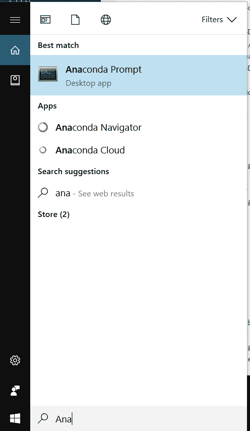
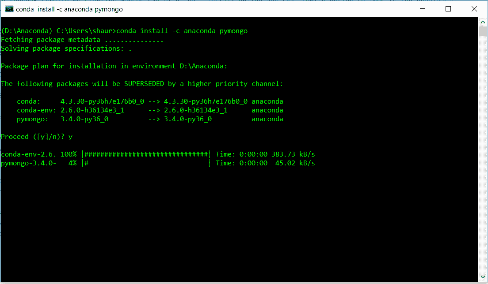

# 用 Python 在 Windows 上安装 MongoDB

> 原文:[https://www . geesforgeks . org/guide-install-MongoDB-python-windows/](https://www.geeksforgeeks.org/guide-install-mongodb-python-windows/)

我们将分步骤解释 MongoDB 的安装。在你安装之前，我建议大家使用 ide spyder，Anaconda。

**步骤 1 - >安装社区版**
[安装链接](https://www.mongodb.com/dr/fastdl.mongodb.org/win32/mongodb-win32-x86_64-2008plus-ssl-3.4.10-signed.msi/download)

**步骤 2 - >运行刚刚下载的已安装 MongoDB windows 安装程序包。**

MongoDB 在这里安装-->

```py
C:\Program Files\MongoDB\Server\3.4\
```

**第三步- >我们来设置 MongoDB 环境**

*   (a) **创建存储所有数据的数据目录。**
    在 C: drive 里面创建一个文件夹数据在里面创建一个文件夹 db
    或者
    运行

    ```py
    md C:\data\db
    ```

*   (b) **To start MongoDB**
    Run ->

    ```py
    "C:\Program Files\MongoDB\Server\3.4\bin\mongod.exe"

    ```

    等待连接消息出现

*   (c) **验证环境路径或设置路径如果没有正确设置**
    打开环境变量，可以通过 windows 搜索进行搜索。
    

    打开系统变量部分下的环境变量打开路径。
    这个应该是这样的。
    
    添加 bin 文件夹的路径如上图所示。

*   (d) **要连接到 MongoDB**
    打开其他命令提示符并运行- >

    ```py
    "C:\Program Files\MongoDB\Server\3.4\bin\mongo.exe

    ```

**第 4 步- >准备好 MongoDB**
打开命令提示符(管理模式)键入- >

```py
mongod
```


**注意:**直到第 4 步 MongoDB 只有在命令提示符打开并且正在监听时才会工作。
现在我们来看看 Extension，让它变得更好。

**以下从第 5 步到第 8 步的步骤可选:**
**第 5 步- >打开命令提示符运行-**

```py
mkdir c:\data\db
mkdir c:\data\log

```

****步骤 6-** >在 C:\ Program Files \ MongoDB \ Server \ 3.4 \ mongod . CFG(文件名 mongod.cfg)** 创建配置文件

```py
systemLog:
    destination: file
    path: c:\data\log\mongod.log
storage:
    dbPath: c:\data\db

```

这可以在记事本的*管理模式或记事本++或任何其他编辑器中创建和保存，以运行记事本管理模式*按 Ctrl + Shift +回车*。记事本的管理模式将让你创建 mongod.cfg 并保存上述文本文件。*

****步骤 7** - >通过使用–Install 选项和-config 选项启动 mongod.exe 来指定之前创建的配置文件，从而安装 MongoDB 服务。**
现在在命令提示符下运行此命令

```py
"C:\Program Files\MongoDB\Server\3.4\bin\mongod.exe" 
--config "C:\Program Files\MongoDB\Server\3.4\mongod.cfg" --install
```

****第 8 步** - >启动&停止 MongoDB 运行**T4】启动:

```py
net start MongoDB
```

要停止:

```py
net stop MongoDB

```


 **注意:**所有命令都在命令提示符管理模式下运行，要打开命令提示符管理模式，请打开普通命令提示符并按 Ctrl+Shift+Enter 或右键单击左侧窗口图标开始按钮，您可以在其中看到选项。
 **第九步** - >打开如图所示的蟒蛇命令提示符。


**第 10 步** - >安装包使用 MongoDB
用 conda run 安装这个包:

```py
conda install -c anaconda pymongo 

```



恭喜你！！安装完成。(Pymongo 只在 MongoDB 启动时工作，使用 net start MongoDB 启动后再在 spyder 上工作)
可以在 python [这里](https://www.geeksforgeeks.org/mongodb-and-python/)学习理解 MongoDB。

本文由 [**SHAURYA UPPAL**](https://www.linkedin.com/in/shaurya-uppal-3b7a6373/) 供稿。如果你喜欢 GeeksforGeeks 并想投稿，你也可以使用[write.geeksforgeeks.org](https://write.geeksforgeeks.org)写一篇文章或者把你的文章邮寄到 review-team@geeksforgeeks.org。看到你的文章出现在极客博客主页上，帮助其他极客。

如果你发现任何不正确的地方，或者你想分享更多关于上面讨论的话题的信息，请写评论。