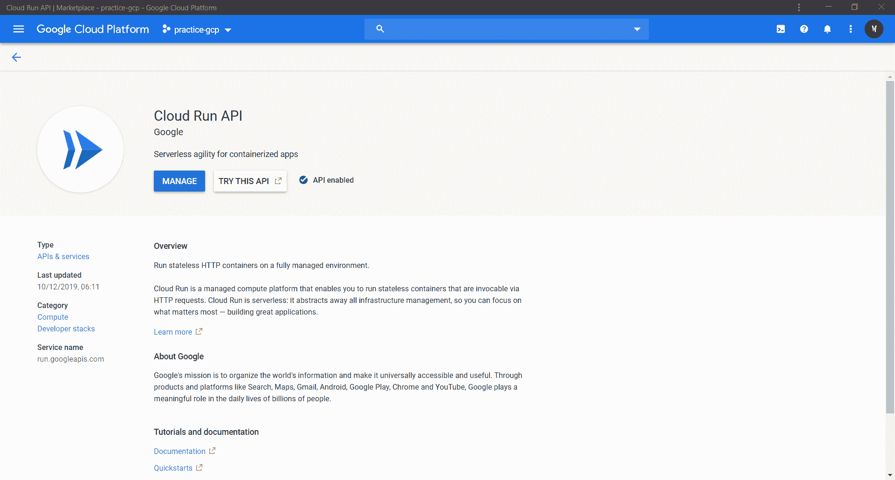
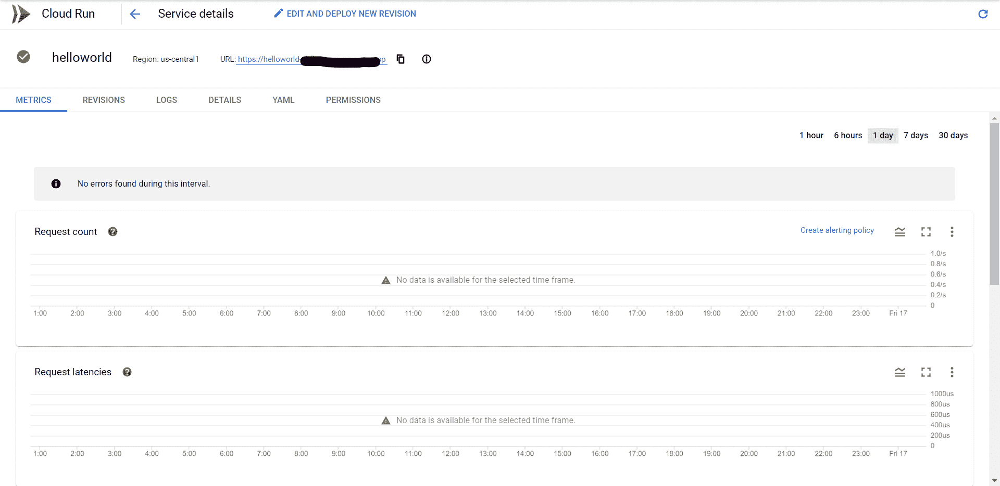

# 谷歌云运行部署容器指南

> 原文:[https://www . geesforgeks . org/guide-to-deploy-containers-on-Google-cloud-run/](https://www.geeksforgeeks.org/guide-to-deploy-containers-on-google-cloud-run/)

谷歌云运行是安全 https 连接上应用编程接口部署的快速和可扩展解决方案之一，可以被认为是每个开发人员的首选。firebase 是静态网站，对吗？如果我们也可以在 firebase 上部署动态网站呢？你只需要**云跑**。在本教程中，我们将向您展示如何在云上部署一个简单的网站。我们将使用[烧瓶](https://palletsprojects.com/p/flask/)作为网站。首先用谷歌云软件开发工具包设置你的系统。如果你不知道怎么做，我建议你阅读他们的官方文件[这里](https://cloud.google.com/sdk)。

## 启用云运行应用编程接口

接下来需要启用**云运行 API** 。

*   前往云控制台中的[市场](https://console.developers.google.com/apis/dashboard)。
*   Then Search for Cloud Run API and enable it

    完成所有这些步骤后，您的页面应该如下所示

    

## 创建项目

现在有趣的部分开始了。让我们进入代码。

*   首先创建一个项目文件夹。就我而言，我将使用名称*云跑教程*。
*   转到项目文件夹，创建一个名为 *requirements.txt* 的文件，并将 *Flask==1.1.1* 添加到该文件中。
*   现在创建一个名为 *app.py* 的 python 文件，并在其中添加以下行。

    ```py
    # importing Flask
    from flask import Flask
    app = Flask(__name__)

    # specifying the route
    @app.route('/')
    def hello_world():
        return 'Hello, World !'

    # this if block make sure that Flask app runs 
    # only if the file is executed directly
    if __name__ == '__main__':
        # exposing port 8080 of localhost
        app.run(host ='0.0.0.0', port = 8080)
    ```

    如果您对上述代码有任何困惑或想了解更多,我希望您阅读烧瓶文档[这里](https://flask.palletsprojects.com/en/1.1.x/).

*   接下来创建一个名为 **Dockerfile** 的 Dockerfile(没有任何扩展名)，并向其中添加以下代码行。

    ```py
    #pulls python 3.7’s image from the docker hub
    FROM python:alpine3.7 
    #copies the flask app into the container
    COPY . /app
    #sets the working directory
    WORKDIR /app
    #install each library written in requirements.txt
    RUN pip install -r requirements.txt 
    #exposes port 8080
    EXPOSE 8080 
    #Entrypoint and CMD together just execute the command 
    #python app.py which runs this file
    ENTRYPOINT [ "python" ] 
    CMD [ "app.py" ] 
    ```

## 部署项目

现在您的项目已经准备好部署了。为了将其部署到谷歌云运行，我们需要将项目和容器容器化到谷歌容器注册中心(gcr)。

让我们看看怎么做。

*   转到您的项目目录并打开终端。
*   键入 *gcloud init* 并选择要在其中部署网站的 GCP 项目，并记下项目 id。
*   键入*导出项目 _id=THE_PROJECT_ID_NOTED* 。
*   然后输入 *gcloud 构建提交–标记 gcr.io/${project_id}/helloworld:v1*。这将需要几分钟才能完成。
*   Then type *gcloud run deploy –image gcr.io/${project_id}/helloworld:v1 –platform managed*
    *   系统会提示您输入服务名称:按*回车*接受默认名称 *helloworld* 。
    *   系统将提示您输入地区:选择您选择的地区。
    *   系统将提示您*允许未经验证的调用*:响应 *y*

    然后等待几分钟，直到部署完成。成功后，命令行显示服务网址。

*   通过在 web 浏览器中打开服务 URL 来访问您部署的容器。

## 输出-

如果您已经正确完成了所有步骤，那么您的云运行页面应该看起来像这样


恭喜你！您刚刚将打包在容器映像中的应用程序部署到云运行。Cloud Run 会自动水平扩展您的容器映像以处理接收到的请求，然后在需求减少时进行缩减。