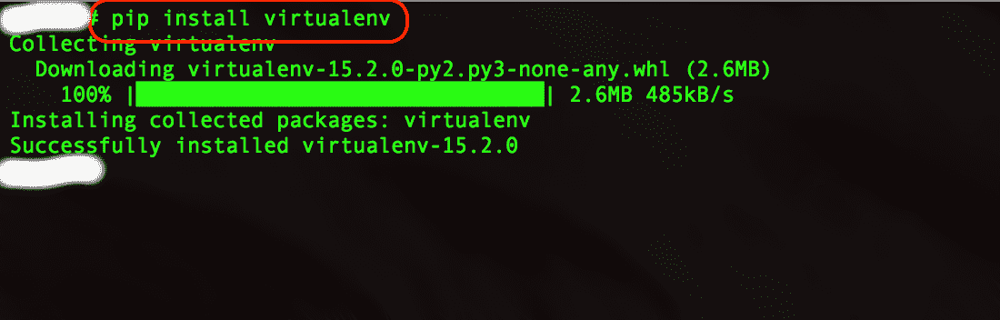
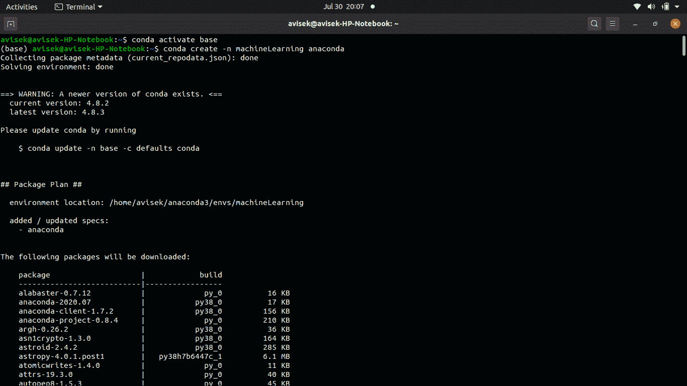
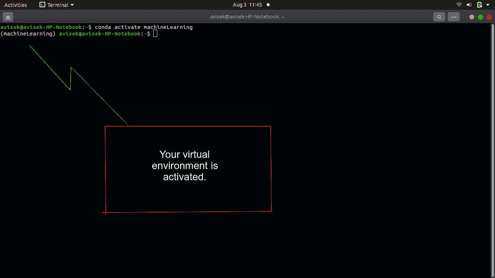
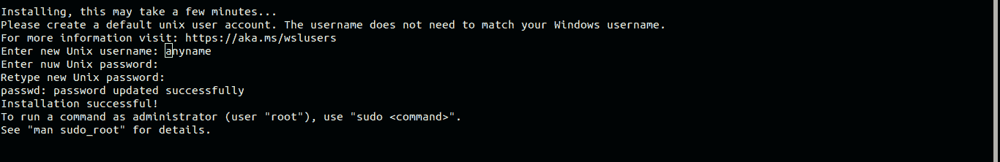
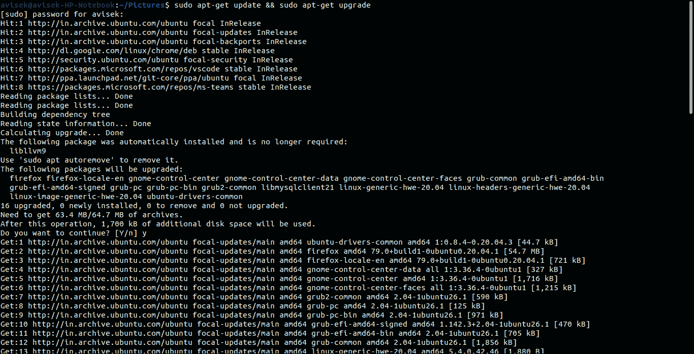
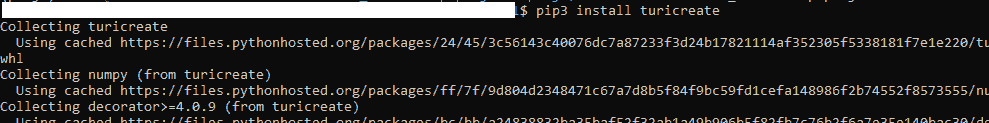

# 在 Python3.x 中安装 TuriCreate 的指南

> 原文:[https://www . geeksforgeeks . org/guide-install-turi create-in-python 3-x/](https://www.geeksforgeeks.org/guide-to-install-turicreate-in-python3-x/)

在安装之前，你首先需要了解什么是真正的图里创建。因此，Turi Create 是一个开源工具集，用于创建 Core ML 模型，用于图像分类、对象检测、风格转换、推荐等任务。

**系统要求**

*   Python 2.7、3.5、3.6、3.7
*   至少 4gb 内存
*   x86_64 架构。

**注意:**出于安装目的，建议的步骤是首先在系统中创建一个虚拟环境。

### 装置

**1。Ubuntu**
**第一步:**创建虚拟环境并激活。

```
# Installing virtual environment using pip
pip install virtualenv

# Create a virtual environment
cd ~
virtual venv

# Activate your virtual environment
source ~/venv/bin/activate

```



使用 pip 安装虚拟环境

或者，如果您使用的是蟒蛇([https://www.anaconda.com/](https://www.anaconda.com/))，您可以使用它的虚拟环境:

```
# creating a virtual environment using Anaconda.
conda create -n  anaconda
```



创建虚拟环境

```
# activating the virtual environment using anaconda
conda activate <virtual-environment-name>
```



激活虚拟环境

**步骤 2 :** 在您的虚拟环境中安装 turicreate

```
(venv) pip install -U turicreate
```


安装 turicreate

**2。Windows :** 在 Windows 中，不能直接安装这个包，但是可以使用 Windows Linux 子系统(WSL)在系统中安装 turicreate。

**步骤 1 :** 安装 WSL

```
# Open powershell as Administrator and run the following command
Enable-WindowsOptionalFeature -Online -FeatureName Microsoft-Windows-Subsystem-Linux
```

注意:出现提示时，请重新启动计算机。

**第二步:**电脑重启后，启动微软商店，搜索 Linux。选择您选择的 Linux 发行版。在本教程中，我们使用的是 Ubuntu 18.04 LTS 发行版。


**第 3 步:**从发行版的页面中，选择获取，然后安装。


**步骤 4 :** 从“开始”菜单或通过单击微软商店上的“启动”按钮启动发行版。

**第五步:**你必须初始化你的新发行版。按照提示设置新的 Linux 帐户(用户名和密码)。稍后使用 sudo 安装软件包时，您将需要您的密码。



设置您的用户名和密码

**步骤 6 :** 使用以下命令更新和升级您的发行版软件包。

```
sudo apt-get update && sudo apt-get upgrade
```



输出

**步骤 7 :** 安装依赖项并设置环境。

```
# Installing dependencies
sudo apt-get install -y libstdc++6 python-setuptools
sudo apt-get install python3-pip

# Installing virtualenv using pip3
sudo pip3 install virtualenv 

# Creating a virtual environment using virtualenv
virtualenv venv

# Activating the created virtual environment
source venv/bin/activate
```

**步骤 8 :** 现在在您的虚拟环境中安装 turicreate。

```
(venv)pip3 install turicreate
```



安装 turicreate

祝贺您，turicreate 已成功安装在您的系统中。快乐编码。