# Hadoop–Python 蛇咬命令行界面客户端，其用法和命令参考

> 原文:[https://www . geesforgeks . org/Hadoop-python-蛇咬-CLI-client-its-usage-and-command-references/](https://www.geeksforgeeks.org/hadoop-python-snakebite-cli-client-its-usage-and-command-references/)

Python 蛇咬附带了命令行界面客户端，这是一个基于 HDFS 的客户端库。要使用 python 蛇咬命令行界面，必须知道名称节点的主机名或 IP 地址以及名称节点的 RPC 端口。我们可以列出所有这些端口值和主机名，只需创建我们自己的配置文件，其中包含名称节点的所有这些细节，如本地主机和远程过程调用端口的主机名。在我们的演示中，我们将使用一种更简单的方法来使用蛇咬命令行界面，即直接将该端口和主机值传递给命令本身。远程过程调用或 RPC 是一种动态分配端口的方法，用于服务器和远程管理应用程序。

我们在这里使用的主机名和端口值可以在您的系统中的 ***fs.default.name*** 属性中的***Hadoop/etc/Hadoop/core-site . XML***文件中找到。我们可以访问[蛇咬命令行界面文档](https://snakebite.readthedocs.io/en/latest/)来获得更多关于蛇咬命令行界面配置的信息。

我们也可以借助下面的命令来检查 ***属性的值。***

```
hdfs getconf -confKey fs.defaultFS      # We can also use fs.default.name but fs.defaultFS is most favourable

```

让我们在系统的 core-site.xml 文件中手动查看 ***fs.default.name*** 属性值，以了解主机或端口。

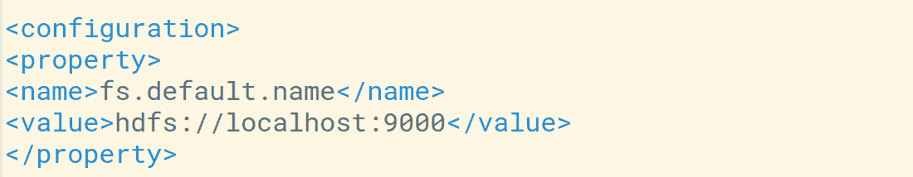

我们可以看到我们的默认主机是**本地主机**或者端口是 **9000** 。

### 毒蛇咬伤的用法

在 python 蛇咬 CLI 的帮助下，我们可以很容易地实现大部分使用 **hdfs dfs** 的命令，比如 *ls、mv、rm、put、get、du、df* 等。因此，让我们执行一些基本操作来了解蛇咬命令行界面的工作原理。

通过命令行中的路径使用蛇咬命令行界面–例如: *hdfs://namenode_host:端口/路径*

**1。列出 HDFS 根目录下所有可用的目录**

**语法:**

```
snakebite lshdfs://localhost:9000/<path>

```

**示例:**

```
snakebite ls hdfs://localhost:9000/

```


**2。从 HDFS 删除文件**

**语法:**

```
snakebite rm  hdfs://localhost:9000/<file_path_with_name>

```

**示例:**

```
snakebite rm  hdfs://localhost:9000/data.txt

```

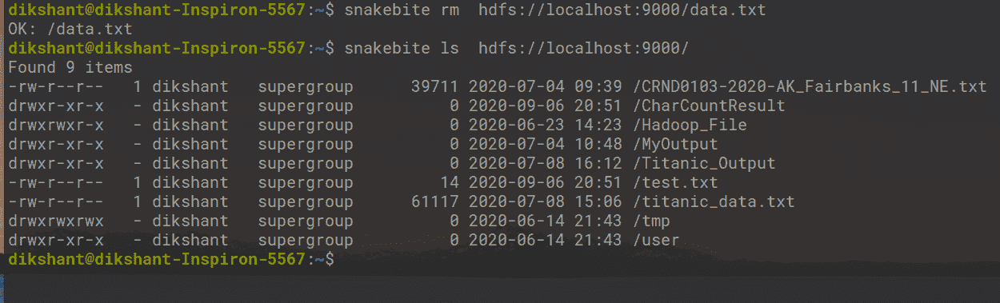

**3。创建目录(在我的情况下，目录的名称是/示例)**

**语法:**

```
snakebite mkdir hdfs://localhost:9000/<path_with_directory_name>

```

**示例:**

```
snakebite mkdir hdfs://localhost:9000/sample

```

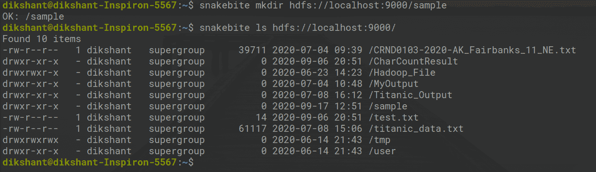

**4。删除目录(在我的情况下，目录的名称是/示例)**

```
snakebite rmdir hdfs://localhost:9000/sample

```

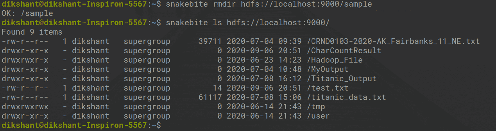

现在通过上面的例子，我们了解了如何实现和使用蛇咬命令行界面。 ***蛇咬*** CLI 和 ***hdfs dfs*** 的重要区别在于蛇咬是一个完整的 python 客户端库，不使用任何 java 库与 hdfs 进行通信。蛇咬库的命令与 HDFS 的交互速度比 hdfs dfs 更快。

### 命令行界面命令参考

Python 蛇咬库提供了许多与 HDFS 合作的工具。所有可供参考的开关和命令都可以通过简单的 ***【蛇咬】*** 命令列出。

```
 snakebite     

```

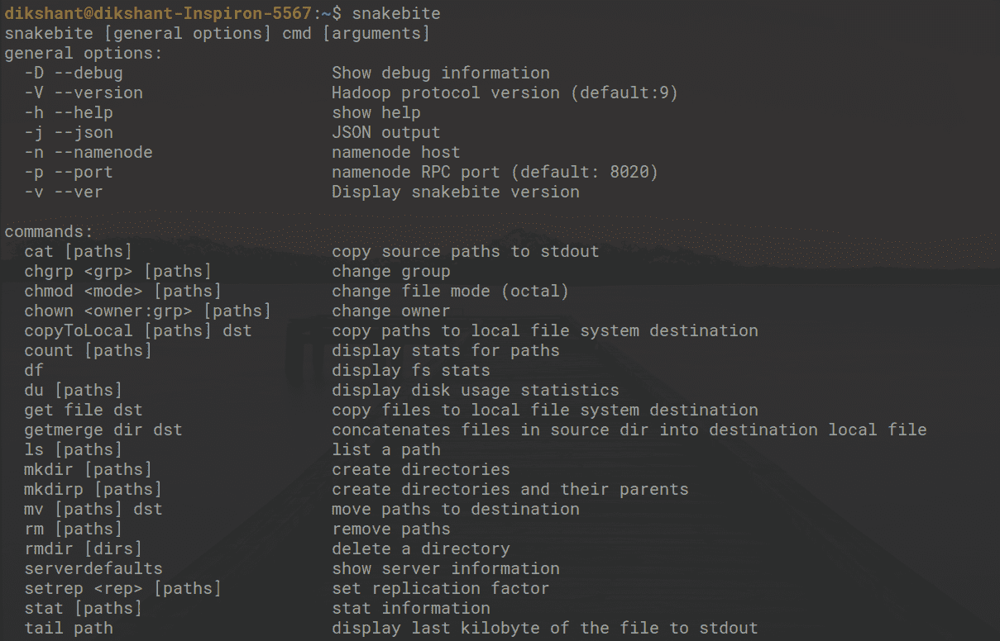

我们可以观察到 **hdfs dfs** 中所有可用的命令类似的命令在蛇咬命令行界面中也是可用的。让我们再表演几个，以便更好地了解蛇咬命令行界面。

**用**检查**蛇咬版**下面的**命令**

```
snakebite --ver

```

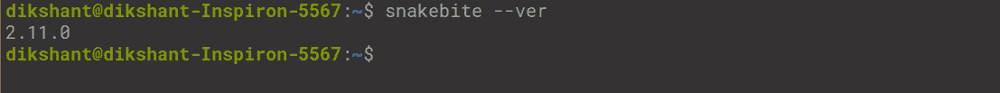

**1。cat:用于打印文件数据**

**示例:**

```
snakebite cat hdfs://localhost:9000/test.txt

```


**2。copyToLocal(或)get:将文件/文件夹从 hdfs 存储复制到本地文件系统。**

**语法:**

```
snakebite copyToLocal <source> <destination>

```

**示例:**

```
snakebite copyToLocal  hdfs://localhost:9000/test.txt /home/dikshant/Pictures

```

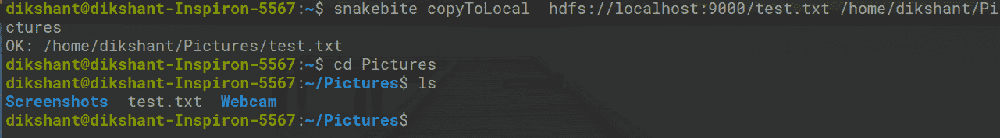

**3。它会创建一个空文件。**

**语法:**

```
snakebite touchz  hdfs://localhost:9000/<name_of_directory>

```

**示例:**

```
snakebite touchz  hdfs://localhost:9000/demo_file

```

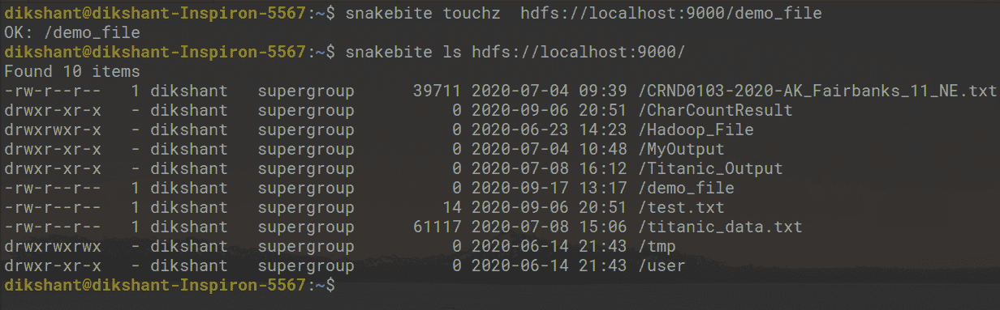

**4。du:显示磁盘使用情况统计**

```
snakebite du  hdfs://localhost:9000/    # show disk usage of root directory

snakebite du  hdfs://localhost:9000/Hadoop_File   # show disk usage of /Hadoop_File directory i.e. already available

```

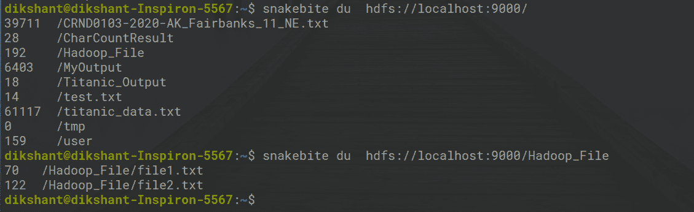

**5。stat:它将给出目录或路径的最后修改时间。简而言之，它将给出目录或文件的统计数据**

```
snakebite stat  hdfs://localhost:9000/

snakebite stat  hdfs://localhost:9000/Hadoop_File

```

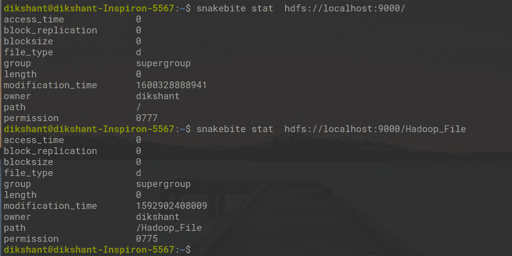

**6 setrep:此命令用于更改 HDFS 文件/目录的复制因子。默认情况下****存储在 HDFS 的任何东西都是 3(在 hdfs core-site.xml 中设置)**

```
snakebite setrep 5  hdfs://localhost:9000/test.txt

```

在下图中，我们可以观察到我们已经将 *test.txt* 文件的复制因子从 1 更改为 5。

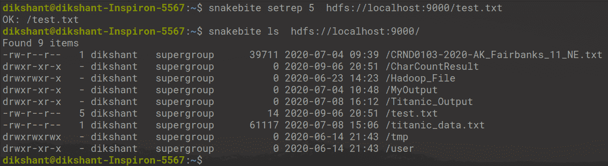

同样，我们可以使用 python 蛇咬命令行界面在 HDFS 上执行多个操作。