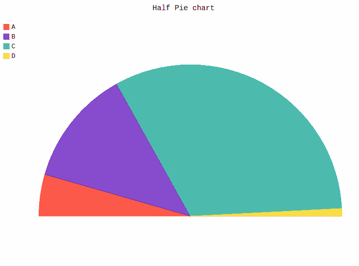
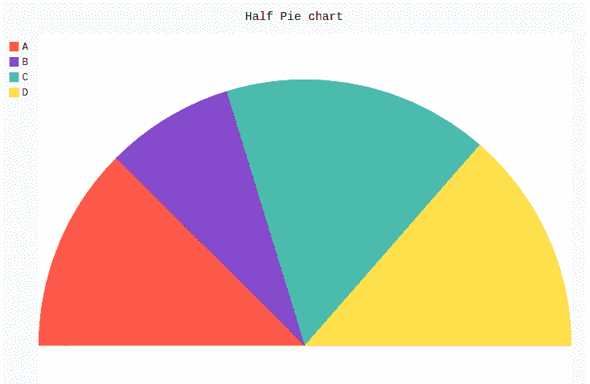

# Pygal 中的半饼图

> 原文:[https://www.geeksforgeeks.org/half-pie-chart-in-pygal/](https://www.geeksforgeeks.org/half-pie-chart-in-pygal/)

**Pygal** 是一个 Python 模块，主要用于构建 SVG(标量矢量图形)图形和图表。SVG 是一种基于矢量的 XML 格式的图形，可以在任何编辑器中编辑。Pygal 可以用最少的代码行创建易于理解的图形。

## 半饼图

半饼图也被称为半月形或半圆形饼图，它是一个 180 度的图形，代表整个饼图的解剖结构。半饼图的工作方式与普通饼图相似。它的主要优点是在布局中占用更少的空间，并且像完整的饼图一样工作。所有的区域都标有不同的颜色，这有助于更有效地理解它。可以使用 pygal 模块的`Pie()`方法通过传递 half_pie 属性来创建。这需要一个布尔值。

**语法:**

```
pie_chart = pygal.Pie(half_pie=True)
```

**例 1:**

```
# importing pygal
import pygal

# creating line chart object
pie_chart = pygal.Pie(half_pie = True)

# naming the title
pie_chart.title = 'Half Pie chart'

# random data
pie_chart.add('A', 115)
pie_chart.add('B', 322)
pie_chart.add('C', 834)
pie_chart.add('D', 21)

pie_chart
```

**输出:**



**例 2:**

```
# importing pygal
import pygal
import numpy

# creating line chart object
pie_chart = pygal.Pie(half_pie = True)

# naming the title
pie_chart.title = 'Half Pie chart'

# Random data
pie_chart.add('A', numpy.random.rand(5))
pie_chart.add('B', numpy.random.rand(5))
pie_chart.add('C', numpy.random.rand(5))
pie_chart.add('D', numpy.random.rand(5))

pie_chart
```

**输出:**

