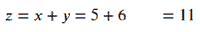
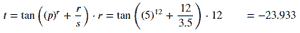
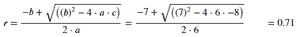

# Python 中的手动模块

> 原文:[https://www.geeksforgeeks.org/handcalcs-module-in-python/](https://www.geeksforgeeks.org/handcalcs-module-in-python/)

**手算器**是 Python 中的一个库，可以在 Latex 中自动进行计算，但方式是模仿手写时方程式可能的格式，编写数学公式，由数字替换支持，然后输出。由于手动计算表示数值替换，所以这些方程变得更容易手动检查和验证。

### **安装**

在终端上运行以下 pip 命令。

```py
pip install handcalcs

```

Python 中的手动计算器库旨在作为一种细胞魔法用于 Jupyter 笔记本或 Jupyter 实验室。
要使用手算库的渲染功能，通过执行*导入手算.渲染*来导入模块，之后只需在要用手算渲染方程或变量的单元格顶部使用**% %渲染**。

**例 1:** 两个数相加

## 蟒蛇 3

```py
# importing the module
import handcalcs.render

x = 5
y = 6

# run the code below in a new Jupyter cell
%%render
z = x + y
```

**输出:**



**例 2:** 计算表达式的 tan。

## 蟒蛇 3

```py
# importing the libraries
import handcalcs.render
from math import tan

p = 5
r = 12
s = 3.5

# run the code below in a new Jupyter cell
%%render
t = tan(p ** r + r / s) * r
```

**输出:**



**例 3:** 带平方根的二次方程。

## 蟒蛇 3

```py
# importing the module
import handcalcs.render
from math import sqrt

a = 6
b = 7
c = -8

# run the code below in a new Jupyter cell
%%render
r = (-b + sqrt(b ** 2 - 4 * a * c)) / (2 * a)
```

**输出:**



### 标签 Comment

通过使用注释，手算师就如何构造方程得出了一些结论。每个单元格只能使用一个注释。

可以使用单元格顶部的# comment 标签创建三种类型的自定义:

**1。#参数:**变量或参数的显示结构可以通过使用# Parameter 标签来控制，该标签用于将显示结构分为垂直显示或水平显示。

**示例:**没有# Parameter 注释，所有方程将垂直显示

## 蟒蛇 3

```py
# importing the module
import handcalcs.render

# run the code below in a new Jupyter cell
%%render
p = 5
q = 4
r = 3
s = 2
t = 1
```