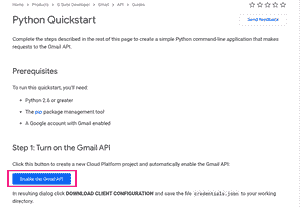
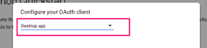

# 用 Python 中的 EZGmail 模块处理邮件

> 原文:[https://www . geesforgeks . org/处理邮件-带-ezgmail-模块-in-python/](https://www.geeksforgeeks.org/handling-mails-with-ezgmail-module-in-python/)

**EZGmail** 是一个 Python 模块，可以通过 Gmail 收发邮件。它工作在官方 Gmail 应用编程接口之上。虽然 EZGmail 没有涵盖 Gmail 应用编程接口可以完成的所有任务，但它使普通任务变得非常简单，而使用谷歌自己的应用编程接口则复杂得多。在本文中，我们将了解如何使用该模块发送、搜索、阅读电子邮件和下载附件。

#### **安装**

该模块没有预装 Python。要安装它，请在终端中键入以下命令。

```
pip install EZGmail

```

### **启用 Gmail 应用编程接口**

首先，我们需要从官方网站启用 Gmail API。前往谷歌开发者官方网站[https://developers.google.com/gmail/api/quickstart/python](https://developers.google.com/gmail/api/quickstart/python)，按照以下步骤操作。

*   点击 ***启用 Gmail 应用编程接口*** 按钮。

[](https://media.geeksforgeeks.org/wp-content/uploads/20200610172632/Screenshot20200610at51707PM-300x208.png)

*   选择 ***桌面应用*** 作为 OAuth 客户端。

[](https://media.geeksforgeeks.org/wp-content/uploads/20200610200807/Screenshot20200610at51750PM-300x70.png)

*   接下来，点击 ***下载客户端配置*** 按钮。

[](https://media.geeksforgeeks.org/wp-content/uploads/20200610201035/Screenshot20200610at51827PM-300x81.png)

*   将下载名为***凭证的 *json* 文件。将此文件复制到 Python 的工作目录中。***

### **认证申请**

接下来，我们需要授权我们的程序使用我们的谷歌帐户。该授权过程只需执行一次。

*   从 Python shell 中运行***【ezgmail . init()】***。
*   这将打开一个浏览器窗口，并将我们带到身份验证页面。然后，我们需要选择谷歌帐户，并授权应用程序使用我们的帐户。

设置完成。现在，我们将了解如何使用这个模块。

## **发送邮件**

**send()** 功能用于发送邮件。

> **语法:** ezgmail.send(电子邮件、sub、文本)
> 
> **参数:**
> 
> *   **电子邮件:**收件人的电子邮件地址
> *   **sub :** 电子邮件主题
> *   **正文:**邮件正文

**示例:**

## 蟒蛇 3

```
import ezgmail

email = 'user@email.com'
subject = 'EZGmail Test'
text = 'This is the body of the mail.'
ezgmail.send(email, subject, text)
```

这将从我们选择的 Gmail 帐户向收件人发送电子邮件。

## **阅读邮件**

EZGmail 有 **GmailThread** 对象来表示对话线程，还有 **GmailMessage** *对象来表示单个电子邮件。 *GmailThread* 对象的**消息**属性包含对话线程中每条消息的 *GmailMessage* 对象列表。*

*   **未读():**方法返回未读线程的 *GmailThread* 对象列表。
*   **summary() :** 在线程对象列表上调用时，返回线程中消息的摘要。
*   **消息**:返回 *GmailMessage* 对象列表的 *GmailThread* 对象的属性。每一个都有描述电子邮件的属性，如*主题*、*正文*、*时间戳*、*发送者*和*接收者*
*   ***【最近】)**:返回*最近线程的 GmailThread 对象列表的函数。*最大结果*参数用于设置要显示的最近邮件数量。默认值为 25。

**示例:**

## 蟒蛇 3

```
import ezgmail

# unread emails
unread = ezgmail.unread()

print("Summary: "+str(ezgmail.summary(unread)))
print("The first thread in the list: " + str(unread[0]))
print("The first message in the first thread: " + str(unread[0].messages[0]))

# attributes of the first message
message = unread[0].messages[0]

# subject
print("subject: "+str(message.subject))

# body
print("body: "+str(message.body))

# sender
print("sender: "+str(message.sender))

# timestamp
print("timestamp: "+str(message.timestamp))

# recent emails
recent = ezgmail.recent(maxResults=10)
print("List of recent threads: " + str(recent))
```

## **搜索电子邮件**

我们还可以搜索特定的电子邮件，就像我们在 gmail 搜索框中输入查询一样。**搜索()**函数返回与搜索参数匹配的 *GmailMessage* 对象列表。我们还可以执行特殊的搜索操作，例如:

*   **'发件人:sender@email.com' :** 从特定发件人处获取电子邮件
*   **“主题:Python”:**特定主题的电子邮件
*   **'标签：未读' ：** 未读电子邮件
*   **“有:附件”:**包含附件的电子邮件

**示例:**

## 蟒蛇 3

```
import ezgmail

# searching for specific emails
results = ezgmail.search('geeksforgeeks')
print(results[0])

# special searches
results = ezgmail.search('has:attachment')
print(results[0])
```

## **下载附件**

通过将每个文件的名称传递给 **downloadAttachment()** 函数，可以下载附加到消息的文件。

*   GmailMessage 对象的**附件**属性返回电子邮件附带的文件名称列表。
*   **downloadAttachment()** 方法将这些文件名中的任何一个作为参数，并下载该文件。
*   使用**downloadallatchments()**方法一次下载所有文件。

**示例:**

## 蟒蛇 3

```
import ezgmail

# searching emails
# with attachments
results = ezgmail.search('has:attachment')

# list of attached filenames
files_attached = results[0].messages[0].attachments

# downloading the first file
# in the list
print('Downloading '+files_attached[0])
results[0].messages[0].downloadAttachment(files_attached[0])
```