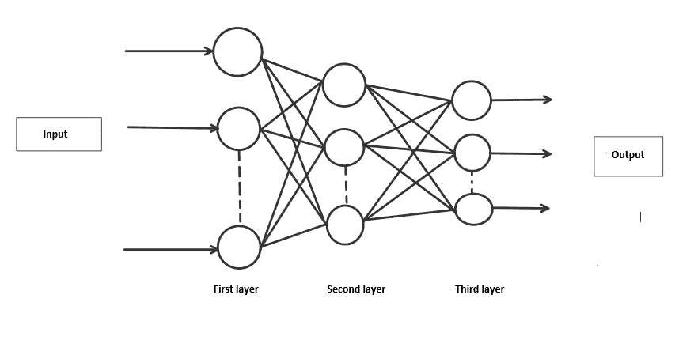

# 利用神经网络进行手写数字识别

> 原文:[https://www . geesforgeks . org/手写数字识别-使用神经网络/](https://www.geeksforgeeks.org/handwritten-digit-recognition-using-neural-network/)

### **简介:**

利用 MNIST 数据集进行手写数字识别是在神经网络帮助下进行的一项重大工程。它基本上检测手写数字的扫描图像。

我们更进一步，我们的手写数字识别系统不仅检测手写数字的扫描图像，还允许在集成图形用户界面的帮助下在屏幕上书写数字进行识别。

### **进场:**

我们将使用三层神经网络来处理这个项目。

*   **输入层:**它将我们示例的特征分布到下一层，用于计算下一层的激活。
*   **隐藏层:**它们由被称为激活的隐藏单元组成，为网络提供非线性联系。根据我们的要求，隐藏层的数量可能会有所不同。
*   **输出层:**这里的节点称为输出单元。它为我们提供了神经网络的最终预测，在此基础上可以做出最终预测。

神经网络是一个受大脑工作原理启发的模型。它由多层组成，有许多激活，这种激活类似于我们大脑的神经元。神经网络试图学习一组数据中的一组参数，这些参数有助于识别潜在的关系。神经网络可以适应不断变化的输入；因此，网络无需重新设计输出标准就能产生最佳结果。

### **方法学:**

我们实现了一个具有 1 个隐藏层的神经网络，该隐藏层具有 *100 个*激活单元(不包括偏置单元)。数据是从*加载的。mat* 文件，特征(X)和标签(y)被提取。然后通过 *255* 对特征进行划分，将它们重新缩放到*【0，1】*的范围内，以避免在计算过程中溢出。数据分为 *6 万*训练和 *1 万*测试示例。使用训练集进行前馈以计算假设，然后进行反向传播以减少层间的误差。正则化参数λ被设置为 0.1，以解决过拟合的问题。优化器运行 70 次迭代以找到最佳模型。



**神经网络的层次**

**注:**

*   保存所有*。py* 文件在同一个目录下。
*   从[https://www.kaggle.com/avnishnish/mnist-original/download](https://www.kaggle.com/avnishnish/mnist-original/download)下载数据集

### **Main.py**

导入所有需要的库，从*文件中提取数据。然后特征和标签将从提取的数据中分离出来。之后，数据将分为训练(60，000)和测试(10，000)示例。在[-0.15，+0.15]范围内随机初始化 Thetas，打破对称性，得到更好的结果。此外，优化器被调用来训练权重，以最小化适当预测的成本函数。我们使用了“*最小化 *scipy.optimize* 库中的*优化器和 *L-BFGS-B* 方法。我们已经计算出测试中，使用“预测”功能的“训练集精度和精确度”。*

## 蟒蛇 3

```py
from scipy.io import loadmat
import numpy as np
from Model import neural_network
from RandInitialize import initialise
from Prediction import predict
from scipy.optimize import minimize

# Loading mat file
data = loadmat('mnist-original.mat')

# Extracting features from mat file
X = data['data']
X = X.transpose()

# Normalizing the data
X = X / 255

# Extracting labels from mat file
y = data['label']
y = y.flatten()

# Splitting data into training set with 60,000 examples
X_train = X[:60000, :]
y_train = y[:60000]

# Splitting data into testing set with 10,000 examples
X_test = X[60000:, :]
y_test = y[60000:]

m = X.shape[0]
input_layer_size = 784  # Images are of (28 X 28) px so there will be 784 features
hidden_layer_size = 100
num_labels = 10  # There are 10 classes [0, 9]

# Randomly initialising Thetas
initial_Theta1 = initialise(hidden_layer_size, input_layer_size)
initial_Theta2 = initialise(num_labels, hidden_layer_size)

# Unrolling parameters into a single column vector
initial_nn_params = np.concatenate((initial_Theta1.flatten(), initial_Theta2.flatten()))
maxiter = 100
lambda_reg = 0.1  # To avoid overfitting
myargs = (input_layer_size, hidden_layer_size, num_labels, X_train, y_train, lambda_reg)

# Calling minimize function to minimize cost function and to train weights
results = minimize(neural_network, x0=initial_nn_params, args=myargs,
          options={'disp': True, 'maxiter': maxiter}, method="L-BFGS-B", jac=True)

nn_params = results["x"]  # Trained Theta is extracted

# Weights are split back to Theta1, Theta2
Theta1 = np.reshape(nn_params[:hidden_layer_size * (input_layer_size + 1)], (
                              hidden_layer_size, input_layer_size + 1))  # shape = (100, 785)
Theta2 = np.reshape(nn_params[hidden_layer_size * (input_layer_size + 1):],
                      (num_labels, hidden_layer_size + 1))  # shape = (10, 101)

# Checking test set accuracy of our model
pred = predict(Theta1, Theta2, X_test)
print('Test Set Accuracy: {:f}'.format((np.mean(pred == y_test) * 100)))

# Checking train set accuracy of our model
pred = predict(Theta1, Theta2, X_train)
print('Training Set Accuracy: {:f}'.format((np.mean(pred == y_train) * 100)))

# Evaluating precision of our model
true_positive = 0
for i in range(len(pred)):
    if pred[i] == y_train[i]:
        true_positive += 1
false_positive = len(y_train) - true_positive
print('Precision =', true_positive/(true_positive + false_positive))

# Saving Thetas in .txt file
np.savetxt('Theta1.txt', Theta1, delimiter=' ')
np.savetxt('Theta2.txt', Theta2, delimiter=' ')
```

### **边缘初始化. py**

它在[-ε，+ε]范围内随机初始化θ。

## 蟒蛇 3

```py
import numpy as np

def initialise(a, b):
    epsilon = 0.15
    c = np.random.rand(a, b + 1) * (
      # Randomly initialises values of thetas between [-epsilon, +epsilon]
      2 * epsilon) - epsilon 
    return c
```

### **Model.py**

该函数执行前馈和反向传播。

*   前向传播:输入数据通过网络向前传送。每个隐藏层接受输入数据，根据激活函数对其进行处理，并将其传递给后续层。我们将使用 sigmoid 函数作为我们的“激活函数”。
*   反向传播:它是基于在前一次迭代中获得的错误率来微调神经网络权重的实践。

它还计算交叉熵成本，用于检查预测值和原始值之间的误差。最后，计算优化目标的梯度。

## 蟒蛇 3

```py
import numpy as np

def neural_network(nn_params, input_layer_size, hidden_layer_size, num_labels, X, y, lamb):
    # Weights are split back to Theta1, Theta2
    Theta1 = np.reshape(nn_params[:hidden_layer_size * (input_layer_size + 1)],
                        (hidden_layer_size, input_layer_size + 1))
    Theta2 = np.reshape(nn_params[hidden_layer_size * (input_layer_size + 1):],
                        (num_labels, hidden_layer_size + 1))

    # Forward propagation
    m = X.shape[0]
    one_matrix = np.ones((m, 1))
    X = np.append(one_matrix, X, axis=1)  # Adding bias unit to first layer
    a1 = X
    z2 = np.dot(X, Theta1.transpose())
    a2 = 1 / (1 + np.exp(-z2))  # Activation for second layer
    one_matrix = np.ones((m, 1))
    a2 = np.append(one_matrix, a2, axis=1)  # Adding bias unit to hidden layer
    z3 = np.dot(a2, Theta2.transpose())
    a3 = 1 / (1 + np.exp(-z3))  # Activation for third layer

    # Changing the y labels into vectors of boolean values.
    # For each label between 0 and 9, there will be a vector of length 10
    # where the ith element will be 1 if the label equals i
    y_vect = np.zeros((m, 10))
    for i in range(m):
        y_vect[i, int(y[i])] = 1

    # Calculating cost function
    J = (1 / m) * (np.sum(np.sum(-y_vect * np.log(a3) - (1 - y_vect) * np.log(1 - a3)))) + (lamb / (2 * m)) * (
                sum(sum(pow(Theta1[:, 1:], 2))) + sum(sum(pow(Theta2[:, 1:], 2))))

    # backprop
    Delta3 = a3 - y_vect
    Delta2 = np.dot(Delta3, Theta2) * a2 * (1 - a2)
    Delta2 = Delta2[:, 1:]

    # gradient
    Theta1[:, 0] = 0
    Theta1_grad = (1 / m) * np.dot(Delta2.transpose(), a1) + (lamb / m) * Theta1
    Theta2[:, 0] = 0
    Theta2_grad = (1 / m) * np.dot(Delta3.transpose(), a2) + (lamb / m) * Theta2
    grad = np.concatenate((Theta1_grad.flatten(), Theta2_grad.flatten()))

    return J, grad
```

### **预测**

它执行前向传播来预测数字。

## 蟒蛇 3

```py
import numpy as np

def predict(Theta1, Theta2, X):
    m = X.shape[0]
    one_matrix = np.ones((m, 1))
    X = np.append(one_matrix, X, axis=1)  # Adding bias unit to first layer
    z2 = np.dot(X, Theta1.transpose())
    a2 = 1 / (1 + np.exp(-z2))  # Activation for second layer
    one_matrix = np.ones((m, 1))
    a2 = np.append(one_matrix, a2, axis=1)  # Adding bias unit to hidden layer
    z3 = np.dot(a2, Theta2.transpose())
    a3 = 1 / (1 + np.exp(-z3))  # Activation for third layer
    p = (np.argmax(a3, axis=1))  # Predicting the class on the basis of max value of hypothesis
    return p
```

### **GUI.py**

它启动了一个用于写数字的图形用户界面。数字的图像在转换为灰度并缩小到 *(28 X 28)* 像素后，存储在同一目录中。

## 蟒蛇 3

```py
from tkinter import *
import numpy as np
from PIL import ImageGrab
from Prediction import predict

window = Tk()
window.title("Handwritten digit recognition")
l1 = Label()

def MyProject():
    global l1

    widget = cv
    # Setting co-ordinates of canvas
    x = window.winfo_rootx() + widget.winfo_x()
    y = window.winfo_rooty() + widget.winfo_y()
    x1 = x + widget.winfo_width()
    y1 = y + widget.winfo_height()

    # Image is captured from canvas and is resized to (28 X 28) px
    img = ImageGrab.grab().crop((x, y, x1, y1)).resize((28, 28))

    # Converting rgb to grayscale image
    img = img.convert('L')

    # Extracting pixel matrix of image and converting it to a vector of (1, 784)
    x = np.asarray(img)
    vec = np.zeros((1, 784))
    k = 0
    for i in range(28):
        for j in range(28):
            vec[0][k] = x[i][j]
            k += 1

    # Loading Thetas
    Theta1 = np.loadtxt('Theta1.txt')
    Theta2 = np.loadtxt('Theta2.txt')

    # Calling function for prediction
    pred = predict(Theta1, Theta2, vec / 255)

    # Displaying the result
    l1 = Label(window, text="Digit = " + str(pred[0]), font=('Algerian', 20))
    l1.place(x=230, y=420)

lastx, lasty = None, None

# Clears the canvas
def clear_widget():
    global cv, l1
    cv.delete("all")
    l1.destroy()

# Activate canvas
def event_activation(event):
    global lastx, lasty
    cv.bind('<B1-Motion>', draw_lines)
    lastx, lasty = event.x, event.y

# To draw on canvas
def draw_lines(event):
    global lastx, lasty
    x, y = event.x, event.y
    cv.create_line((lastx, lasty, x, y), width=30, fill='white', capstyle=ROUND, smooth=TRUE, splinesteps=12)
    lastx, lasty = x, y

# Label
L1 = Label(window, text="Handwritten Digit Recoginition", font=('Algerian', 25), fg="blue")
L1.place(x=35, y=10)

# Button to clear canvas
b1 = Button(window, text="1\. Clear Canvas", font=('Algerian', 15), bg="orange", fg="black", command=clear_widget)
b1.place(x=120, y=370)

# Button to predict digit drawn on canvas
b2 = Button(window, text="2\. Prediction", font=('Algerian', 15), bg="white", fg="red", command=MyProject)
b2.place(x=320, y=370)

# Setting properties of canvas
cv = Canvas(window, width=350, height=290, bg='black')
cv.place(x=120, y=70)

cv.bind('<Button-1>', event_activation)
window.geometry("600x500")
window.mainloop()
```

### **结果:**

> 训练集准确率为 99.44 万%
> 
> 测试集准确率为 97.32 万%
> 
> 精度为 0.9944

### **输出:**

<video class="wp-video-shortcode" id="video-621686-1" width="640" height="360" preload="metadata" controls=""><source type="video/mp4" src="https://media.geeksforgeeks.org/wp-content/uploads/20210720153411/Handwritten-digit-recognition-2021-07-20-15-26-08_Trim.mp4?_=1">[https://media.geeksforgeeks.org/wp-content/uploads/20210720153411/Handwritten-digit-recognition-2021-07-20-15-26-08_Trim.mp4](https://media.geeksforgeeks.org/wp-content/uploads/20210720153411/Handwritten-digit-recognition-2021-07-20-15-26-08_Trim.mp4)</video>

本文由以下作者撰写:

1.  utkarsh shaw(https://auth . geeksforgeeks . org/user/utkarshshaw/profile
2.  塔尼亚([https://auth.geeksforgeeks.org/user/taniachanana02/profile](https://auth.geeksforgeeks.org/user/taniachanana02/profile))
3.  rishab mammgai(https://auth . geeksforgeeks . org/user/rishabmagai/profile