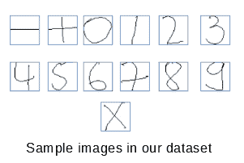
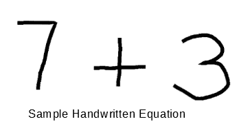
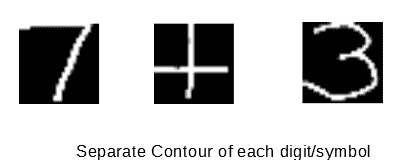

# Python 手写方程求解器

> 原文:[https://www . geesforgeks . org/手写-python 中的方程求解器/](https://www.geeksforgeeks.org/handwritten-equation-solver-in-python/)

**获取训练数据**

*   **下载数据集**

    [link](https://www.kaggle.com/xainano/handwrittenmathsymbols)
    *   **Extracting Features**

    1.  反转图像，然后将其转换为二进制图像，因为当对象为白色，周围为黑色时，轮廓提取会给出最佳结果。
    2.  使用“查找轮廓”功能查找轮廓。对于要素，使用“边界矩形”功能获得轮廓的边界矩形(边界矩形是包围整个轮廓的最小水平矩形)。
    3.  因为我们数据集中的每个图像只包含一个符号/数字，所以我们只需要最大尺寸的边框。为此，我们计算每个轮廓的边界矩形的面积，并选择面积最大的矩形。
    4.  现在，将最大区域边框调整为 28 乘 28。将其重塑为 784 乘 1。所以现在会有 784 像素的值或特征。现在，给它对应的标签(例如，对于 0-9 个图像，与它们的数字相同的标签，对于-分配标签 10，对于+分配标签 11，对于时间分配标签 12)。因此，现在我们的数据集包含 784 个要素列和一个标签列。提取要素后，将数据保存到 CSV 文件中。

    

    **使用卷积神经网络训练数据**

    *   **构建卷积神经网络**

    ```
    import pandas as pd
    import numpy as np
    import pickle
    np.random.seed(1212)
    import keras
    from keras.models import Model
    from keras.layers import * from keras import optimizers
    from keras.layers import Input, Dense
    from keras.models import Sequential
    from keras.layers import Dense
    from keras.layers import Dropout
    from keras.layers import Flatten
    from keras.layers.convolutional import Conv2D
    from keras.layers.convolutional import MaxPooling2D
    from keras.utils import np_utils
    from keras import backend as K
    K.set_image_dim_ordering('th')
    from keras.utils.np_utils import to_categorical
    from keras.models import model_from_json
    ```

    ```
    model = Sequential()
    model.add(Conv2D(30, (5, 5), input_shape =(1, 28, 28), activation ='relu'))
    model.add(MaxPooling2D(pool_size =(2, 2)))
    model.add(Conv2D(15, (3, 3), activation ='relu'))
    model.add(MaxPooling2D(pool_size =(2, 2)))
    model.add(Dropout(0.2))
    model.add(Flatten())
    model.add(Dense(128, activation ='relu'))
    model.add(Dense(50, activation ='relu'))
    model.add(Dense(13, activation ='softmax'))
    # Compile model
    model.compile(loss ='categorical_crossentropy', 
                  optimizer ='adam', metrics =['accuracy'])
    ```

    *   **Fitting Model to Data**

    ```
    model.fit(np.array(l), cat, epochs = 10, batch_size = 200, 
              shuffle = True, verbose = 1)
    ```

    ```
    model_json = model.to_json()
    with open("model_final.json", "w") as json_file:
        json_file.write(model_json)
    # serialize weights to HDF5
    model.save_weights("model_final.h5")
    ```

    **测试我们的模型或使用它求解方程**

    ```
    json_file = open('model_final.json', 'r')
    loaded_model_json = json_file.read()
    json_file.close()
    loaded_model = model_from_json(loaded_model_json)
    # load weights into new model
    loaded_model.load_weights("model_final.h5")
    ```

    *   现在，输入一个包含手写公式的图像。将图像转换为二进制图像，然后反转图像(如果数字/符号为黑色)。*   现在获取图像的轮廓，默认情况下，它会从左到右获取轮廓。*   获取每个轮廓的边框。*   有时，同一数字/符号会有两个或多个轮廓。为了避免这种情况，请检查这两个轮廓的边框是否重叠。如果它们重叠，则丢弃较小的矩形。*   现在，将所有剩余的边框调整为 28 乘 28。*   使用该模型，预测每个边框对应的数字/符号，并将其存储在字符串中。*   After that use ‘eval’ function on the string to solve the equation.

    
    

    [here](https://github.com/vipul79321/Handwritten-Equation-Solver)