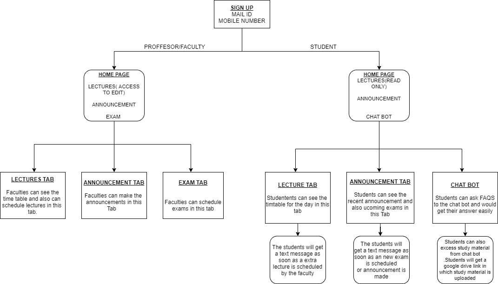
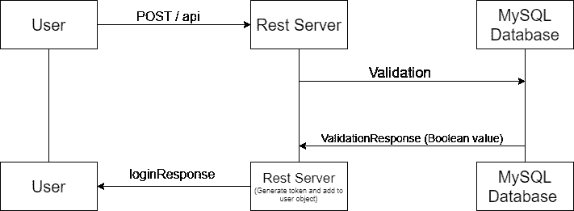
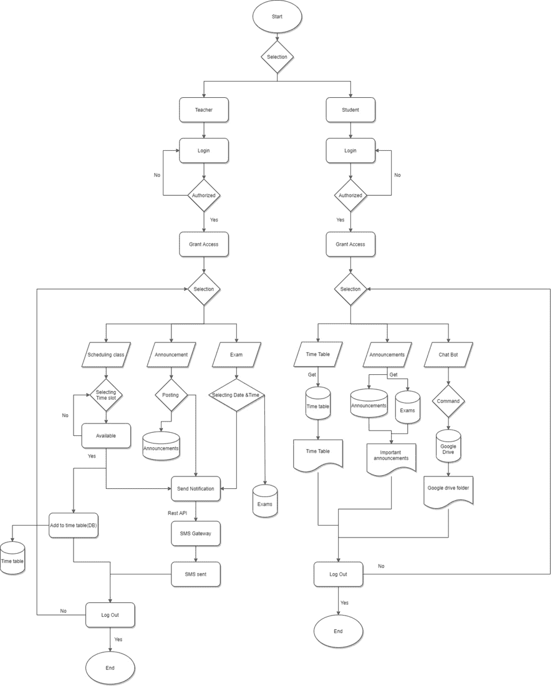
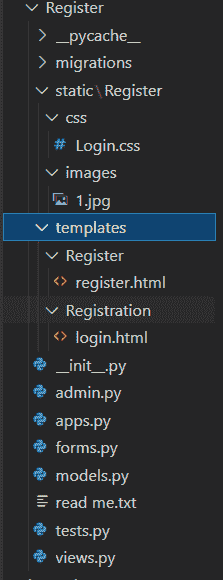

# HAUS Connect–Python 项目

> 原文:[https://www.geeksforgeeks.org/haus-connect-python-project/](https://www.geeksforgeeks.org/haus-connect-python-project/)

大学生面临的最常见的问题之一是，我们的时间表非常不稳定，跟上它们是一项繁琐的任务，这些问题在每个人都独立的疫情时代被极大地放大了。该应用程序的目的是帮助学生跟踪他们的课程、考试和作业，并帮助简化教师和学生之间的交流。HAUS-Connect 是一个平台，学院的教职员工可以在这里安排或重新安排会议或讲座，他们还可以设置考试提醒和上传学习材料。聊天机器人将帮助寻找学习材料。基本上，我们希望确保没有人错过任何截止日期。目前，这是针对大学生的，但它的多功能性是巨大的，它可以大规模用于整个企业的通信，一个管理休假、休假余额、待处理工作等的单一系统。

## 特征

*   录制讲座链接，。ppt 文件、参考书 pdf 可由教职员工上传。
*   时间表修改权限将只提供给教员。
*   将提供一个疑问区，学生必须上传他的疑问图片并选择主题，教师屏幕上将弹出一条消息，他还可以发送解决方案。
*   聊天机器人将帮助寻找学习材料
*   如果教师重新安排了一个特定的会议，一条短信和电子邮件将直接发送给所有的学生。

## 使用的工具:

### 客户端:

*   超文本标记语言
*   半铸钢ˌ钢性铸铁(Cast Semi-Steel)
*   java 描述语言

### 服务器端:

*   MySQL 数据库
*   计算机编程语言
*   短信接口
*   Django

## 说明图



说明图

## 登录图



登录图

## 代码流



代码流

## 逐步实施

**广播台:**这是包含主项目文件的文件夹。

### [**设置**](https://www.geeksforgeeks.org/django-settings-file-step-by-step-explanation/)

这个文件声明了所有的依赖关系和其他设置。

## 蟒蛇 3

```py
from pathlib import Path
import os

# Build paths inside the project like this:
# BASE_DIR / 'subdir'.
BASE_DIR = Path(__file__).resolve().parent.parent

# SECURITY WARNING: keep the secret key used in 
# production secret!
SECRET_KEY = 'django-insecure-lzy=xp#!(0e-h9+%u!dsj$m4-2+=j7r$5hsb((@7ziv2g=dgbt'

# SECURITY WARNING: don't run with debug turned
# on in production!
DEBUG = True

ALLOWED_HOSTS = []

# Application definition
INSTALLED_APPS = [
    'django.contrib.admin',
    'django.contrib.auth',
    'django.contrib.contenttypes',
    'django.contrib.sessions',
    'django.contrib.messages',
    'django.contrib.staticfiles',
    'Teacher.apps.TeacherConfig',
    'Student.apps.StudentConfig',
    'Register.apps.RegisterConfig',
    'crispy_forms',
]

MIDDLEWARE = [
    'django.middleware.security.SecurityMiddleware',
    'django.contrib.sessions.middleware.SessionMiddleware',
    'django.middleware.common.CommonMiddleware',
    'django.middleware.csrf.CsrfViewMiddleware',
    'django.contrib.auth.middleware.AuthenticationMiddleware',
    'django.contrib.messages.middleware.MessageMiddleware',
    'django.middleware.clickjacking.XFrameOptionsMiddleware',
]

ROOT_URLCONF = 'broadcaster.urls'

TEMPLATES = [
    {
        'BACKEND': 'django.template.backends.django.DjangoTemplates',
        'DIRS': [],
        'APP_DIRS': True,
        'OPTIONS': {
            'context_processors': [
                'django.template.context_processors.debug',
                'django.template.context_processors.request',
                'django.contrib.auth.context_processors.auth',
                'django.contrib.messages.context_processors.messages',
            ],
        },
    },
]

WSGI_APPLICATION = 'broadcaster.wsgi.application'

# Database
DATABASES = {
    'default': {
        'ENGINE': 'django.db.backends.sqlite3',
        'NAME': BASE_DIR / 'db.sqlite3',
    }
}

# Password validation
AUTH_PASSWORD_VALIDATORS = [
    {
        'NAME': 'django.contrib.auth.password_validation.\
        UserAttributeSimilarityValidator',
    },
    {
        'NAME': 'django.contrib.auth.password_validation.\
        MinimumLengthValidator',
    },
    {
        'NAME': 'django.contrib.auth.password_validation.\
        CommonPasswordValidator',
    },
    {
        'NAME': 'django.contrib.auth.password_validation.\
        NumericPasswordValidator',
    },
]

# Internationalization
LANGUAGE_CODE = 'en-us'

TIME_ZONE = 'UTC'

USE_I18N = True

USE_L10N = True

USE_TZ = True

# Static files (CSS, JavaScript, Images)
STATIC_URL = '/static/'
STATIC_ROOT = os.path.join(BASE_DIR, 'static')

CRISPY_TEMPLATE_PACK = "bootstrap4"

LOGIN_REDIRECT_URL = "/"

# Default primary key field type
DEFAULT_AUTO_FIELD = 'django.db.models.BigAutoField'
```

### [**URL . py**](https://www.geeksforgeeks.org/django-url-patterns-python/)

该文件将不同依赖项和其他应用程序的网址链接到主项目。

## 蟒蛇 3

```py
from django.contrib import admin
from django.urls import path, include
from Register import views as v

urlpatterns = [
    path('admin/', admin.site.urls),
    path('', include("Teacher.urls")),
    path('', include("Student.urls")),
    path('register/', v.register, name="register"),
    path("", include("django.contrib.auth.urls")),

]
```

现在让我们创建项目所需的应用程序。

## 注册应用程序

这个应用程序处理用户的登录和注册。



寄存器层次结构

**注意:**静态文件夹包含所有静态文件，如 JavaScript 文件、CSS 文件和图像

### 模板文件夹

您可以看到有一个包含两个 HTML 文件的模板文件夹。第一个文件是 register.html，第二个文件是 login.html

## 超文本标记语言

```py
<!-- Register -->


<!DOCTYPE html>
<html>
<head>
    <title>Login/SignUp</title>
    <link rel="stylesheet" type="text/css" href="">
<link href="https://fonts.googleapis.com/css2?family=Jost:wght@500&display=swap" rel="stylesheet">
</head>

    <body>
    <div class="main">     
    <input type="checkbox" id="chk" aria-hidden="true">

        <div class="signup">

        <form method="post" class="form-group">
            
            <label for="chk" aria-hidden="true">Sign up</label>
                    <div class="input">
                        {{form.username}}
                    </div>
                    <div class="input">
                        {{form.email}}
                    </div>
                    <div class="input">
                        {{form.password1}}
                    </div>
                    <div class="input">
                        {{form.password2}}
                    </div>

            <button type="submit" class="btn btn-success"> Register </button>
        </form>
        <div class="error">
            {{form.errors}}
        </div>

        </div>
        <style>
            .main{
        width: 350px;
        height: 500px;
        background:red;
        overflow: hidden;
        background: url("") no-repeat center/ cover;
        border-radius: 10px;
        box-shadow: 5px 20px 50px #000;
    }
    .error{
        color:#ffffff;
        align-items: center;
    }
        </style>

        <script>

            var form_fields = document.getElementsByTagName('input')
            form_fields[2].placeholder='Username..';
            form_fields[3].placeholder='Email..';
            form_fields[4].placeholder='Enter password...';
            form_fields[5].placeholder='Re-enter Password...';

        </script>
      </div>
    </body>
</html>
```