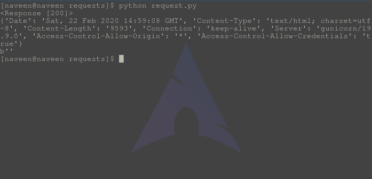

# HEAD 方法–Python 请求

> 原文:[https://www.geeksforgeeks.org/head-method-python-requests/](https://www.geeksforgeeks.org/head-method-python-requests/)

请求库是 Python 向指定网址发出 HTTP 请求的重要方面之一。本文围绕如何使用 **requests.head()** 方法向指定的网址发出 HEAD 请求展开。在检查 HEAD 方法之前，让我们弄清楚什么是 Http HEAD 请求–

#### HEAD Http 方法

HEAD 是万维网使用的 HTTP 支持的请求方法。HEAD 方法要求一个与 GET 请求相同的响应，但是没有响应体。这对于检索写在响应头中的元信息非常有用，而不必传输整个内容。

#### 如何通过 Python 请求发出 HEAD 请求

Python 的请求模块提供了一个名为 **head()** 的内置方法，用于向指定的 URI 发出 head 请求。

**语法–**

```py
requests.head(url, params={key: value}, args)

```

**示例–**

出于示例目的，让我们尝试向 httpbin 的 API 发出请求。

## 蟒蛇 3

```py
import requests

# Making a HEAD request
r = requests.head('https://httpbin.org/', data ={'key':'value'})

# check status code for response received
# success code - 200
print(r)

# print headers of request
print(r.headers)

# checking if request contains any content
print(r.content)
```

save this file as request.py and through terminal run,

```py
python request.py
```

**输出–**



#### 带有 HEAD 请求的高级

响应 HEAD 请求的 HTTP 头中包含的元信息应该与响应 GET 请求发送的信息相同。此方法可用于获取请求所暗示的实体的元信息，而无需传输实体主体本身。这种方法通常用于测试超文本链接的有效性、可访问性和最近的修改。

对 HEAD 请求的响应可以是可缓存的，因为包含在响应中的信息可以用于从该资源更新先前缓存的实体。如果新字段值指示缓存实体不同于当前实体(如内容长度、内容 MD5、ETag 或上次修改的变化所示)，则缓存必须将缓存条目视为过时。