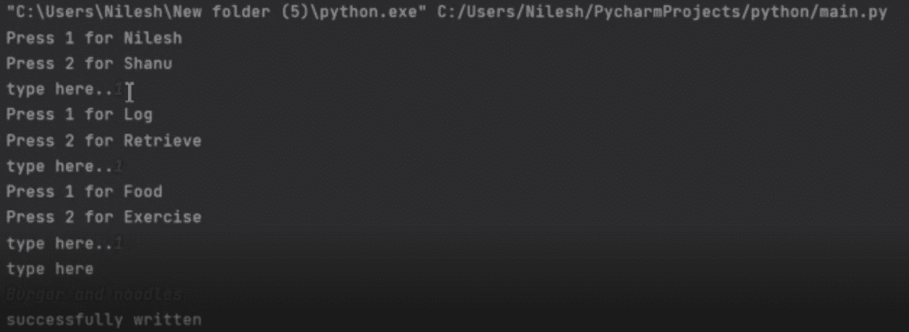

# 使用 Python 的健康管理系统

> 原文:[https://www . geesforgeks . org/health-management-system-use-python/](https://www.geeksforgeeks.org/health-management-system-using-python/)

有时候我们太忙了，以至于我们甚至不能关心我们的身体，我们所说的关心是指健身、食物、锻炼等等，然后我们认为我们需要制定我们的饮食计划或锻炼计划来保持我们的身体。所以让我们制作一个 Python 脚本来为我们维护这个记录。在这个程序中，我们添加我们的饮食和我们需要做的运动，或者我们可以保存我们的日常饮食或运动与日期和时间，以保持记录。这也有助于我们制定另一个健身计划。

在这个程序中，用户输入他们的饮食和锻炼，然后我们保存输入的日期和时间，这样每当用户想要的时候，他们就可以看到他们的日常生活。以下操作将在此下执行:

*   获取日期（）
*   selectname()
*   选择文件操作()
*   select_task()
*   行动()

**进场:**

*   **getdate():** 跟踪数据的日期，以便日志检索有意义

## 蟒蛇 3

```py
def getdate():

    # to get date and time
    return datetime.datetime.now()
```

*   **选择名称():**该功能允许用户选择需要执行任务的人员。这个函数首先给出两个人之间的选择，并将输入作为一个整数。然后，它被返回进行进一步处理。

## 蟒蛇 3

```py
def selectname():

    name = {1: "Nilesh", 2: "Shanu"}
    b = {1: "Food", 2: "Exercise"}

    for key, value in name.items():

        # taking input of name
        print("Press", key, "for", value, "\n", end="")

    n = int(input("type here.."))

    if n > 2:
        print("error select 1 or 2")
        exit()
    else:
        return n
```

*   **select_file_action():** 这个函数接受应该对文件做什么，即文件应该用于写入数据(日志)还是检索现有数据。这再次采用整数参数并返回它们。

## 蟒蛇 3

```py
def select_file_action():

    a = {1: "Log", 2: "Retrieve"}
    for key, value in a.items():

        # taking input of function that user wants to
        # do (either log or retrieve)
        print("Press", key, "for", value, "\n", end="")

    x = int(input("type here.."))
    if x > 2:
        print("error select 1 or 2")
        exit()
    else:
        return x
```

*   **select_task():** 此功能有助于指定与必须输入的任务相关的数据。这里给出的选择是在食物和运动之间。这再次接受整数输入，并将其返回进行进一步处理。

## 蟒蛇 3

```py
def select_task():

    b = {1: "Food", 2: "Exercise"}

    for key, value in b.items():

        # ask user to choose between food and exercise
        print("Press", key, "for", value, "\n", end="")

    y = int(input("type here.."))
    if y > 2:
        print("error select 1 or 2")
        exit()
    else:
        return y
```

*   **动作():**通过条件检查，根据上述功能返回的输入执行适当的任务。

## 蟒蛇 3

```py
def action(n, x, y):

    # condition no 1
    if n == 1 and x == 1 and y == 1:
        value = input("type here\n")

        with open("nilesh food.txt", "a") as nileshfood:

            # printing date and time
            nileshfood.write(str([str(getdate())]) + ": " + value + "\n")
            print("successfully written")

    # condition no 2
    elif n == 1 and x == 1 and y == 2:

        value = input("type here\n")

        # printing date and time
        with open("nilesh exercise.txt", "a") as nileshexercise:

            # printing date and time
            nileshexercise.write(str([str(getdate())]) + ": " + value + "\n")
            print("successfully written")

    # condition 3
    elif n == 2 and x == 1 and y == 1:

        value = input("type here\n")

        # printing date and time
        with open("shanu food.txt", "a") as shanufood:

            # printing date and time
            shanufood.write(str([str(getdate())]) + ": " + value + "\n")
            print("successfully written")

    # condition 4
    elif n == 2 and x == 1 and y == 2:

        value = input("type here\n")

        # printing date and time
        with open("shanu exercise.txt", "a") as shanuexercise:

            # printing date and time
            shanuexercise.write(str([str(getdate())]) + ": " + value + "\n")
            print("successfully written")

    # condition 5
    elif n == 1 and x == 2 and y == 1:

        # printing date and time
        with open("nilesh food.txt", "r") as nileshfood:

            a = nileshfood.read()
            print(a)

    # condition no 6
    elif n == 1 and x == 2 and y == 2:

        # printing date and time
        with open("nilesh exercise.txt", "r") as nileshexercise:

            a = nileshexercise.read()
            print(a)

    # condition no 7
    elif n == 2 and x == 2 and y == 1:

        # printing date and time
        with open("shanu food.txt", "r") as shanufood:

            a = shanufood.read()
            print(a)

    # condition no 8
    elif n == 2 and x == 2 and y == 2:

        # printing date and time
        with open("shanu exercise.txt", "r") as shanuexercise:

            a = shanuexercise.read()
            print(a)
```

下面是一个完整的实现。

## 计算机编程语言

```py
import datetime

def getdate():

    # to get date and time
    return datetime.datetime.now()

def selectname():

    name = {1: "Nilesh", 2: "Shanu"}
    b = {1: "Food", 2: "Exercise"}

    for key, value in name.items():

        # taking input of name
        print("Press", key, "for", value, "\n", end="")

    n = int(input("type here.."))

    if n > 2:
        print("error select 1 or 2")
        exit()
    else:
        return n

def select_file_action():

    a = {1: "Log", 2: "Retrieve"}

    for key, value in a.items():

        # taking input of function that user wants to
        # do (either log or retrieve)
        print("Press", key, "for", value, "\n", end="")

    x = int(input("type here.."))

    if x > 2:
        print("error select 1 or 2")
        exit()
    else:
        return x

def select_task():

    b = {1: "Food", 2: "Exercise"}

    for key, value in b.items():

        # ask user to choose between food 
        # and exercise
        print("Press", key, "for", value, "\n", end="")

    y = int(input("type here.."))

    if y > 2:
        print("error select 1 or 2")
        exit()
    else:
        return y

def action(n, x, y):

    # condition no 1
    if n == 1 and x == 1 and y == 1:
        value = input("type here\n")

        with open("nilesh food.txt", "a") as nileshfood:

            # printing date and time
            nileshfood.write(str([str(getdate())]) + ": " + value + "\n")
            print("successfully written")

    # condition no 2
    elif n == 1 and x == 1 and y == 2:
        value = input("type here\n")

        # printing date and time
        with open("nilesh exercise.txt", "a") as nileshexercise:

            # printing date and time
            nileshexercise.write(str([str(getdate())]) + ": " + value + "\n")
            print("successfully written")

    # condition 3
    elif n == 2 and x == 1 and y == 1:
        value = input("type here\n")

        # printing date and time
        with open("shanu food.txt", "a") as shanufood:

            # printing date and time
            shanufood.write(str([str(getdate())]) + ": " + value + "\n")
            print("successfully written")

    # condition 4
    elif n == 2 and x == 1 and y == 2:
        value = input("type here\n")

        # printing date and time
        with open("shanu exercise.txt", "a") as shanuexercise:

            # printing date and time
            shanuexercise.write(str([str(getdate())]) + ": " + value + "\n")
            print("successfully written")

    # condition 5
    elif n == 1 and x == 2 and y == 1:

        # printing date and time
        with open("nilesh food.txt", "r") as nileshfood:
            a = nileshfood.read()
            print(a)

    # condition no 6
    elif n == 1 and x == 2 and y == 2:

        # printing date and time
        with open("nilesh exercise.txt", "r") as nileshexercise:
            a = nileshexercise.read()
            print(a)

    # condition no 7
    elif n == 2 and x == 2 and y == 1:

        # printing date and time
        with open("shanu food.txt", "r") as shanufood:
            a = shanufood.read()
            print(a)

    # condition no 8
    elif n == 2 and x == 2 and y == 2:

        # printing date and time
        with open("shanu exercise.txt", "r") as shanuexercise:
            a = shanuexercise.read()
            print(a)

n = selectname()
x = select_file_action()
y = select_task()
action(n, x, y)
```

**输出:**



<video class="wp-video-shortcode" id="video-583276-1" width="640" height="360" preload="metadata" controls=""><source type="video/mp4" src="https://media.geeksforgeeks.org/wp-content/uploads/20210401092452/output.mp4?_=1">[https://media.geeksforgeeks.org/wp-content/uploads/20210401092452/output.mp4](https://media.geeksforgeeks.org/wp-content/uploads/20210401092452/output.mp4)</video>