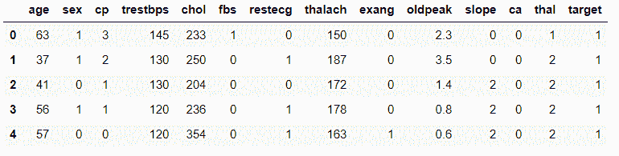
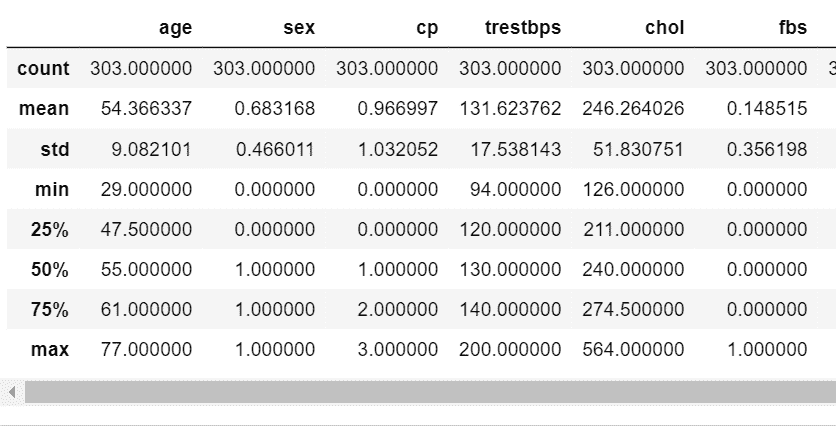
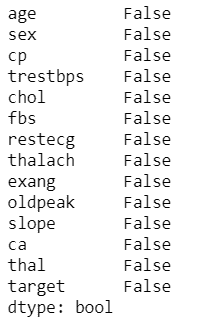
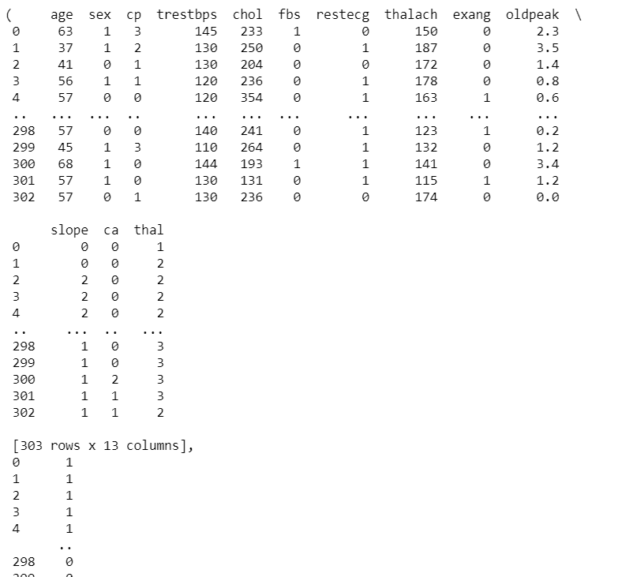
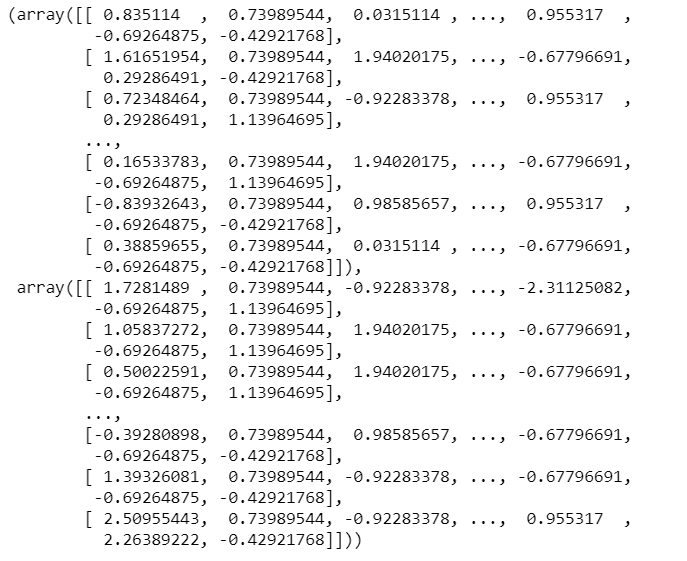
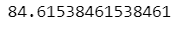

# 使用人工神经网络预测心脏病

> 原文:[https://www . geesforgeks . org/heart-disease-prediction-use-ann/](https://www.geeksforgeeks.org/heart-disease-prediction-using-ann/)

深度学习是一种模仿人脑的技术，它像人脑一样由多层神经元组成。如此形成的网络由输入层、输出层和一个或多个隐藏层组成。网络试图从输入的数据中学习，然后据此进行预测。最基本的神经网络是人工神经网络。人工神经网络没有任何特殊的结构，它只是由用于预测的多个神经层组成。
我们用 ANN 建立一个预测一个人是否有心脏病的模型。

**关于数据:**
在数据集中，我们有 *13* 列，其中我们被赋予了不同的属性，如性别、年龄、胆固醇水平等。给我们一个目标栏，告诉我们这个人是否有心脏病。我们将保留所有列作为独立变量，而不是目标列，因为它将是我们的因变量。我们将建立一个人工神经网络来预测一个人是否患有心脏病，并给出这个人的其他特征。

你可以在这里找到数据集[心脏病数据集](https://archive.ics.uci.edu/ml/datasets/Heart+Disease)

**Code: Importing Libraries**

```
import tensorflow as tf
import pandas as pd
import numpy as np
import matplotlib.pyplot as plt
import keras
from keras.models import Sequential
from keras.layers import Dense
from sklearn.metrics import confusion_matrix
```

**代码:导入数据集**

```
data = pd.read_csv('heart.csv')
data.head()
```



**数据描述:**

```
data.describe()
```



**代码:检查空值**

```
data.isnull().any()
```


**分配因变量和自变量**

```
X = data.iloc[:,:13].values
y = data["target"].values
```



**编码:将数据拆分为训练和测试数据集**

```
X_train,X_test,y_train, y_test = train_test_split(X,y,test_size = 0.3 , random_state = 0 )
```

**代码:缩放数据。**

```
from sklearn.preprocessing import StandardScaler
sc = StandardScaler()
X_train = sc.fit_transform(X_train)
X_test = sc.transform(X_test)
```


**代码:建立模型**

```
classifier = Sequential()
classifier.add(Dense(activation = "relu", input_dim = 13, 
                     units = 8, kernel_initializer = "uniform"))
classifier.add(Dense(activation = "relu", units = 14, 
                     kernel_initializer = "uniform"))
classifier.add(Dense(activation = "sigmoid", units = 1, 
                     kernel_initializer = "uniform"))
classifier.compile(optimizer = 'adam' , loss = 'binary_crossentropy', 
                   metrics = ['accuracy'] )
```

**代码:拟合模型**

```
classifier.fit(X_train , y_train , batch_size = 8 ,epochs = 100  )
```


**代码:执行预测和重新缩放**

```
y_pred = classifier.predict(X_test)
y_pred = (y_pred > 0.5)
```

**代码:混淆矩阵**

```
cm = confusion_matrix(y_test,y_pred)
cm
```


**代码:精度**

```
accuracy = (cm[0][0]+cm[1][1])/(cm[0][1] + cm[1][0] +cm[0][0] +cm[1][1])
print(accuracy*100)
```


我们将获得大约 85%的准确率。