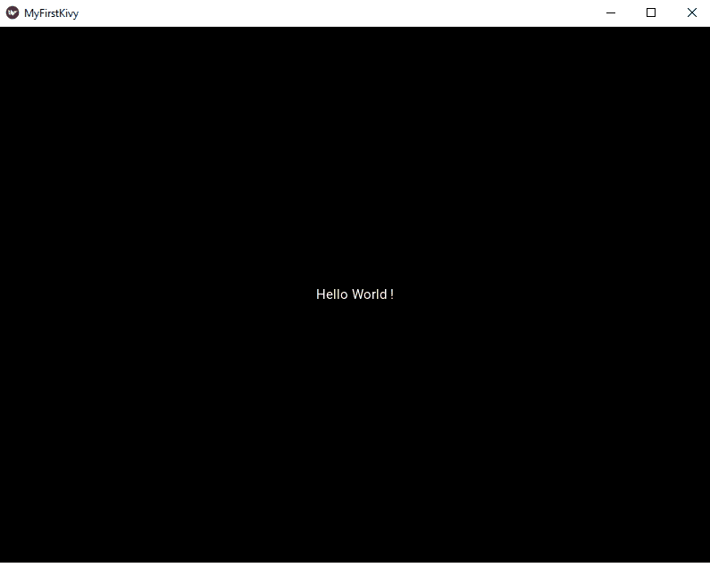

# 基维的 Hello World

> 原文:[https://www.geeksforgeeks.org/hello-world-in-kivy/](https://www.geeksforgeeks.org/hello-world-in-kivy/)

Kivy 是一个开源的 Python 多平台 GUI 开发库，可以在 iOS、Android、Windows、OS X 和 GNU/Linux 上运行。它有助于开发利用创新的多点触控用户界面的应用程序。Kivy 背后的基本思想是使开发人员能够一次构建一个应用程序，并在所有设备上使用它，使代码可重用和可部署，从而实现快速简单的交互设计和快速原型制作。

**注意:**由于 Kivy 基于 [Python](https://www.geeksforgeeks.org/python-programming-language/) ，所以 Python 是安装 Kivy 的前提。更多信息请参考 [Python 编程语言](https://www.geeksforgeeks.org/python-programming-language/)。

#### 装置

根据您的操作系统，有几种方法可以将 Kivy 安装到您的系统中。让我们深入研究一下。
**视窗操作系统**

*   **使用画中画**

    ```
    pip install kivy
    ```

*   **使用 conda**

    ```
    conda install -c conda-forge kivy
    ```

Linux

*   **使用以下命令添加 PPA:**

    ```
    sudo add-apt-repository ppa:kivy-team/kivy
    ```

*   **使用您的套餐管理器更新您的套餐列表-**

    ```
    sudo apt-get update
    ```

*   **安装 Kivy**

    ```
    sudo apt-get install python3-kivy
    ```

**OS X**

*   **使用轮子**
    轮子是为您所在的特定平台预编译的二进制文件。在 osx 上使用轮子安装 Kivy 只需要

    ```
    $ python -m pip install kivy
    ```

## 基维的你好世界

*   让我们创建一个 Python 文件，即扩展名为`.py`的文件。
*   首先，让我们导入 kivy 并确保它是最新的。

    ```
    import kivy

    # Replace this with your 
    # current version
    kivy.require('1.11.1')   
    # To find your kivy version use,
    # print(kivy.__version__)

    ```

*   现在要创建 Kivy 接口，我们需要在程序中使用以下代码导入 Kivy App 模块:

    ```
    from kivy.app import App

    ```

*   现在从`kivy.uix.label`

    ```
    from kivy.uix.label import Label

    ```

    导入标签
*   现在让我们写打印 Hello World 的主块，终于耶！！

    ```
    class MyFirstKivyApp(App):
        def build(self):
            return Label(text ="Hello World !")

    ```

**完成程序**

```
import kivy
from kivy.app import App
from kivy.uix.label import Label

# Replace this with your 
# current version
kivy.require('1.11.1')  

# Defining a class
class MyFirstKivyApp(App):

    # Function that returns 
    # the root widget
    def build(self):

        # Label with text Hello World is 
        # returned as root widget
        return Label(text ="Hello World !")          

# Here our class is initialized
# and its run() method is called. 
# This initializes and starts 
# our Kivy application.
MyFirstKivyApp().run()               
```

**输出:**

