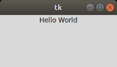

# Tkinter 的 Hello World

> 原文:[https://www.geeksforgeeks.org/hello-world-in-tkinter/](https://www.geeksforgeeks.org/hello-world-in-tkinter/)

**[【Tkinter】](https://www.geeksforgeeks.org/python-gui-tkinter/)**是构建到 Python 标准库中的 Python *GUI 框架*。在所有的图形用户界面方法中，tkinter 是最常用的方法，因为它提供了创建图形用户界面应用程序的最快和最简单的方法。

## 在 Tkinter 创建你好世界计划

让我们从“你好世界”教程开始。以下是 tkinter 中第一个程序的解释:

*   ```
    from tkinter import *
    ```

    在 Python3 中，我们首先从 tkinter 包中导入所有的类、函数和变量。

*   ```
    root=Tk()
    ```

    现在我们通过调用`Tk()`来创建一个根小部件。这将自动创建一个带有标题栏、最小化、最大化和关闭按钮的图形窗口。这个手柄允许我们将内容放入窗口，并根据需要重新配置。

*   ```
    a = Label(root, text="Hello, world!")
    ```

    现在我们创建一个标签小部件作为根窗口的子窗口。这里 root 是我们标签小部件的父级。我们将默认文本设置为“你好，世界！”

    **注意:**这将显示在窗口中。一个**标签**小部件可以显示文本、图标或其他图像。

*   ```
    a.pack()
    ```

    接下来，我们在这个小部件上调用 **pack()** 方法。这告诉它调整自己的大小以适应给定的文本，并使自己可见。它只是告诉几何管理器将小部件放在同一行或同一列中。如果您只想显示一个或几个小部件，它通常是最容易使用的。

*   ```
    root.mainloop()
    ```

    在进入主循环之前，应用程序窗口不会出现。这个方法表示获取我们创建的所有小部件和对象，在我们的屏幕上呈现它们，并响应任何交互。程序一直循环，直到我们关闭窗口。

下面是实现。

```
# Python tkinter hello world program

from tkinter import *

root = Tk()
a = Label(root, text ="Hello World")
a.pack()

root.mainloop()
```

**输出:**

