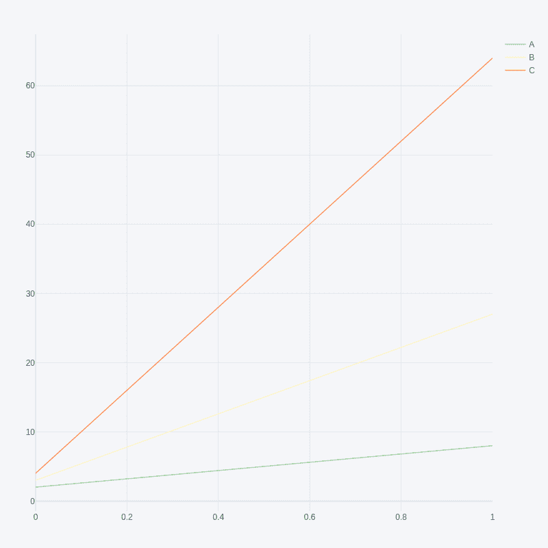
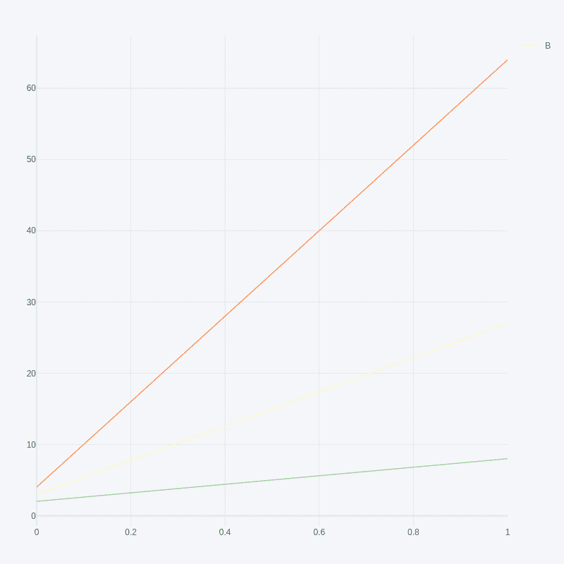

# 在 Python 中的一个情节图中隐藏图例条目

> 原文:[https://www . geesforgeks . org/hide-legend-entries-in-a-plot-in-figure-python/](https://www.geeksforgeeks.org/hide-legend-entries-in-a-plotly-figure-in-python/)

在本文中，我们将看到如何使用 Python 在一个情节图中隐藏图例条目。

**下图显示了没有隐藏图例条目的图:**



## **方法 1:通过**轨迹**的名称设置 showlegend 属性**

在这里，我们将设置 showlegend 属性，以删除图形中的图例条目。

## 蟒蛇 3

```
import pandas as pd
import plotly.offline as py
import plotly.graph_objs as go
import cufflinks as cf
cf.go_offline()

df = pd.DataFrame(data=[[2, 3, 4], [8, 27, 64]],
                  columns=['A', 'B', 'C'])

# get figure property
fig = df.iplot(kind='scatter', asFigure=True)

# set showlegend property by name of trace
for trace in fig['data']:
    if(trace['name'] != 'B'):
        trace['showlegend'] = False

# generate webpage
py.plot(fig)
```

**输出:**



## **方法二:使用****更新功能，**删除**所有条目**

在这里，我们将使用更新功能删除所有条目

## 蟒蛇 3

```
import pandas as pd
import plotly.offline as py
import plotly.graph_objs as go
import cufflinks as cf
cf.go_offline()

df = pd.DataFrame(data=[[2, 3, 4], [8, 27, 64]], 
                  columns=['A', 'B', 'C'])

# get figure property
fig = df.iplot(kind='scatter', asFigure=True)

# set layout_showlegend=False
fig.update(layout_showlegend=False)

# generate webpage
py.plot(fig)
```

**输出:**

