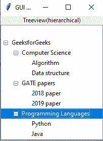

# Python GUI 应用中的层次树视图

> 原文:[https://www . geesforgeks . org/hierarchy-treeview-in-python-GUI-application/](https://www.geeksforgeeks.org/hierarchical-treeview-in-python-gui-application/)

Python 使用不同的图形用户界面应用程序，这些应用程序在与用户使用的应用程序交互时对用户有所帮助。python 基本上使用三个图形用户界面，即*Tkit、wxPython 和 PyQt* 。所有这些都可以在 windows、Linux 和 mac-OS 上运行。然而，这些图形用户界面应用程序有许多小部件，即有助于用户与应用程序交互的控件。一些小部件是按钮、列表框、滚动条、树视图等。
**注:**更多信息请参考[Python GUI–tkinter](https://www.geeksforgeeks.org/python-gui-tkinter/)

## Treeview 小部件

这个小部件有助于可视化和允许在项目层次结构上导航。它可以显示层次结构中每个项目的多个特征。它可以像在 Windows 资源管理器中一样构建一个树形视图作为用户界面。因此，这里我们将使用 Tkinter，以便在 Python GUI 应用程序中构建一个分层的树视图。
*我们来看一个在 Python GUI 应用程序中构建**层次树视图的例子。***

图形用户界面如下所示:



**例:**

## 计算机编程语言

```py
# Python program to illustrate the usage
# of hierarchical treeview in python GUI
# application using tkinter

# Importing tkinter
from tkinter import * 

# Importing ttk from tkinter
from tkinter import ttk 

# Creating app window
app = Tk() 

# Defining title of the app
app.title("GUI Application of Python") 

# Defining label of the app and calling a geometry
# management method i.e, pack in order to organize
# widgets in form of blocks before locating them
# in the parent widget
ttk.Label(app, text ="Treeview(hierarchical)").pack()

# Creating treeview window
treeview = ttk.Treeview(app) 

# Calling pack method on the treeview
treeview.pack() 

# Inserting items to the treeview
# Inserting parent
treeview.insert('', '0', 'item1',
                text ='GeeksforGeeks')

# Inserting child
treeview.insert('', '1', 'item2',
                text ='Computer Science')
treeview.insert('', '2', 'item3',
                text ='GATE papers')
treeview.insert('', 'end', 'item4',
                text ='Programming Languages')

# Inserting more than one attribute of an item
treeview.insert('item2', 'end', 'Algorithm',
                text ='Algorithm') 
treeview.insert('item2', 'end', 'Data structure',
                text ='Data structure')
treeview.insert('item3', 'end', '2018 paper',
                text ='2018 paper') 
treeview.insert('item3', 'end', '2019 paper',
                text ='2019 paper')
treeview.insert('item4', 'end', 'Python',
                text ='Python')
treeview.insert('item4', 'end', 'Java',
                text ='Java')

# Placing each child items in parent widget
treeview.move('item2', 'item1', 'end') 
treeview.move('item3', 'item1', 'end')
treeview.move('item4', 'item1', 'end')

# Calling main() 
app.mainloop()
```

**输出:**

<video class="wp-video-shortcode" id="video-387600-1" width="640" height="360" preload="metadata" controls=""><source type="video/mp4" src="https://media.geeksforgeeks.org/wp-content/uploads/20210116133613/FreeOnlineScreenRecorderProject6.mp4?_=1">[https://media.geeksforgeeks.org/wp-content/uploads/20210116133613/FreeOnlineScreenRecorderProject6.mp4](https://media.geeksforgeeks.org/wp-content/uploads/20210116133613/FreeOnlineScreenRecorderProject6.mp4)</video>

在上面的输出中，创建了一个层次树视图。其中， *GeeksforGeeks* 是以*计算机科学、GATE 论文和编程语言*为子系的家长。所有的孩子都有他们各自的属性。最后，这里调用 move()方法，以便将所有子树连接到父树。