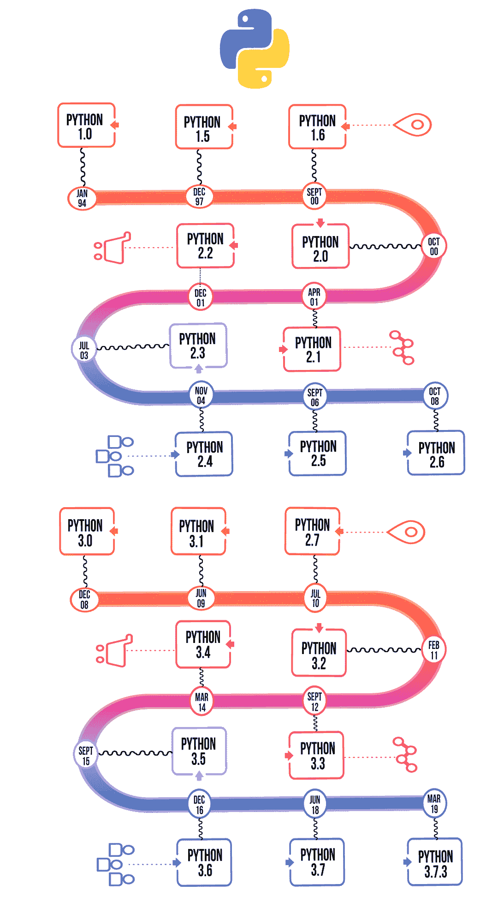

# 蟒蛇历史

> 原文:[https://www.geeksforgeeks.org/history-of-python/](https://www.geeksforgeeks.org/history-of-python/)

[Python](https://www.geeksforgeeks.org/python-programming-language/) 是一种广泛使用的通用高级编程语言。它最初由吉多·范·罗苏姆在 1991 年设计，由 Python 软件基金会开发。它主要是为了强调代码的可读性而开发的，它的语法允许程序员用更少的代码行来表达概念。

**我们再深入挖掘一下–**
上世纪 80 年代末，历史即将书写。那是 Python 工作开始的时候。此后不久，吉多·范·罗松于 1989 年 12 月开始在位于荷兰的 T4 信息中心(CWI)进行基于应用的工作。它最初是作为一个爱好项目开始的，因为他在寻找一个有趣的项目来让他在圣诞节期间保持忙碌。据说 Python 成功的编程语言是 ABC 编程语言，它具有与阿米巴操作系统的接口，并且具有异常处理的特性。在他职业生涯的早期，他已经帮助创建了美国广播公司，他看到了美国广播公司的一些问题，但喜欢大多数功能。在那之后，他做的事情真的非常聪明。他采用了 ABC 的语法，以及它的一些好特性。这也带来了很多抱怨，所以他彻底解决了这些问题，并创建了一个很好的脚本语言，消除了所有的缺陷。这个名字的灵感来自英国广播公司的电视节目——“蒙蒂·蟒蛇的飞行马戏团”，因为他是这个电视节目的忠实粉丝，他也想为他的发明取一个简短、独特和略显神秘的名字，因此他把它命名为蟒蛇！他是“一生的仁慈独裁者”(BDFL)，直到 2018 年 7 月 12 日从领导人的位置上退下来。在相当长的一段时间里，他曾在谷歌工作，但目前，他在 Dropbox 工作。
语言终于在 1991 年发布。当它发布时，它用更少的代码来表达概念，当我们将其与 Java、C++ & C 进行比较时，它的设计理念也相当好。它的主要目标是提供代码可读性和高级开发人员生产力。当它发布时，它有足够的能力为类提供继承、几个核心数据类型异常处理和函数。

以下是不同版本 Python 的插图以及时间线。

**Python 3.7.3 是最新版本。**
使用最多的两个版本已经到了 Python 2.x & 3.x，两者之间竞争非常激烈，而且两者似乎都有相当多不同的粉丝群。

出于各种目的，如开发、脚本编写、生成和软件测试，使用这种语言。由于其优雅和简单，像 Dropbox、谷歌、Quora、Mozilla、惠普、高通、IBM 和思科这样的顶级技术组织已经实现了 Python。

Python 已经走过了漫长的道路，成为世界上最流行的编码语言。Python 刚满 30 岁，但它仍然有那种不为人知的魅力& X 因素，这一点从谷歌用户对 Python 的搜索一直比搜索金·卡戴珊、唐纳德·特朗普、汤姆·克鲁斯等要多得多这一事实就可以清楚地看出。

Python 一直是许多其他编码语言的灵感来源，如 Ruby、Cobra、Boo、CoffeeScript ECMAScript、Groovy、Swift Go、OCaml、Julia 等。