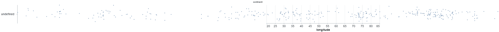

# 使用 Python 中的牛郎星进行抖动的水平剥离

> 原文:[https://www . geeksforgeeks . org/水平-带抖动剥离-使用 python 中的 Altair/](https://www.geeksforgeeks.org/horizontal-stripplot-with-jitter-using-altair-in-python/)

**先决条件:** [牛郎星](https://www.geeksforgeeks.org/introduction-to-altair-in-python/)

Altair 是一个 python 中的统计数据可视化库，它基于 Vega 和 Vega-Lite 可视化语法。剥离物用于图形数据分析。这是一个简单的响应值图，沿着单个轴按排序顺序排列。带状图由两个不同的轴(X，Y)组成。带状图为直方图和其他基于密度的图提供了替代方案，通常用于小型数据集。

简单的带状图用于将数据绘制为点，这对我们可能不是很有用。为了让简单的脱衣舞更加有教养，我们添加了随机抖动。简单来说，抖动就是给数据增加少量可变性(水平或垂直)，以确保所有数据点都可见。在本文中，我们将讨论如何横向实现。

### 方法

*   导入模块
*   读取或创建数据
*   现在，为了创建水平脱衣舞场，我们将交换我们的 x 轴和 y 轴。
*   定义绘图的抖动
*   绘制图表
*   显示图

### 使用的功能

calculate_transform()允许用户在数据集中定义使用表达式从其他字段计算的新字段。

**语法:**

```py
calculate_transform(<some_expression>)
```

**程序:**

## 蟒蛇 3

```py
import altair as alt
import pandas as pd
import numpy as np

data_url = 'https://raw.githubusercontent.com/curran/data/gh-pages/geonames/cities1000000.csv'
df = pd.read_csv(data_url)
df.head()

horizontal_stripplot = alt.Chart(df, width=600, height=100).mark_circle(size=12).encode(
    y=alt.Y(
        'jitter:Q',
        title=None,
        axis=alt.Axis(values=[0], ticks=True, grid=False, labels=False),
        scale=alt.Scale(),
    ),
    x=alt.X('longitude:Q', scale=alt.Scale(domain=(20, 85))),
    color=alt.Color('continent:N', legend=None),
    row=alt.Row(
        'continent:N',
        header=alt.Header(
            labelAngle=0,
            labelFontSize=16,
            titleOrient='top',
            labelOrient='left',
            labelAlign='left',
        ),
    ),
).transform_calculate(
    # Generate Gaussian jitter with a Box-Muller transform
    jitter='sqrt(-2*log(random()))*cos(2*PI*random())'
).configure_facet(
    spacing=0
).configure_view(
    stroke=None
).configure_axis(
    labelFontSize=16,
    titleFontSize=16
)

horizontal_stripplot
```

**输出:**

