# 自动编码器是如何工作的？

> 原文:[https://www.geeksforgeeks.org/how-autoencoders-works/](https://www.geeksforgeeks.org/how-autoencoders-works/)

自动编码器是数据集中的模型，通过利用神经网络的极端非线性来寻找低维表示。自动编码器由两部分组成:

> **编码器–**这将输入(高维)转换为清晰简短的代码。
> **解码器–**这将短码转换为高维输入。

假设从一个数据生成过程 `pdata(x)`，如果 X 是一组抽取的样本。假设 Xi>>n；但是，不要对支撑结构保持任何限制。例如，对于 RGB 图像，xi > > n×m×3。

这里有一个通用自动编码器的简单说明:
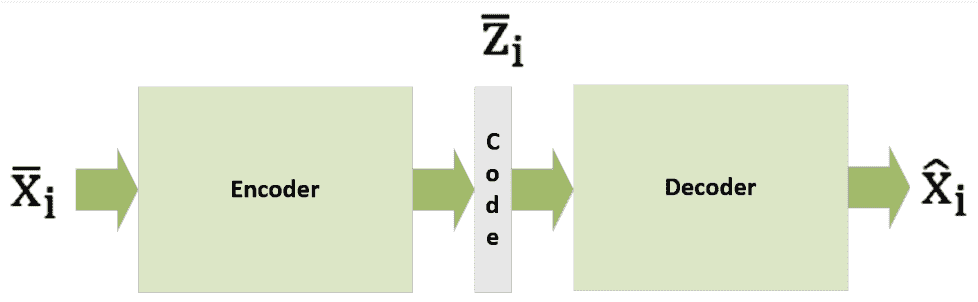

对于 p 维矢量码，参数化函数 e(·)是编码器的定义:
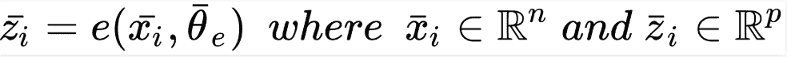

以类似的方式，解码器是另一个参数化函数，d():
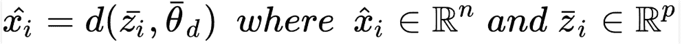

因此，当给定一个输入样本时，xi，一个全自动编码器，一个合并函数，将提供输出的最佳选择:
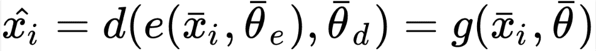

自动编码器经常使用基于均方误差成本函数的反向传播算法来训练，原因是自动编码器通常通过神经网络来应用。
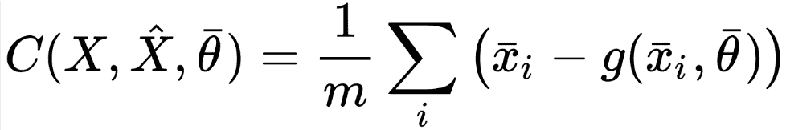

另一方面，如果考虑数据生成的过程，可以看参数化的条件分布，q(·)重申目标:
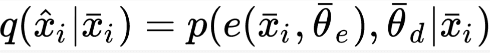

这导致成本函数发展为 pdata()和 q():
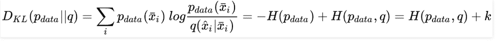之间的库尔巴克-莱布勒散度

使用优化过程，可以排除 *pdata* ，因为它的熵是恒定的。现在， *pdata* 与 q 和散度之间的交叉熵的最小化是相等的。库尔巴克-莱布勒成本函数和均方误差相等。如果你假设 *pdata* 和 q 是高斯型的，你可以互换这两种方法。

在某些情况下，您可以为*数据*和 q 实现伯努利分布。但是，这只有当您将数据范围规范化为(0，1)时才可能。虽然伯努利分布是二进制的`xi ? {0, 1}d`，但这在形式上并不完全正确。sigmoid 输出单元的使用也将导致对连续样本`xi? (0, 1)d`的有效优化。现在，成本函数将如下所示:
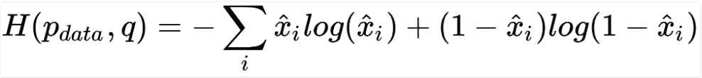

### 实施深度卷积自动编码器–

现在我们来看一个基于 TensorFlow 的深度卷积自动编码器的例子。我们将使用 Olivetti 面数据集，因为它体积小，符合目的，并且包含许多表达式。

**Step #1:** Load the 400 64 × 64 grayscale image samples to prepare the set for training:

```py
from sklearn.datasets import fetch_olivetti_faces

faces = fetch_olivetti_faces(shuffle=True, random_state=1000)
X_train = faces['images']
```

**第二步:**现在，为了提高我们的计算速度，我们将把它们的大小调整到 32 × 32。这也有助于避免任何内存问题。我们可能会失去一点视觉精度。请注意，如果您有高计算资源，您可以跳过这一步。

**第三步:**我们来定义主要常量。

```py
-> number of epochs (nb_epochs)
-> batch_size
-> code_length
-> graph
```

```py
import tensorflow as tf

nb_epochs = 600
batch_size = 50
code_length = 256 
width = 32
height = 32

graph = tf.Graph()
```

**步骤#4:** 使用每批 50 个样本，我们现在将为 600 个时代训练模型。图像大小为 64 × 64 = 4，096，我们将得到 4，096/256 = 16 倍的压缩比。您可以随时尝试不同的配置，以最大限度地提高收敛速度和最终精度。

**第 5 步:**用这些图层建模编码器。

> **- >** 2D 卷积具有 16 个(3 × 3)滤波器、(2 × 2)步长、ReLU 激活和相同的填充。
> **- >** 2D 用 32 (3 × 3)个滤波器卷积，(1 × 1)步距，ReLU 激活，以及相同的填充。
> **- >** 2D 卷积具有 64 (3 × 3)个滤波器、(1 × 1)个步长、ReLU 激活和相同的填充。
> **- >** 2D 卷积具有 128 个(3 × 3)滤波器、(1 × 1)步长、ReLU 激活和相同的填充。

**步骤#6:** 解码器实现去卷积(转置卷积的序列)。

> **- >** 2D 转置卷积具有 128 个(3 × 3)滤波器、(2 × 2)步长、ReLU 激活和相同的填充。
> **- >** 2D 用 64 (3 × 3)个滤波器进行转置卷积，(1 × 1)步距，ReLU 激活，以及相同的填充。
> **- >** 2D 转置卷积具有 32 个(3 × 3)滤波器、(1 × 1)步长、ReLU 激活和相同的填充。
> **- >** 2D 转置卷积具有 1 (3 × 3)滤波器、(1 × 1)步长、Sigmoid 激活和相同的填充。

损失函数基于重建图像和原始图像之间差异的 L2 范数。这里，Adam 是学习率α =0.001 的优化器。现在，让我们看看 TensorFlow DAG 的编码器部分:

```py
import tensorflow as tf

with graph.as_default():
    input_images_xl = tf.placeholder(tf.float32, 
                                     shape=(None, X_train.shape[1],
                                     X_train.shape[2], 1))

    input_images = tf.image.resize_images(input_images_xl,
                                          (width, height),
                    method=tf.image.ResizeMethod.BICUBIC)

    # Encoder
    conv_0 = tf.layers.conv2d(inputs=input_images,
                              filters=16,
                              kernel_size=(3, 3),
                              strides=(2, 2),
                              activation=tf.nn.relu,
                              padding='same')

    conv_1 = tf.layers.conv2d(inputs=conv_0,
                              filters=32,
                              kernel_size=(3, 3),
                              activation=tf.nn.relu,
                              padding='same')

    conv_2 = tf.layers.conv2d(inputs=conv_1,
                              filters=64,
                              kernel_size=(3, 3),
                              activation=tf.nn.relu,
                              padding='same')

    conv_3 = tf.layers.conv2d(inputs=conv_2,
                              filters=128,
                              kernel_size=(3, 3),
                              activation=tf.nn.relu,
                              padding='same')
```

以下是 DAG 的编码部分:

```py
import tensorflow as tf

with graph.as_default(): 

    # Code layer
    code_input = tf.layers.flatten(inputs=conv_3)

    code_layer = tf.layers.dense(inputs=code_input,
                                 units=code_length,
                                 activation=tf.nn.sigmoid)

    code_mean = tf.reduce_mean(code_layer, axis=1)
```

现在，让我们看看 DAG 解码器:

```py
import tensorflow as tf

with graph.as_default(): 

    # Decoder
    decoder_input = tf.reshape(code_layer,
                      (-1, int(width / 2),
                       int(height / 2), 1))

    convt_0 = tf.layers.conv2d_transpose(inputs=decoder_input,
                                         filters=128,
                                         kernel_size=(3, 3),
                                         strides=(2, 2),
                                         activation=tf.nn.relu,
                                         padding='same')

    convt_1 = tf.layers.conv2d_transpose(inputs=convt_0,
                                         filters=64,
                                         kernel_size=(3, 3),
                                         activation=tf.nn.relu,
                                         padding='same')

    convt_2 = tf.layers.conv2d_transpose(inputs=convt_1,
                                         filters=32,
                                         kernel_size=(3, 3),
                                         activation=tf.nn.relu,
                                         padding='same')

    convt_3 = tf.layers.conv2d_transpose(inputs=convt_2,
                                         filters=1,
                                         kernel_size=(3, 3),
                                         activation=tf.sigmoid,
                                         padding='same')

    output_images = tf.image.resize_images(convt_3, (X_train.shape[1],
                                                    X_train.shape[2]), 
                                  method=tf.image.ResizeMethod.BICUBIC)
```

**第 7 步:**以下是如何定义损失函数和 Adam 优化器–

```py
import tensorflow as tf

with graph.as_default():
    # Loss
    loss = tf.nn.l2_loss(convt_3 - input_images)

    # Training step
    training_step = tf.train.AdamOptimizer(0.001).minimize(loss)
```

**步骤#8:** 现在我们已经定义了完整的 DAG，我们可以启动会话并初始化所有变量。

```py
import tensorflow as tf

session = tf.InteractiveSession(graph=graph)
tf.global_variables_initializer().run()
```

**步骤#9:** 我们可以在初始化 TensorFlow 后开始训练过程:

```py
import numpy as np

for e in range(nb_epochs):
    np.random.shuffle(X_train)

    total_loss = 0.0
    code_means = []

    for i in range(0, X_train.shape[0] - batch_size, batch_size):
        X = np.expand_dims(X_train[i:i + batch_size, :, :],
                                axis=3).astype(np.float32)

        _, n_loss, c_mean = session.run([training_step, loss, code_mean],
                                        feed_dict={input_images_xl: X})

        total_loss += n_loss
        code_means.append(c_mean)

    print('Epoch {}) Average loss per sample: {} (Code mean: {})'.
          format(e + 1, total_loss / float(X_train.shape[0]),
          np.mean(code_means)))
```

**输出:**

```py
Epoch 1) Average loss per sample: 11.933397521972656 (Code mean: 0.5420681238174438)
Epoch 2) Average loss per sample: 10.294102325439454 (Code mean: 0.4132006764411926)
Epoch 3) Average loss per sample: 9.917563934326171 (Code mean: 0.38105469942092896)
...
Epoch 600) Average loss per sample: 0.4635812330245972 (Code mean: 0.42368677258491516)
```

当训练过程达到高潮时，0.46(考虑 32 × 32 个图像)是每个样本的平均损失，0.42 是代码的平均值。这证明编码相对密集，使平均值达到 0.5。我们的重点是在比较结果的过程中观察稀疏性。

一些示例图像产生了自动编码器的以下输出:

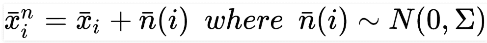
当图像放大到 64 × 64 时，重建质量受到部分影响。但是，我们可以通过降低压缩率和增加代码长度来获得更好的效果。

**如何给自动编码器降噪？**
当自动编码器的应用依赖于从输入到输出的转换过程时，它会很有帮助。它不一定与 autoencoder 查找低维表示的能力相关。

让我们看一个例子，假设 X 是一个以零为中心的数据集和一个有噪声的版本，其示例将具有如下结构:

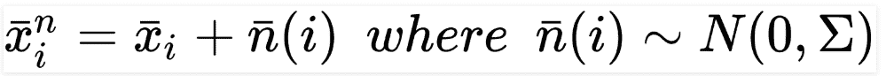

这里，自动编码器的重点是去除噪声项，并恢复原始样本 xi。如果我们从数学角度来看，标准自动编码器和去噪自动编码器是一样的，但我们需要考虑这些模型的容量需求。由于它们必须恢复原始样本，给定一个损坏的输入(其特征占据更大的样本空间)，图层的数量和尺寸可能比标准自动编码器更大。

当然，考虑到复杂性，不经过几次测试是不可能有清晰的洞察力的；因此，我强烈建议从较小的模型开始，增加容量，直到最佳成本函数达到合适的值。您可以使用各种策略来添加噪声，例如，破坏每个批次中包含的样本，使用噪声层作为编码器的输入 1，或者使用丢失层作为编码器的输入 1。

最集体的选择之一是假设噪声是高斯的。如果是这样的话，我们可以制造同异方差和异方差噪声。第一种情况有一个方差，对于所有的分量都保持不变(即 n(i)？N(0，？2I))，而第二种情况具有各自不同的组件。从问题的本质来看，我们可以选择另一个恰当的解决方案。但是，最好采用异方差噪声来提高整个系统的鲁棒性。

### 如何给自动编码器增加噪声–

我们将修改我们的深度卷积自动编码器，以便它可以管理有噪声的输入样本。由于 DAG 几乎相等，我们需要包括原始和有噪声的图像。

```py
import tensorflow as tf

with graph.as_default():
    input_images_xl = tf.placeholder(tf.float32, 
                         shape=(None, X_train.shape[1],
                         X_train.shape[2], 1))
    input_noisy_images_xl = tf.placeholder(tf.float32, 
                             shape=(None, X_train.shape[1],
                             X_train.shape[2], 1))

    input_images = tf.image.resize_images(input_images_xl, 
                                          (width, height), 
                     method=tf.image.ResizeMethod.BICUBIC)

    input_noisy_images = tf.image.resize_images(input_noisy_images_xl,
                                                      (width, height), 
                                 method=tf.image.ResizeMethod.BICUBIC)

    # Encoder
    conv_0 = tf.layers.conv2d(inputs=input_noisy_images,
                              filters=16,
                              kernel_size=(3, 3),
                              strides=(2, 2),
                              activation=tf.nn.relu,
                              padding='same')
```

考虑到新图像，我们可以计算损失函数:

```py
# Loss
loss = tf.nn.l2_loss(convt_3 - input_images)

# Training step
training_step = tf.train.AdamOptimizer(0.001).minimize(loss)
```

一旦变量的标准初始化完成，我们就可以开始考虑加性噪声 ni？N(0，0.45)(也就是，？？0.2):

```py
import numpy as np

for e in range(nb_epochs):
    np.random.shuffle(X_train)

    total_loss = 0.0
    code_means = []

    for i in range(0, X_train.shape[0] - batch_size, batch_size):
        X = np.expand_dims(X_train[i:i + batch_size, :, :],
                                 axis=3).astype(np.float32)

        Xn = np.clip(X + np.random.normal(0.0, 0.2, 
                     size=(batch_size, X_train.shape[1],
                     X_train.shape[2], 1)), 0.0, 1.0)

        _, n_loss, c_mean = session.run([training_step, loss, code_mean],
                                       feed_dict={ input_images_xl: X,
                                             input_noisy_images_xl: Xn })

        total_loss += n_loss
        code_means.append(c_mean)

    print('Epoch {}) Average loss per sample: {} (Code mean: {})'.
                format(e + 1, total_loss / float(X_train.shape[0]),
                                             np.mean(code_means)))
```

现在我们已经训练了模型，我们使用一些有噪声的样本来测试它。这是这个动作的输出–
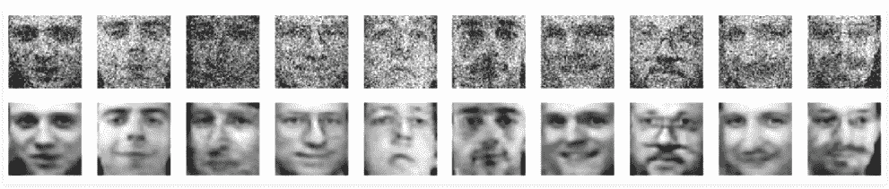
我们已经成功地教会了自动编码器对输入图像去噪，不管输入图像的质量如何。您可以继续尝试不同的数据集，以获得最大的噪声方差。

**参考:**
[用 Python 进行动手无监督学习](https://www.amazon.com/Hands-Unsupervised-Learning-Python-Scikit-Learn-ebook/dp/B07HHCNGDP?utm_source=geeksforgeeks&utm_medium=referral&utm_campaign=ThirdPartyPromotions)。