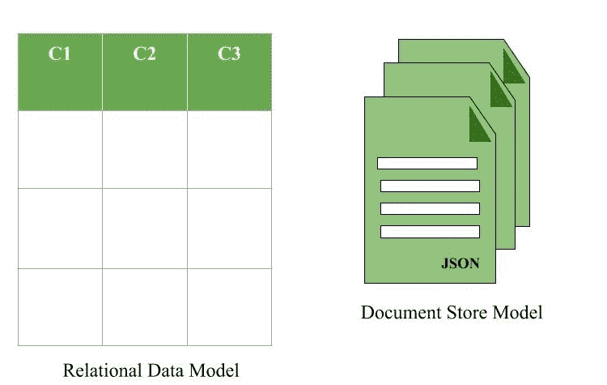
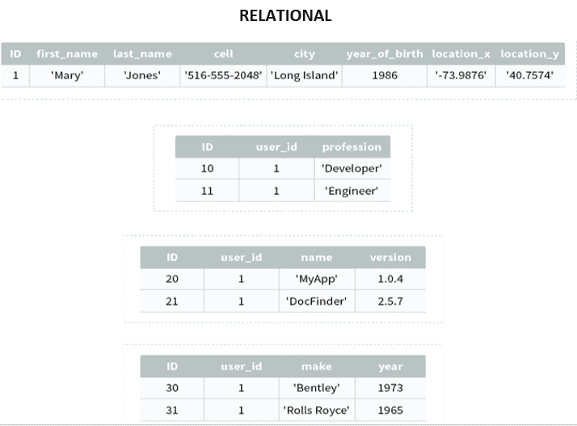
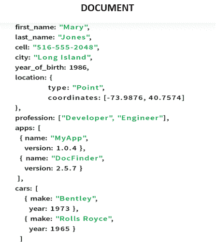

# 文档数据库是如何工作的？

> 原文:[https://www . geesforgeks . org/how-do-document-databases-work/](https://www.geeksforgeeks.org/how-do-document-databases-work/)

文档数据库以文档或半结构化数据库的形式检索或存储信息。因为它们是非关系型的，所以它们通常被称为 NoSQL 数据。

文档数据库以键值对的形式获取和积累数据，但是在这里，这些值被称为文档。文档可以被描述为一个复杂的数据结构。这里的文档可以是文本、数组、字符串、JSON、XML 或任何这样的格式。嵌套文档的使用也非常普遍。它非常有效，因为创建的大多数数据通常是 JSON 形式的，并且是非结构化的。

### 优势

对于开发人员来说，文档数据库既自然又灵活。

*   它们为开发人员提供了更高的生产力和更快的发展。
*   通过使用开发人员在应用程序代码中使用的相同文档模型格式，文档数据库对于开发人员来说更容易在数据库中存储和查询数据。
*   对于目录、用户配置文件和内容管理系统等用例，其中每个文档都是唯一的，并随着时间的推移而发展，使用文档模型要好得多。
*   文档数据库为文档集合提供灵活的索引、强大的临时查询和分析。

### 不足之处

*   处理多个文档具有挑战性
*   聚合操作可能无法准确工作。

**考虑以下示例，该示例显示了存储在关系数据库和文档数据库**
中的示例数据库

 