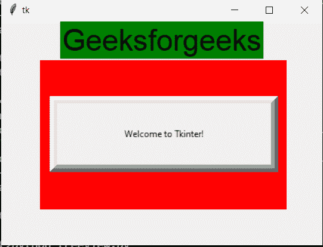

# 如何在 tkinter 画布上创建按钮？

> 原文:[https://www . geesforgeks . org/how-you-do-create-a-tkinter-canvas 上的按钮/](https://www.geeksforgeeks.org/how-do-you-create-a-button-on-a-tkinter-canvas/)

在本文中，我们将看到如何在 Tkinter 画布上创建一个按钮。

画布小部件在应用程序上显示各种图形。它可以用来把简单的图形绘制成复杂的图形。我们还可以根据需要显示各种定制的小部件。

它用于触发代码中出现的任何功能

**代码介绍:**

在这里，我们尝试在画布上创建按钮小部件。首先制作画布，然后将按钮放在画布上。

> **语法:**
> 
> C =画布(根、高、宽、bd、bg)
> 
> **语法:**
> 
> 按钮=按钮(根、高度、宽度、宽度、命令)

**步骤:**

1.  从导入 tkinter
2.  然后定义窗口大小和其他要求。
3.  首先从上面给出的语法创建画布。
4.  借助 tkinter 中的放置功能，放置按钮。

## 蟒蛇 3

```
# import everything from tkinter module
from tkinter import *

root = Tk()

root.geometry('430x300')

title = Label(root, text="Geeksforgeeks", bg="green", font=("bold", 30))
title.pack()
c = Canvas(root, width=330, height=200, bg="red")
c.place(x=50, y=50)
btn = Button(root, text='Welcome to Tkinter!', width=40,
             height=5, bd='10', command=root.destroy)

btn.place(x=65, y=100)

root.mainloop()
```

```
**OUTPUT:**
```

