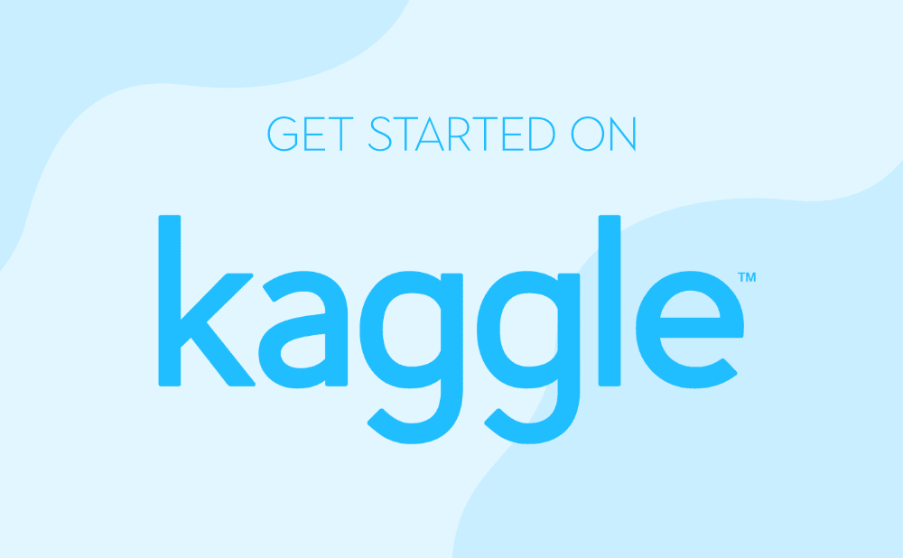

# 机器学习初学者应该如何在 Kaggle 上入门？

> 原文:[https://www . geeksforgeeks . org/机器学习方法-初学者-kaggle 入门/](https://www.geeksforgeeks.org/how-should-a-machine-learning-beginner-get-started-on-kaggle/)

你对数据科学着迷吗？你认为机器学习有趣吗？您是否想了解更多关于这些领域的信息，但不确定从哪里开始？好吧，从**卡格尔开始！**

[Kaggle](https://www.kaggle.com/) 是谷歌在 2010 年创立的一个致力于数据科学家和机器学习的在线社区。它是世界上最大的数据社区，成员从像你这样的 ML 初学者到世界上一些最好的研究人员。Kaggle 也是开始玩数据的最佳场所，因为它托管着超过 **23，000 个公共数据集**和超过 **200，000 个可在线运行的公共笔记本**！万一这还不够，卡格尔还举办了许多数据科学竞赛，奖金高得吓人(150 万英镑曾经提供过一次！).

但是对于卡格尔仍然有很多误解。有些人认为它只是一个竞赛主办网站，而另一些人认为只有专家才能充分利用它。事实是，Kaggle 也是初学者的平台，因为它提供了像**基础课程**这样与数据科学和 ML 相关的资源。然后还有【入门】类的**基础赛**，慢慢让初学者变成专家。这就是为什么本文介绍了 Kaggle，以及您最终成为一名成熟的数据科学专家的途径。现在让我们开始吧！！！

### Kaggle 上的可用资源

Kaggle 上有很多资源可以帮助你成为数据科学初学者。首先，让我们详细看看所有这些资源。

**1。数据集:**在卡格尔有大约 23，000 个公开的[数据集](https://www.kaggle.com/datasets)，你可以免费下载。事实上，其中许多数据集已经被下载了数百万次。你可以使用搜索框搜索你想要的任何主题的公共数据集，从健康到科学到流行漫画！你也可以在卡格勒上创建新的公共数据集，这些数据集可能会为你赢得奖牌，并引导你获得高级卡格勒头衔，如*专家、大师和特级大师*。

**2。笔记本:**Kaggle 上的[笔记本](https://www.kaggle.com/notebooks)是可以在云上运行的虚拟 Jupyter 笔记本，不需要下载。而且是免费的！所以你可以在笔记本上查看代码，编辑它或添加图像(基本上你想要什么！)使用*“复制并编辑”*按钮。也可以通过点击*“新建笔记本”*按钮，从头开始新建笔记本(也叫内核)。

**3。课程:**Kaggle 上有一整套与数据科学和机器学习相关的[免费课程](https://www.kaggle.com/learn/overview)，可以教你入门所需的一切知识。虽然这些课程并不深入，但它们是在 Kaggle 上开始练习的最快方法。微课程(他们被称为)从基础课程开始，如*[【Python】](https://practice.geeksforgeeks.org/batch/fork-python)[机器学习](https://practice.geeksforgeeks.org/courses/machine-learning-foundation?vb=163)[SQL](https://www.geeksforgeeks.org/sql-tutorial/)【数据可视化】*，并转向更复杂的主题，如 *[【熊猫】](https://www.geeksforgeeks.org/python-data-analysis-using-pandas/)【深度学习】【地理空间分析】*等。

**4。讨论:**除了笔记本中的评论选项外，还有整个[讨论](https://www.kaggle.com/discussion)部分。本讨论区包括*卡格乐论坛，QnA* 可以向其他数据科学家咨询，*入门*是初学者的第一站，*产品反馈*和*学习*是与卡格乐课程相关的 QA。请查看本部分提问并了解更多关于 Kaggle 的信息！

**5。比赛:**在你花了一些时间使用卡格尔数据集和笔记本后，是时候进入[比赛](https://www.kaggle.com/competitions)了。Kaggle 竞赛是测试您的知识并了解您在数据科学世界中所处位置的绝佳方式！如果你是初学者，你应该从练习像[泰坦尼克号:灾难中的机器学习](https://www.kaggle.com/c/titanic)这样的老竞赛题开始。在那之后，你可以继续积极的比赛，甚至可能赢得巨额现金奖励！！！

**6。博客:** Kaggle 有一个[官方博客](http://blog.kaggle.com/)，里面有很多有趣的文章，从*《AI 在非洲的未来》*到*《教一个 AI 跳舞》*！Kaggle 博客也有各种关于神经网络、高维数据结构等主题的教程。你也可以在这里查看一些卡格尔的新闻，比如对特级大师的采访，卡格尔的更新等等。

**7。乔布斯:**最后，如果你正在招聘或者正在找工作，卡格尔还有一个[工作门户](https://www.kaggle.com/jobs)！如果你正在招聘并获得卡格尔号上 150 万数据科学家的访问权，你可以创建一个*工作列表*。如果你正在找工作，你可以订阅卡格尔*就业委员会*以获得可用的职业机会。

### 启动 Kaggle 时要遵循的基本大纲

现在您已经知道了 Kaggle 上所有可用的选项，下面是您刚开始使用时要遵循的基本概要。在你对这个社区有了更多的了解之后，你可以根据自己的技能水平，更加专注于问题和比赛。

#### 1.选择一种编程语言:

启动 Kaggle 时，你绝对不能跳过的一件事就是学习编程语言！ **[Python](https://www.geeksforgeeks.org/python-programming-language/) 和 R** 是目前数据科学和机器学习最著名的两种编程语言。如果你有开发背景，那么 Python 对你来说是更简单的选择，如果你有分析背景，那么 R 是首选。

然而，Python 是目前 ML 最流行的语言。事实上，有很多 Python 库特别适用于人工智能和机器学习，如 **Keras、TensorFlow、Scikit-learn、**等。所以想学 ML，最好是学 Python！Kaggle 上甚至有一个[免费 Python 课程](https://www.kaggle.com/learn/python)，可以教你开始学习所需的大部分知识！

#### 2.了解标准数据集

一旦学会了 Python(或 R)，下一步就是掌握数据了！您应该能够管理数据的加载和导航，以获得最佳结果。为此，学习不同的模型，并在真实数据集上练习。这也将帮助您了解在不同情况下使用哪些模型。

Kaggle 上大约有**23000 个公共数据集**可以用来练习。现在，如果你是一个初学者，很难理解哪个数据集是好的，哪个不是。因此，您最好从可用的标准数据集开始练习，如[印度肝脏患者记录](https://www.kaggle.com/uciml/indian-liver-patient-records)、[鸢尾物种](https://www.kaggle.com/uciml/iris)、[成人普查收入](https://www.kaggle.com/uciml/adult-census-income)、[威斯康星乳腺癌](https://www.kaggle.com/uciml/breast-cancer-wisconsin-data)等。

#### 3.练习老卡格尔竞赛题

不是说你对 Kaggle 有一些基本的了解，是时候练习一些老的竞赛题了。最好你能解决过去几年流行的卡格尔问题，这样你就能对未来有一个基本的概念。解决各种类型的问题，然后尝试改进你的解决方案。您可以通过检查论坛帖子、GitHub 存储库和 winner 博客帖子来解决这个问题。这将教会你如何以最有效的方式解决卡格尔问题，这样你甚至可以在未来赢得比赛！

如果你不知道从哪些问题开始，这里有一些基本的比赛，可以帮助你建立信心。

*   [**泰坦尼克号:灾难中的机器学习**](https://www.kaggle.com/c/titanic) :这个挑战对于 ML 来说是一个非常受欢迎的初学者项目，因为它有多个教程可以使用。因此，这是对 ML 概念的一个很好的介绍，如数据探索、特征工程和模型调优。
*   [**【数字识别器】**](https://www.kaggle.com/c/digit-recognizer) :这是一个你有了 Python 和 ML 基础知识之后应该尝试的项目。这是一个令人兴奋的世界神经网络使用一个经典的数据集，其中包括预先提取的特征的伟大介绍。
*   [**与 Julia 的第一步**](https://www.kaggle.com/c/street-view-getting-started-with-julia) :这个比赛会帮助你学习 Julia，一个比较新的计算语言。朱莉娅的第一步还包括两个关于朱莉娅的教程，其中第一个侧重于语言的基础知识，第二个侧重于 K 最近邻算法。

像这 3 个比赛，有很多老的比赛可以练习，尤其是“入门”类。

#### 4.参加活跃的高尔夫比赛

既然你已经适应了卡格尔，那就该开始参加[主动比赛](https://www.kaggle.com/competitions)了！卡格尔竞赛以疯狂的奖品而闻名，所以谁知道你会赢得什么！但最好从小处着手，一次只专注于一场比赛。另外，在私人排行榜的前 25%中争取至少一个席位，因为一开始就赢是一个不合理的期望。

此外，在论坛上分享你的想法和解决方案，因为它们可能会在未来带来新的想法和合作。最后，玩得开心，因为你的目标是学习，而不是赢。(谁知道呢，你也可能会赢！！！)