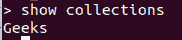

# 如何使用 Python 访问 MongoDB 中的一个集合？

> 原文:[https://www . geeksforgeeks . org/如何使用 python 访问 mongodb 中的集合/](https://www.geeksforgeeks.org/how-to-access-a-collection-in-mongodb-using-python/)

[**MongoDB**](https://www.geeksforgeeks.org/mongodb-and-python/)是一个跨平台、面向文档的数据库，致力于集合和文档的概念。MongoDB 提供了高速度、高可用性和高扩展性。

## 访问集合

**1)获取集合列表:**为了获取 MongoDB 数据库的集合列表，使用了 list _ collection _ names()方法。此方法返回集合列表。

**语法:**

```
list_collection_names()

```

**例:**

**样本数据库:**



## 蟒蛇 3

```
from pymongo import MongoClient

# create an client instance of the 
# MongoDB class
mo_c = MongoClient()

# create an instance of 'some_database'
db = mo_c.GFG

# get a list of a MongoDB database's 
# collections
collections = db.list_collection_names()
print ("collections:", collections, "\n")
```

**输出:**

```
collections: ['Geeks'] 

```

**2)检查集合是否存在:**要检查数据库的集合属性是否存在，请使用 hasattr()方法。如果集合在数据库中，则返回 true，否则返回 false。

> **语法:** hasattr(db，‘collection name’)
> 
> **参数:**
> **db:** 是数据库对象。
> **collectionname:** 是集合的名称。

**示例:**

## 蟒蛇 3

```
from pymongo import MongoClient

# create an client instance of 
# the MongoDB class
mo_c = MongoClient()

# create an instance of 'some_database'
db = mo_c.GFG

# check collection is exists or not 
print(hasattr(db, 'Geeks'))
```

**输出:**

```
True
```

**3)访问集合:**要访问 MongoDB 集合名称，请使用以下语法。

**语法:**

```
database_object.Collectionname
or
database_object["Collectionname"]
```

**注意:**在集合名称之间包含空格的情况下，即像 Database_object[“集合名称”]这样的情况下，database_object[“集合名称”]可能会很有用。

**示例:**

## 蟒蛇 3

```
from pymongo import MongoClient

# create an client instance of
# the MongoDB class
mo_c = MongoClient()

# create an instance of 'some_database'
db = mo_c.GFG

col1 = db["gfg"]

print ("Collection:", col1)
```

**输出:**

> 集合:集合(数据库(MongoClient(host =[' localhost:27017 ']，document_class=dict，tz_aware=False，connect=True)，' GFG '，' gfg')