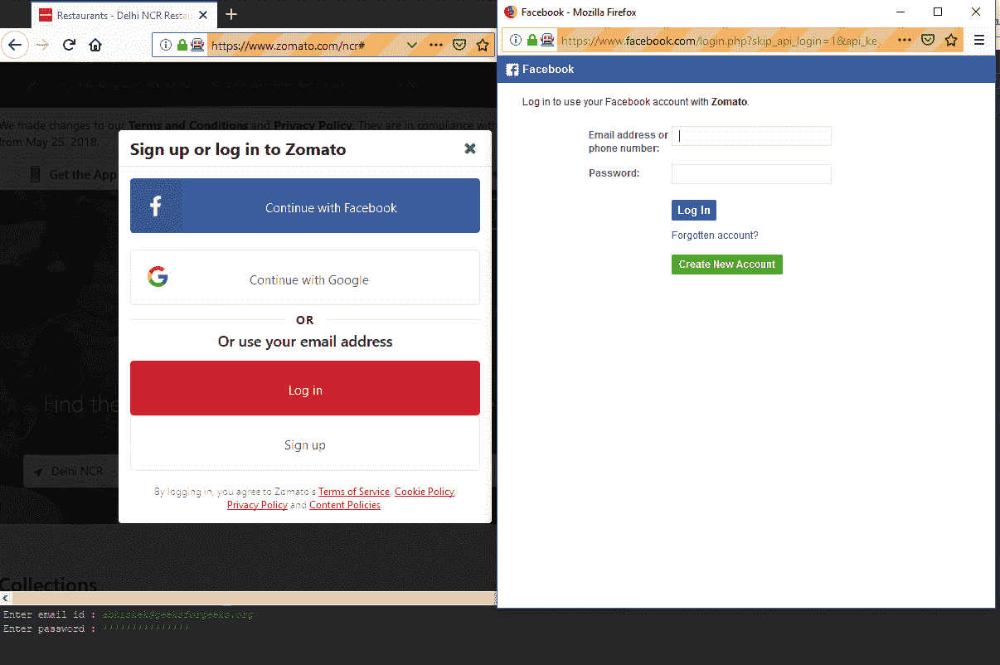

# 如何使用 Python 访问 selenium 中的弹出登录窗口

> 原文:[https://www . geesforgeks . org/如何访问-弹出-登录-硒中窗-使用-python/](https://www.geeksforgeeks.org/how-to-access-popup-login-window-in-selenium-using-python/)

许多网站使用社交媒体登录，使用户登录过程变得容易。在大多数情况下，如果单击该按钮，则会打开一个新的弹出窗口，用户必须在其中输入他们的用户凭据。手动可以在浏览器中切换窗口，并输入登录所需的凭据。但是在使用 webdriver 进行无人值守 web 访问的情况下，驱动程序不能自动切换窗口。我们需要更改驱动程序中的窗口句柄，以便在弹出窗口中输入登录凭据。 *Selenium* 具有使用同一驱动程序切换窗口访问多个窗口的功能。
首先，我们必须从网络驱动程序中获取当前窗口句柄，可以通过:
完成

```py
driver.current_window_handle
```

我们需要保存它以便获取当前窗口句柄。弹出窗口出现后，我们必须立即获得所有可用窗口句柄的列表。

```py
driver.window_handles
```

然后我们可以从这个列表中获取登录页面的窗口句柄，然后切换控件。要切换窗口手柄，请使用:

```py
driver.swtich_to.window(login_page)
```

成功登录后，我们可以使用相同的 switch_to 方法将控制更改为上一页。
**注意:**要运行这个代码硒库，需要火狐的*壁虎*。硒的安装可以使用 Python 第三方库安装程序 pip 来完成。要安装硒，运行此命令

```py
pip install selenium
```

对于 geckodriver，下载文件并将其路径添加到 OS PATH 变量中，这样就可以从文件目录中的任何位置激活它。
让我们看看使用脸书登录 zomato.com 的代码。

## 蟒蛇 3

```py
# import the libs
from selenium import webdriver
from time import sleep

# create the initial window
driver = webdriver.Firefox()

# go to the home page
driver.get('https://www.zomato.com')

# storing the current window handle to get back to dashboard
main_page = driver.current_window_handle

# wait for page to load completely
sleep(5)

# click on the sign in tab
driver.find_element_by_xpath('//*[@id ="signin-link"]').click()

sleep(5)

# click to log in using facebook
driver.find_element_by_xpath('//*[@id ="facebook-login-global"]/span').click()

# changing the handles to access login page
for handle in driver.window_handles:
    if handle != main_page:
        login_page = handle

# change the control to signin page       
driver.switch_to.window(login_page)

# user input for email and password
print('Enter email id : ', end ='')
email = input().strip()
print('Enter password : ', end ='')
password = input().strip()

# enter the email
driver.find_element_by_xpath('//*[@id ="email"]').send_keys(email)

# enter the password
driver.find_element_by_xpath('//*[@id ="pass"]').send_keys(password)

# click the login button
driver.find_element_by_xpath('//*[@id ="u_0_0"]').click()

# change control to main page
driver.switch_to.window(main_page)

sleep(10)
# print user name
name = driver.find_element_by_xpath('/html/body/div[4]/div/div[1]/header/div[2]/div/div/div/div/span').text
print('Your user name is : {}'.format(name))

# closing the window
driver.quit()
```

**输出:**

