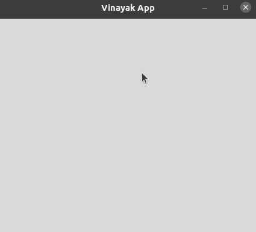

# 如何用快捷键或绑定激活 Tkinter 菜单和工具栏？

> 原文:[https://www . geeksforgeeks . org/如何使用快捷键或绑定激活菜单和工具栏/](https://www.geeksforgeeks.org/how-to-activate-tkinter-menu-and-toolbar-with-keyboard-shortcut-or-binding/)

您可能已经在各种桌面应用程序中看到了菜单栏和工具栏，它们是通过快捷键打开的。难道你不知道如何创建这样一个菜单栏和工具栏，通过快捷键打开吗？读一读这篇文章，了解做同样事情的步骤。

要使用快捷键激活菜单栏和工具栏，请分别使用菜单栏和工具栏中要执行的所有操作创建菜单栏和工具栏的功能。在为菜单栏和工具栏创建了函数之后，编写以下代码来激活菜单栏和工具栏。

> app . bind(' T0 '，#菜单栏功能)
> 
> app . bind(' T0 '，#工具栏功能)

### **分步实施:**

**第一步:**首先导入库 **tkinter** 和 **ttk** 。

```py
from tkinter import *
from tkinter import ttk
```

**步骤 2:** 现在，使用 tkinter 创建一个 GUI 应用程序。

```py
app=Tk()
```

**第三步:**然后，为你的应用设置标题和几何图形。

```py
app.title(“#Title of the app”)
app.geometry('#Dimensions you want to set of an app')
```

**第 4 步:**接下来，用事件声明菜单栏的函数为无，这样它对每种情况都有效。

```py
def menubar_shortcut(event=None):
```

一旦声明了函数，就在其中创建菜单栏。

```py
menubar = Menu()
```

在菜单栏的功能中，声明所有你想在菜单栏中显示的小部件。这里，我们在菜单栏中添加了文件级联**菜单**。

```py
file=Menu(menubar, tearoff=False)
menubar.add_cascade(label='File', menu=file)
```

此外，在应用程序中显示菜单栏。

```py
app.config(menu=menubar)
```

**第 5 步:**此外，将带有事件的工具栏声明为“无”，以便它适用于所有情况。

```py
def toolbar_shortcut(event=None):
```

创建工具栏功能后，创建并显示工具栏标签。

```py
toolbar=ttk.Label(app)
toolbar.pack(side=TOP, fill=X)
```

接下来，创建并显示您想要在工具栏中显示的小部件。这里我们在工具栏中增加了 **bold_btn** 按钮。

```py
bold_btn=ttk.Button(toolbar, text="Bold")
bold_btn.grid(row=0, column=0, padx=5)
```

**第六步:**一旦你创建了菜单栏和工具栏的功能，用快捷键绑定菜单栏和工具栏。这里增加快捷键**【Ctrl+p】**激活菜单栏，**【Ctrl+q】**激活工具栏。

```py
app.bind('<Control-p>', menubar_shortcut)
app.bind('<Control-q>', toolbar_shortcut)
```

**第 7 步:**最后，最后，进行在屏幕上显示 GUI 应用的循环

```py
app.mainloop()
```

**以下是完整实现:**

## 计算机编程语言

```py
# Python program to activate menu and toolbar
# with keyboard shortcut key

# Import the libraries tkinter and ttk
from tkinter import *
from tkinter import ttk

# Create a GUI app
app = Tk()

# Setting the title and geometry of the app
app.title('Vinayak App')
app.geometry('600x400')

# Creating function for menu bar
def menubar_shortcut(event = None):
    menubar = Menu()

    # Declare file and edit for showing in menu bar
    file = Menu(menubar, tearoff = False)
    edit = Menu(menubar, tearoff = False)

    # Display file and edit declared in previous step
    menubar.add_cascade(label = 'File', menu = file)
    menubar.add_cascade(label = 'Edit', menu = edit)

    # Display of menu bar in the app
    app.config(menu = menubar)

# Creating function for tool bar
def toolbar_shortcut(event = None):

    # Creating and displaying label for toolbar
    toolbar = ttk.Label(app)
    toolbar.pack(side = TOP, fill = X)

    # Creating and displaying of Bold button
    bold_btn = ttk.Button(toolbar, text = "Bold")
    bold_btn.grid(row=0, column = 0, padx = 5)

    # Creating and displaying of italic button
    italic_btn = ttk.Button(toolbar, text = "Italic")
    italic_btn.grid(row = 0, column = 1, padx = 5)

# Set up shortcut key for menu bar
app.bind('<Control-p>', menubar_shortcut)

# Set up shortcut key for tool bar
app.bind('<Control-q>', toolbar_shortcut)

# Make the loop for displaying app
app.mainloop()
```

**输出:**

