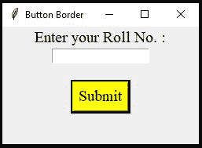
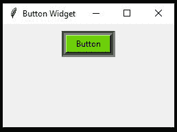

# 如何在 Tkinter 中给按钮添加边框颜色？

> 原文:[https://www . geesforgeks . org/如何将边框颜色添加到 tkinter 中的按钮/](https://www.geeksforgeeks.org/how-to-add-a-border-color-to-a-button-in-tkinter/)

在本文中，我们将学习如何在 Tkinter 中为按钮添加边框颜色。在第一个示例中，我们使用框架小部件通过用黑色突出显示边框来为框架中的按钮添加边框颜色，边框的厚度为 2。

**示例 1:使用 Frame 小部件为按钮添加边框颜色。**

**步骤:**

1.  框架是小部件的容器。在本文中，我们使用框架小部件参数作为 highlightbackground 和 highlightthickness 来为按钮添加边框颜色。
2.  使用标签小部件以文本字体为参数在图形用户界面中添加文本。
3.  入口小部件用于接受用户的单行输入。
4.  按钮使用厚度为 2、高亮背景颜色为黑色的框架。
5.  文本为“提交”的按钮小部件，按钮背景颜色为黄色，按钮上文本的前景色在该图形用户界面中被用作黑色。
6.  最后，成功创建了一个黑色边框按钮，文本为提交。

**下面是实现:**

## 蟒蛇 3

```py
import tkinter as tk

root = tk.Tk()
root.geometry('250x150')
root.title("Button Border")

# Label
l = tk.Label(root, text = "Enter your Roll No. :",
             font = (("Times New Roman"), 15))
l.pack()

# Entry Widget
tk.Entry(root).pack()

# for space between widgets
tk.Label(root, text=" ").pack()

# Frame for button border with black border color
button_border = tk.Frame(root, highlightbackground = "black", 
                         highlightthickness = 2, bd=0)
bttn = tk.Button(button_border, text = 'Submit', fg = 'black',
                 bg = 'yellow',font = (("Times New Roman"),15))
bttn.pack()
button_border.pack()

root.mainloop()
```

**输出:**



**示例 2:使用 LabelFrame 为按钮添加边框颜色。**

**步骤:**

1.  tkinter 中的 LabelFrame 小部件包含标签和框架的功能。
2.  LabelFrame 的参数即 bd(边框宽度)取 6，bg(背景)颜色为黑色。
3.  按钮小部件用于创建按钮，文本参数用于在按钮上添加文本，按钮背景颜色为绿色，上面有黑色文本。
4.  最后，使用标签框架小部件成功创建了一个黑色边框的按钮，按钮上有文本作为“按钮”。

**下面是实现:**

## 蟒蛇 3

```py
from tkinter import *

window = Tk()
window.geometry('250x150')
window.title('Button Widget')

# Button with black border
border = LabelFrame(window, bd = 6, bg = "black")
border.pack(pady = 10)

btn = Button(border, text="Button", width = 8,
             bg = "#6CD300", fg = "black")
btn.pack()

window.mainloop()
```

**输出:**

