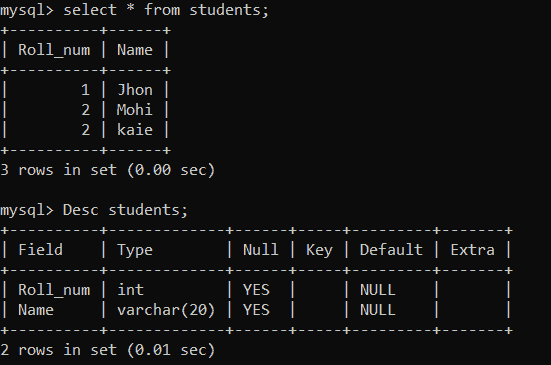
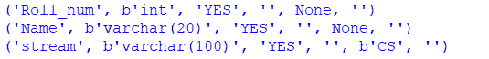
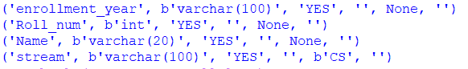
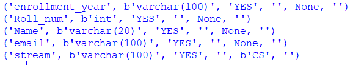
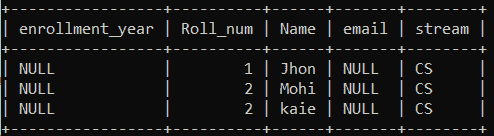

# 如何在 Python 中给 MySQL 表添加一列？

> 原文:[https://www . geesforgeks . org/如何将一列添加到 python 中的 mysql 表/](https://www.geeksforgeeks.org/how-to-add-a-column-to-a-mysql-table-in-python/)

**先决条件:** [Python: MySQL 创建表](https://www.geeksforgeeks.org/python-mysql-create-table/)

Python 允许广泛的数据库服务器与应用程序的集成。从 Python 访问数据库需要数据库接口。 [**MySQL 连接器**](https://www.geeksforgeeks.org/mysql-connector-python-module-in-python/) -Python 模块是 Python 中的一个 API，用于与 MySQL 数据库进行通信。

## **更改 SQL 语句**

使用 ALTER 语句，可以添加、删除或修改现有表的列以及修改表约束。

用 ALTER 语句添加列的语法:

```
ALTER TABLE table_name
ADD new_column_name column_definition
[FIRST | AFTER column_name];
```

这里，table_name 是要添加列的表的名称，new_column_name 是要添加的列的名称，column_definition 是要添加的列的数据类型和定义。FIRST 和 AFTER 是可选语句，告诉 MySQL 表中新列的位置。如果未指定此参数，则新列将添加到表的末尾。

**实施:**

要在 Python 中向 MySQL 表添加一列，首先要与数据库服务器建立连接。然后创建一个光标对象。该游标对象与 MySQL 服务器交互，可用于执行操作，如执行 SQL 语句、获取数据和调用过程。因此，使用这个游标对象，执行 ALTER 语句在末尾或特定位置添加一列。让我们看一些例子，以便更好地理解。

**正在使用的数据库:**



我们将使用一个带有学生表的数据库，该表描述了学生的详细信息，如学号和姓名。在我们学习向表中添加列之前，创建这样一个示例表(插入值是可选的)。

**例 1:**

此示例显示了在表的末尾添加一列。步骤如下:

*   使用 connect()函数建立与数据库服务器的连接。将主机、用户(根用户或您的用户名)、密码(如果存在)和数据库参数传递给 connect()方法。
*   然后使用 cursor()函数创建一个游标对象。
*   执行 ALTER 语句，将流列添加到学生表中。
*   要检查是否添加了列，请执行并获取 DESC 语句的结果来描述表的结构。

**代码:**

## 计算机编程语言

```
# Import required packages
import mysql.connector

# Establish connection to MySQL database
mydb = mysql.connector.connect(
    host = "localhost",
    user = "username",
    password = "geeksforgeeks",
    database = "College"
)

# Create a cursor object
mycursor = mydb.cursor()

# MySQL query for adding a column
query = "ALTER TABLE students \
        ADD stream VARCHAR(100) DEFAULT 'CS'"
# Execute the query 
mycursor.execute(query)

# Print description of students table
mycursor.execute("desc students")
myresult = mycursor.fetchall()
for row in myresult:
    print(row)

# Close database connection
mydb.close()
```

**输出:**



**例 2:**

此示例显示了在表的开头添加一列。按照与上述示例相同的步骤建立连接并创建光标对象。在 ALTER 语句中使用关键字 FIRST 在学生表的开头追加一列，即注册年份。

**代码:**

## 计算机编程语言

```
# Import required packages
import mysql.connector

# Establish connection to MySQL database
mydb = mysql.connector.connect(
    host = "localhost",
    user = "username",
    password = "geeksforgeeks",
    database = "College"
)

# Create a cursor object
mycursor = mydb.cursor()

# MySQL query for adding a column 
# at the beginning of table 
query = "ALTER TABLE students \
        ADD enrollment_year VARCHAR(100) \
        FIRST"
# Execute the query 
mycursor.execute(query)

# Print description of students table
mycursor.execute("desc students")
myresult = mycursor.fetchall()
for row in myresult:
    print(row)

# Close database connection
mydb.close()
```

**输出:**



**例 3:**

此示例显示了在表中的特定位置添加一列。按照与示例 1 相同的步骤建立连接并创建光标对象。在 ALTER 语句中使用关键字 AFTER，在学生表中的名称列后附加一个电子邮件列。

## 计算机编程语言

```
# Import required packages
import mysql.connector

# Establish connection to MySQL database
mydb = mysql.connector.connect(
    host = "localhost",
    user = "username",
    password = "geeksforgeeks",
    database = "College"
)

# Create a cursor object
mycursor = mydb.cursor()

# MySQL query for adding a column 
# after a specific column
query = "ALTER TABLE students \
        ADD email VARCHAR(100) \
        AFTER Name"
# Execute the query 
mycursor.execute(query)

# Print description of students table
mycursor.execute("desc students")
myresult = mycursor.fetchall()
for row in myresult:
    print(row)

# Close database connection
mydb.close()
```

**输出:**



**新增列后的数据库:**



**注意:**如果表中存在现有值或行，则新列为 Null 或指定的默认值。