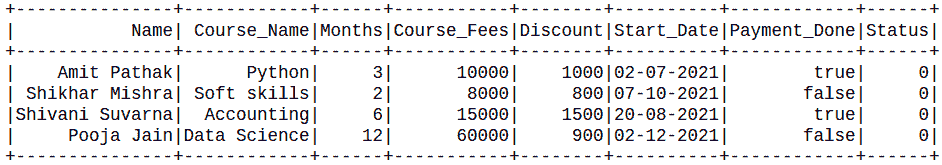
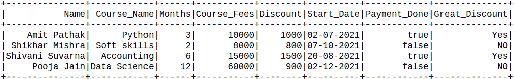
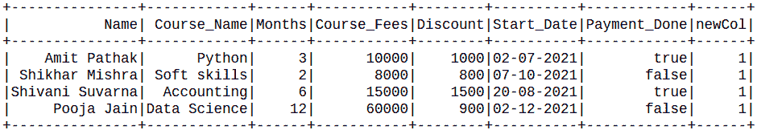

# 如何在 PySpark DataFrame 中添加常量列？

> 原文:[https://www . geesforgeks . org/how-add-a-constant-in-a-pyspark-data frame/](https://www.geeksforgeeks.org/how-to-add-a-constant-column-in-a-pyspark-dataframe/)

在本文中，我们将看到如何在 PySpark Dataframe 中添加一个常量列。

**可以这样做:**

*   使用灯光()
*   使用 Sql 查询。

创建用于演示的数据框:

## 蟒蛇 3

```py
# Create a spark session
from pyspark.sql import SparkSession
from pyspark.sql.functions import lit
spark = SparkSession.builder.appName('SparkExamples').getOrCreate()

# Create a spark dataframe
columns = ["Name", "Course_Name",
           "Months",
           "Course_Fees", "Discount",
           "Start_Date", "Payment_Done"]
data = [
    ("Amit Pathak", "Python", 3,
     10000, 1000, "02-07-2021", True),
    ("Shikhar Mishra", "Soft skills",
     2, 8000, 800, "07-10-2021", False),
    ("Shivani Suvarna", "Accounting", 6,
     15000, 1500, "20-08-2021", True),
    ("Pooja Jain", "Data Science", 12,
     60000, 900, "02-12-2021", False),
]
df = spark.createDataFrame(data).toDF(*columns)

# View the dataframe
df.show()
```

**输出:**


## **方法 1:使用 lit()**

在这些方法中，我们将使用 lit()函数，这里我们可以使用 select 方法将常量列“literal_values_1”添加为值 1。lit()函数将向所有行插入常量值。我们将使用 withColumn()选择数据框:

> **语法:**df . with column(“NEW _ COL”，lit(VALUE))

**例 1:****列** **中增加常数值。**

## 蟒蛇 3

```py
df.withColumn('Status', lit(0)).show()
```

**输出:**



**例 2:基于另一列添加常数值。**

## 蟒蛇 3

```py
from pyspark.sql.functions import when, lit, col

df.withColumn(
  "Great_Discount", when(col("Discount") >=1000,lit(
    "Yes")).otherwise(lit("NO"))).show()
```

**输出:**



## **方法二:使用 Sql 查询**

在这里，我们将在 Pyspark 中使用 sql 查询，我们将在 createTempView()的帮助下创建表的临时视图，并且这个临时视图的生命期一直到 sparkSession 的生命期。registerTempTable()将创建临时表，如果它不可用，或者如果它可用，则替换它。

然后在创建表之后，选择将所有值作为字符串的表 by SQL 子句。

## 蟒蛇 3

```py
df.registerTempTable('table')
newDF = spark.sql('select *, 1 as newCol from table')
newDF.show()
```

**输出:**

