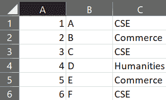
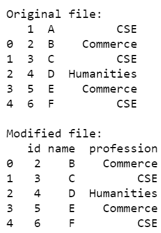
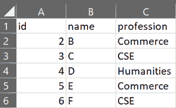
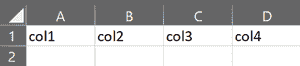

# 如何在 Python 中给 CSV 文件添加表头？

> 原文:[https://www . geesforgeks . org/how-add-a-header-to-a-CSV-file-in-python/](https://www.geeksforgeeks.org/how-to-add-a-header-to-a-csv-file-in-python/)

CSV 文件包含表格形式的数据，每行包含逗号分隔的值。这些列可能包含属于不同数据结构的值。Python 提供了广泛的方法和模块来实现 CSV 文件到*熊猫*数据帧的相互转换，反之亦然。CSV 文件的标题是分配给每个列的值的数组。它充当数据的行标题。最初，CSV 文件被转换为数据帧，然后在数据帧中添加标题。数据帧的内容再次存储回 CSV 文件。

在本文中，我们将向 Python 中的 CSV 文件添加一个标题。

**方法#1:** 使用*中*表头*参数到 _csv()* 方法。

最初，以列表的形式创建一个标题，然后使用 *to_csv()* 方法将该标题添加到 CSV 文件中。

以下 CSV 文件 *gfg.csv* 用于操作:



## 蟒蛇 3

```py
# importing python package
import pandas as pd

# read contents of csv file
file = pd.read_csv("gfg.csv")
print("\nOriginal file:")
print(file)

# adding header
headerList = ['id', 'name', 'profession']

# converting data frame to csv
file.to_csv("gfg2.csv", header=headerList, index=False)

# display modified csv file
file2 = pd.read_csv("gfg2.csv")
print('\nModified file:')
print(file2)
```

**输出:**



创建 CSV 文件*gfg 2 . CSV*:



**方法#2:** 使用*DictWriter()* 方法

使用 *DictWriter()* 的另一种方法可以用于向 CSV 文件的内容附加一个标题。*字段名*属性可用于指定 CSV 文件的标题，分隔符参数通过 *csv* 模块中给出的分隔符分隔值，需要添加标题。然后在 *csvwriter* 对象上调用 *writeheader()* 方法，不传递任何参数。

## 蟒蛇 3

```py
# import required modules
import pandas as pd
import csv

# assign header columns
headerList = ['col1', 'col2', 'col3', 'col4']

# open CSV file and assign header
with open("gfg3.csv", 'w') as file:
    dw = csv.DictWriter(file, delimiter=',', 
                        fieldnames=headerList)
    dw.writeheader()

# display csv file
fileContent = pd.read_csv("gfg3.csv")
fileContent
```

**输出:**


创建的新 CSV 文件 *gfg3.csv* 为:



**注意:**此方法只适用于空的 CSV 文件。