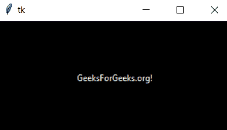
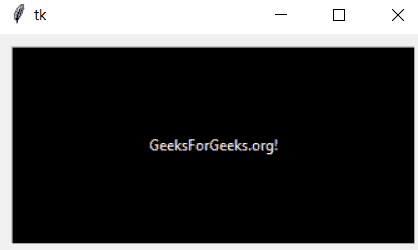
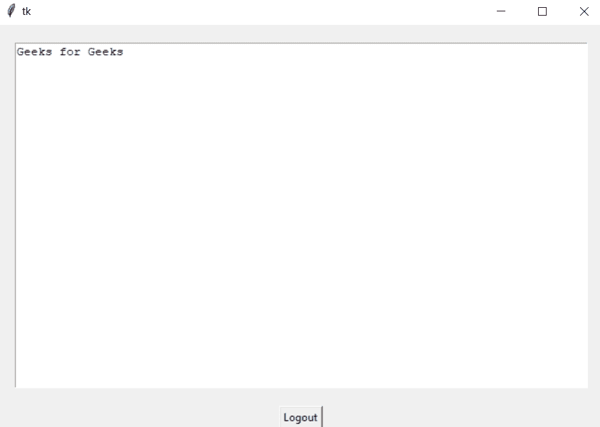

# 如何给 tkinter 窗口添加边距？

> 原文:[https://www . geeksforgeeks . org/如何将保证金添加到 tkinter-window/](https://www.geeksforgeeks.org/how-to-add-a-margin-to-a-tkinter-window/)

在本文中，我们将看到如何向 this 窗口添加边距。

我们将使用框架来添加边距:

**语法:**

> 框架(根，选项)

**进场:**

*   正在导入模块。
*   创建主窗口(容器)
*   使用框架和框架包()
*   在小部件上应用事件触发器。

**不使用框架法:**

## 蟒蛇 3

```py
# importing the module
from tkinter import *

# main container
root = Tk()

# container content
label = Label(root, text='GeeksForGeeks.org!',
              width=45, height=10)

label.pack()

root.mainloop()
```

**输出:**



**例 1:**

通过使用本模块的框架方法。使用 frame()时，我们使用 pack()函数放置内容并创建边距。

> window.pack(选项)
> 
> 选项有填充、扩展或侧边。

**下面是实现:**

## 蟒蛇 3

```py
# importing module
from tkinter import *

# main container
root = Tk()

# frame
frame = Frame(root, relief = 'sunken',
              bd = 1, bg = 'white')
frame.pack(fill = 'both', expand = True,
           padx = 10, pady = 10)

# container content
label = Label(frame, text = 'GeeksForGeeks.org!',
              width = 45, height = 10, bg = "black",
              fg = "white")
label.pack()

root.mainloop()
```

**输出:**



**示例 2:** 我们还可以使用模块的 grid()方法给容器或窗口留出余量。

**语法:**

> **窗口网格(**网格 _ 选项 **)**

## 蟒蛇 3

```py
# importing the module
from tkinter import *

# container window
root = Tk()

# frame
frame = Frame(root)

# content of the frame
frame.text = Text(root)
frame.text.insert('1.0', 'Geeks for Geeks')

# to add margin to the frame
frame.text.grid(row = 0, column = 1,
                padx = 20, pady = 20)

# simple button
frame.quitw = Button(root)
frame.quitw["text"] = "Logout",
frame.quitw["command"] = root.quit
frame.quitw.grid(row = 1, column = 1)

root.mainloop()
```

**输出:**

