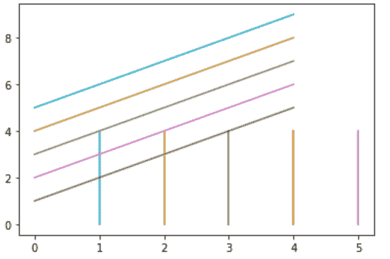
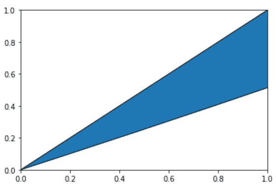
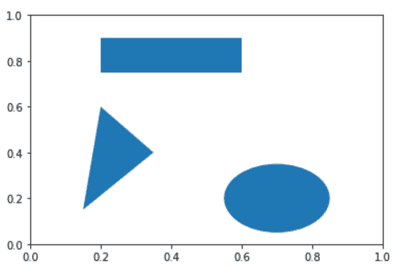
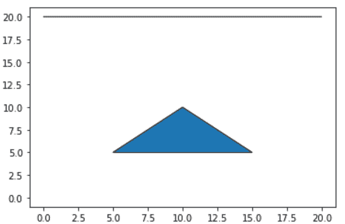

# 如何在 Python 中给一个剧情添加补丁？

> 原文:[https://www . geeksforgeeks . org/如何在 python 中添加补丁/绘图/](https://www.geeksforgeeks.org/how-to-add-a-patch-in-a-plot-in-python/)

**Matplotlib** 是 Python 中一个惊人的可视化库，用于数组的 2D 图。Matplotlib 是一个多平台数据可视化库，构建在 NumPy 数组上，旨在与更广泛的 SciPy 堆栈一起工作。**轴类**包含了大部分的图形元素:轴、刻度、线 2 维、文本、多边形等。，并设置坐标系。Axes 的实例通过回调属性支持回调。Matplotlib 库的轴模块中的[matplotlib . axes . axes . add _ Patch()](https://www.geeksforgeeks.org/matplotlib-axes-axes-add_patch-in-python/)方法是给轴的面片添加一个面片；归还补丁。

> **语法:**T2【axes . add _ patch(self，p)
> 
> ***参数:**该方法接受以下参数。*
> 
> *   ***线:**此参数是轴面片的面片。*
> 
> ***返回值:**此方法返回补丁。*

以下是描述如何在 Python 绘图中添加补丁的各种示例:

**例 1:**

## 蟒蛇 3

```
# import modules
import numpy as np 
import matplotlib.pyplot as plt 

# adjust figure and assign coordinates
y, x = np.mgrid[:5, 1:6] 
poly_coords = [(25, 75), (25, 75), (25, 75), (25, 75)]
fig, ax = plt.subplots() 

# depict illustration
cells = ax.plot(x, y, x + y) 
ax.add_patch(plt.Polygon(poly_coords)) 

plt.show() 
```

**输出:**



**例 2:**

## 蟒蛇 3

```
# import modules
import matplotlib.path as mpath
import matplotlib.patches as mpatches
import matplotlib.pyplot as plt

Path = mpath.Path

# adjust figure and assign coordinates
fig, ax = plt.subplots()
pp = mpatches.PathPatch(Path([(0, 0), (10, 5), (10, 10), (20, 10)],
                             [Path.MOVETO, Path.CURVE3,
                              Path.CURVE3, Path.CLOSEPOLY]),
                        transform=ax.transData)

# depict illustration
ax.add_patch(pp)
plt.show()
```

**输出:**



**例 3:**

## 蟒蛇 3

```
# import modules
import matplotlib.path as mpath
import matplotlib.patches as mpatches
import matplotlib.pyplot as plt

# adjust figure and assign coordinates
fig = plt.figure()
ax = fig.add_subplot(1, 1, 1)

pp1 = plt.Rectangle((0.2, 0.75),
                    0.4, 0.15)

pp2 = plt.Circle((0.7, 0.2), 0.15)

pp3 = plt.Polygon([[0.15, 0.15],
                   [0.35, 0.4],
                   [0.2, 0.6]])

# depict illustrations
ax.add_patch(pp1)
ax.add_patch(pp2)
ax.add_patch(pp3)
```

**输出:**



**例 4:**

## 蟒蛇 3

```
# import module
from matplotlib.patches import PathPatch
from matplotlib.path import Path
import matplotlib.pyplot as plt
import numpy as np

# assign coordinates
coord = [(0, 20), (20, 20), (20, 20),
         (20, 20), (10, 10), (10, 10),
         (5, 5), (15, 5), (0, 0)]

instn = [Path.MOVETO, Path.LINETO, Path.LINETO,
         Path.LINETO, Path.CLOSEPOLY, Path.MOVETO,
         Path.LINETO, Path.LINETO, Path.CLOSEPOLY]

# adjust figure
coord = np.array(coord, float)
path = Path(coord, instn)
pathpatch = PathPatch(path)
fig, ax = plt.subplots()
ax.add_patch(pathpatch)

# depict illustration
ax.autoscale_view()
plt.show()
```

**输出:**

