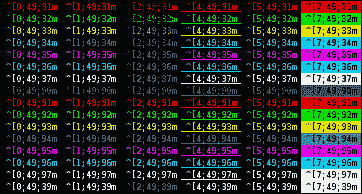
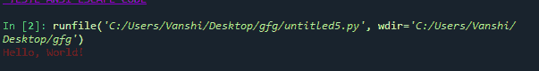
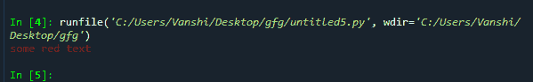

# 如何给文本 Python 添加颜色？

> 原文:[https://www . geesforgeks . org/如何将颜色添加到文本-python/](https://www.geeksforgeeks.org/how-to-add-colour-to-text-python/)

python 支持多种方式为文本添加颜色。本文用恰当的例子来讨论所有这些，以帮助你更好地理解。

### 方法 1:使用 ANSI 转义码

ANSI 转义序列是一个 ASCII 字符序列，前两个是 ASCII“转义”字符 27 (1Bh)和左括号字符“”(5Bh)。转义字符和左括号字符后面的一个或多个字符指定控制键盘或显示功能的字母数字代码。

要为文本添加颜色和样式，您应该创建一个名为 ANSI 的类，在这个类中，用代码 ANSI 声明关于文本和颜色的配置。

**接近**

*   声明 ANSI 类
*   在这个类中声明函数来执行特殊的文本格式化任务
*   使用类对象调用所需的函数

**使用的功能:**

*   **背景:**允许背景格式化。接受 40 到 47、100 到 107 之间的 ANSI 代码
*   **style_text** :对应于格式化文本的样式。接受 0 到 8 之间的 ANSI 代码
*   **color_text:** 对应颜色的文本。接受 30 到 37、90 到 97 之间的 ANSI 代码

**示例:**

## 蟒蛇 3

```py
class ANSI():
    def background(code):
        return "\33[{code}m".format(code=code)

    def style_text(code):
        return "\33[{code}m".format(code=code)

    def color_text(code):
        return "\33[{code}m".format(code=code)

example_ansi = ANSI.background(
    97) + ANSI.color_text(35) + ANSI.style_text(4) + " TESTE ANSI ESCAPE CODE"
print(example_ansi)
```

**表 ANSI 转义码**



表 ANSI 转义码

**输出:**


Ansi 转义码示例

### 方法 2:使用彩色

要使用这个模块，首先需要使用 pip 安装它，因为它没有内置 python。

> pip install termcolor

方法

*   导入模块
*   使用 colored()函数为文本添加颜色
*   打印彩色文本

**语法:**

> 彩色(文本、颜色、属性数组)

**示例:**

## 蟒蛇 3

```py
from termcolor import colored

text = colored('Hello, World!', 'red', attrs=['reverse', 'blink'])

print(text)
```

**输出:**



### 方法 3:使用色素瘤

它使 ANSI 转义字符序列在微软视窗下产生彩色终端文本和光标定位工作。

它需要使用 pip 手动安装

> pip 安装 colorama

**接近**

*   导入模块
*   用所需的颜色调用 Fore
*   传递要着色的文本。
*   打印结果

**语法:**

> 前。(文本颜色，文本)

在 colorama 中，与 ANSI 转义和 Colored 相比，实现是不同的。

**示例:**

## 计算机编程语言

```py
from colorama import Fore, Back, Style

print(Fore.RED + 'some red text')
```

**输出:**

