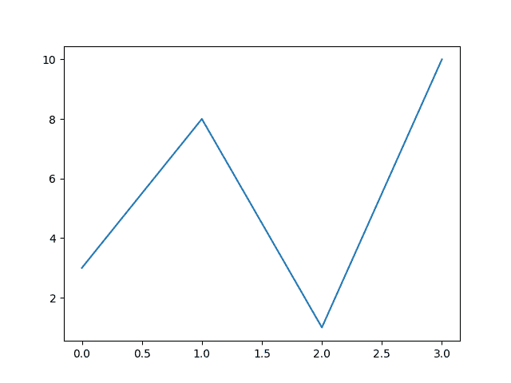
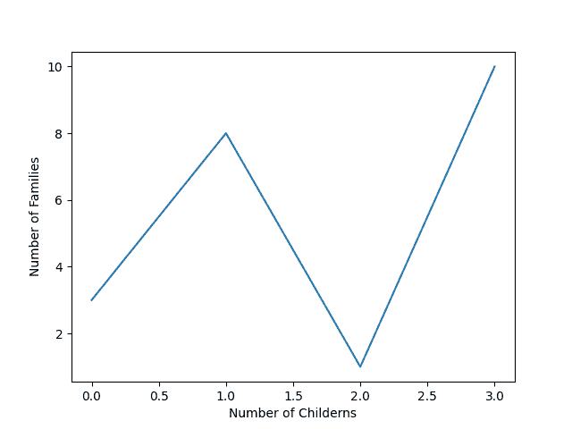
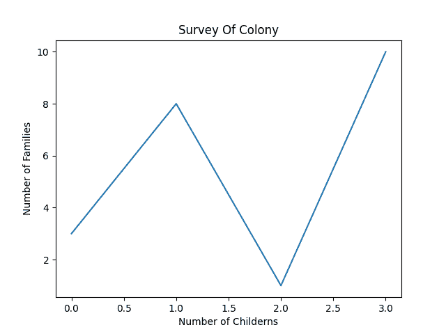
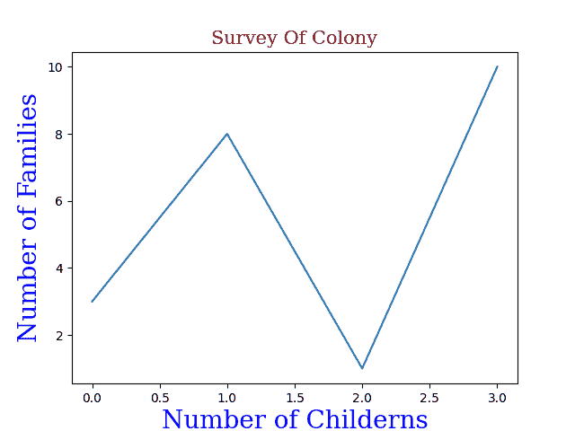

# 如何使用 Python 在绘图中添加标签？

> 原文:[https://www . geesforgeks . org/如何使用 python 在绘图中添加标签/](https://www.geeksforgeeks.org/how-to-add-labels-in-a-plot-using-python/)

**先决条件:** [Python Matplotlib](https://www.geeksforgeeks.org/python-introduction-matplotlib/)

在本文中，我们将讨论使用 Python 中的 Matplotlib 向图中添加标签。但是首先，要明白什么是情节中的标签。写在垂直轴(比如 Y 轴)和水平轴(比如 X 轴)的标题或子标题提高了对绘制的统计数据的理解质量。

**示例:**让我们创建一个简单的情节

## 计算机编程语言

```
# python program to plot graph without labels
import matplotlib
import matplotlib.pyplot as plt
import numpy as np

# it will take x coordinates by default
# starting from 0,1,2,3,4...
y = np.array([3, 8, 1, 10])

plt.plot(y)
plt.show()
```

**输出:**



不带标签或标题的绘图

## 为地块创建标签

通过使用库的 pyplot()函数，我们可以添加 xlabel()和 ylabel()来设置 x 和 y 标签。

**示例:**让我们在上面的图中添加标签

## 计算机编程语言

```
# python program for plots with label
import matplotlib
import matplotlib.pyplot as plt
import numpy as np

# Number of children it was default in earlier case
x = np.array([0, 1, 2, 3])

# Number of families
y = np.array([3, 8, 1, 10])

plt.plot(x, y)

# Label for x-axis
plt.xlabel("Number of Childerns")

# Label for y-axis
plt.ylabel("Number of Families")

plt.show()  # for display
```

**输出:**



带有标签的绘图

如果你想让它更容易理解，在剧情中加入一个**标题**，只需加入一行代码。

```
plt.title("Survey Of Colony")
```

**示例:**

## 蟒蛇 3

```
# python program for plots with label
import matplotlib
import matplotlib.pyplot as plt
import numpy as np

# Number of children it was default in earlier case
x = np.array([0, 1, 2, 3])

# Number of families
y = np.array([3, 8, 1, 10])

plt.plot(x, y)

# Label for x-axis
plt.xlabel("Number of Childerns")

# Label for y-axis
plt.ylabel("Number of Families")

# title of the plot
plt.title("Survey Of Colony")

plt.show()  # for display
```

**输出:**



标题图

## 设置标题和标签的字体属性

为了使绘图更有吸引力，请使用 xlabel()、ylabel()和 title()中的 fontdict 参数来应用字体属性。

## 计算机编程语言

```
# Adding font properties to labels and titles
import matplotlib
import matplotlib.pyplot as plt
import numpy as np

# Number of Children
x = np.array([0, 1, 2, 3])

# Number of Families
y = np.array([3, 8, 1, 10])

# label including this form1 will have these properties
form1 = {'family': 'serif', 'color': 'blue', 'size': 20}

# label including this form2 will have these properties
form2 = {'family': 'serif', 'color': 'darkred', 'size': 15}

plt.plot(x, y)
plt.xlabel("Number of Childerns", fontdict=form1)
plt.ylabel("Number of Families", fontdict=form1)
plt.title("Survey Of Colony", fontdict=form2)
plt.show()
```

**输出:**



带有字体属性的绘图