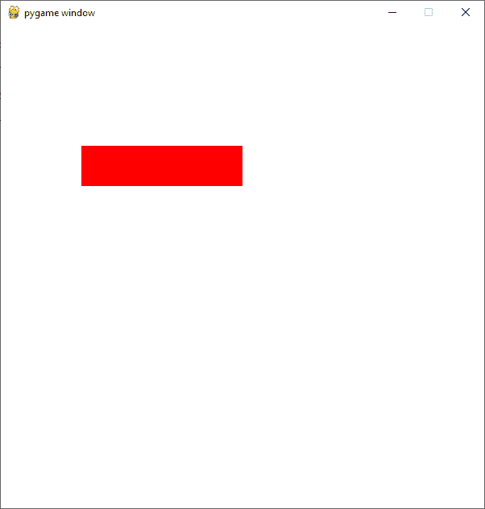
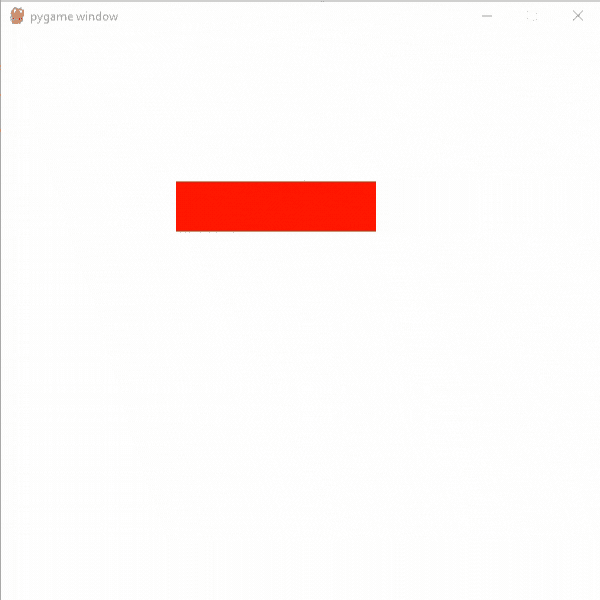
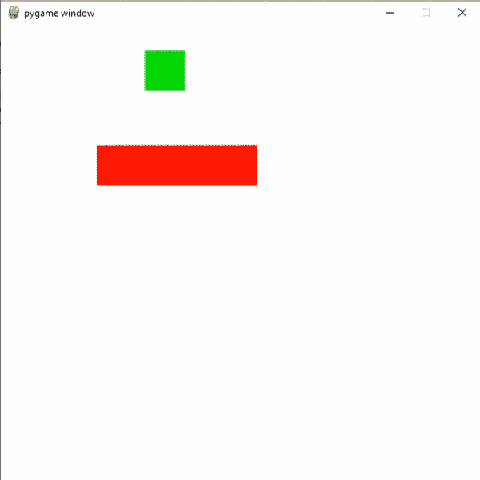

# 如何在 PyGame

中添加移动平台

> 原文:[https://www . geesforgeks . org/how-add-move-platforms-in-pygame/](https://www.geeksforgeeks.org/how-to-add-moving-platforms-in-pygame/)

**先决条件:** [在 Pygame 中绘图](https://www.geeksforgeeks.org/python-drawing-different-shapes-on-pygame-window/)

在本文中，我们将学习如何使用 Python 中的 PyGame 向游戏中添加移动平台。

## 创建平台

我们可以使用 draw()方法在 pygame 中轻松创建任何类型的平台。为此，我们将使用 draw.rect()函数创建具有特定宽度和高度的 react。

> **语法:** pygame.draw.rect(表面、颜色、矩形、宽度)
> 
> **参数:**
> 
> *   **曲面:**这里我们可以通过要在其上绘制矩形的曲面。
> *   **颜色:**这里我们可以为我们的矩形传递颜色。
> *   **矩形:**这里我们可以传递矩形、位置和尺寸。
> *   **宽度:**这里我们可以通过线条粗细。我们也可以通过改变这个宽度参数的值来创建一个实心矩形。

**代码:**

## 蟒蛇 3

```py
# Importing the pygame module
import pygame
from pygame.locals import *

# Initiate pygame and give permission
# to use pygame's functionality
pygame.init()

# Create a display surface object
# of specific dimension
window = pygame.display.set_mode((600,600))

# Creating a new clock object to
# track the amount of time
clock = pygame.time.Clock()

# Starting coordinates of the platform
x = 100
y = 150

# Creating a rect with width
# and height
rect = Rect(x, y, 200, 50)

# Creating a boolean variable that
# we will use to run the while loop
run = True

# Creating an infinite loop
# to run our game
while run:

    # Setting the framerate to 30fps
    clock.tick(30)

    # Drawing the rect on the screen using the
    # draw.rect() method
    pygame.draw.rect(window, (255, 0, 0),rect)

    # Updating the display surface
    pygame.display.update()

    # Filling the window with white color
    window.fill((255,255,255))
```

**输出:**



## 移动平台

为了移动平台，我们可以创建一个带有数值的速度变量，我们可以将这个速度加到平台的 x 坐标上。之后，如果速度变量的 x 坐标小于 100 或大于等于 300，我们将把它乘以-1。

**代码:**

## 蟒蛇 3

```py
# Importing the pygame module
import pygame
from pygame.locals import *

# Initiate pygame and give permission
# to use pygame's functionality
pygame.init()

# Create a display surface object
# of specific dimension
window = pygame.display.set_mode((600,600))

# Creating a new clock object to
# track the amount of time
clock = pygame.time.Clock()

# Variable to store the
# velocity of the platform
platform_vel = 5

# Starting coordinates of the platform
x = 100
y = 150

# Creating a rect with width
# and height
rect = Rect(x, y, 200, 50)

# Creating a boolean variable that
# we will use to run the while loop
run = True

# Creating an infinite loop
# to run our game
while run:

    # Setting the framerate to 30fps
    clock.tick(30)

    # Multiplying platform_vel with -1
    # if its x coordinate is less then 100
    # or greater than or equal to 300.
    if rect.left >=300 or rect.left<100:
        platform_vel*= -1

    # Adding platform_vel to x
    # coordinate of our rect
    rect.left += platform_vel

    # Drawing the rect on the screen using the
    # draw.rect() method
    pygame.draw.rect(window, (255,   0,   0),rect)

    # Updating the display surface
    pygame.display.update()

    # Filling the window with white color
    window.fill((255,255,255))
```

**输出:**



## 添加玩家精灵和碰撞

现在我们要添加我们的播放器，以及我们的播放器和平台之间的碰撞。为此，我们使用了对撞机()方法。

> **语法：**pygame。直肠 1，直肠 2
> 
> **参数:**将取两个矩形作为其参数。
> 
> 如果任一矩形的任何部分重叠，则返回 true。

如果玩家与平台碰撞，那么我们将设置玩家底部的坐标等于平台顶部，然后我们将添加平台速度。我们也在创造一个重力变量。

**代码:**

## 蟒蛇 3

```py
# Importing the pygame module
import pygame
from pygame.locals import *

# Initiate pygame and give permission
# to use pygame's functionality
pygame.init()

# Create a display surface object
# of specific dimension
window = pygame.display.set_mode((600,600))

# Creating a new clock object to
# track the amount of time
clock = pygame.time.Clock()

# Variable to store the
# velocity of the platform
platform_vel = 5

# Starting coordinates of the platform
x = 100
y = 150

# Starting coordinates for
# player sprite
player_x = 180
player_y = 0

# Creating a new variable
# for gravity
gravity = 8

# Creating a new rect for player
player_rect = Rect(player_x, player_y, 50, 50)

# Creating a rect with width
# and height
rect = Rect(x, y, 200, 50)

# Creating a boolean variable that
# we will use to run the while loop
run = True

# Creating an infinite loop
# to run our game
while run:

    # Setting the framerate to 30fps
    clock.tick(30)

    # Multiplying platform_vel with -1
    # if its x coordinate is less then 100
    # or greater than or equal to 300.
    if rect.left >=300 or rect.left<100:
        platform_vel*= -1

    # Checking if player is colliding
    # with platform or not using the
    # colliderect() method.
    # It will return a boolean value
    collide = pygame.Rect.colliderect(rect, player_rect)

    # If player is colliding with
    # platform then setting coordinate
    # of player bottom equal to top of platform
    # and adding the platform velocity
    if collide:
        player_rect.bottom = rect.top
        player_rect.left += platform_vel

    # Adding platform_vel to x
    # coordinate of our rect
    rect.left += platform_vel

    # Adding gravity
    player_rect.top += gravity

    # Drawing the rect on the screen using the
    # draw.rect() method
    pygame.draw.rect(window, (255,   0,   0),rect)

    # Drawing player rect
    pygame.draw.rect(window, (0,   255,   0),player_rect)

    # Updating the display surface
    pygame.display.update()

    # Filling the window with white color
    window.fill((255,255,255))
```

**输出:**

