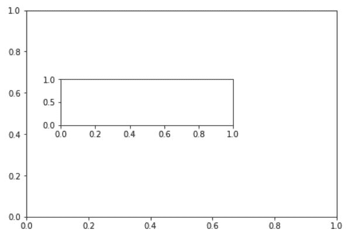
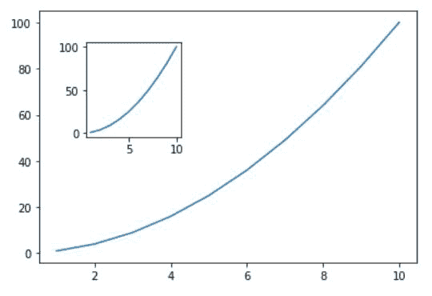
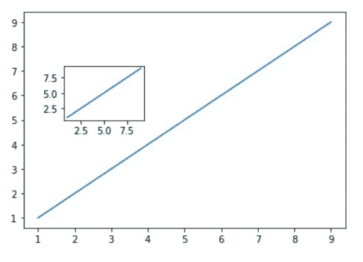

# 如何在 Python 中给图形添加多轴

> 原文:[https://www . geesforgeks . org/如何将多轴添加到 python 图形中/](https://www.geeksforgeeks.org/how-to-add-multiple-axes-to-a-figure-in-python/)

在本文中，我们将讨论如何使用 Python 中的*[*【matplotlib】*](https://www.geeksforgeeks.org/python-introduction-matplotlib/)为一个图形添加多个轴。我们将使用 *matplotlib* 模块的[*add _ axes()*](https://www.geeksforgeeks.org/matplotlib-figure-figure-add_axes-in-python/)*方法为一个图形添加多个轴。**

****分步方法:****

*   **导入所需模块**
*   **导入 *matplotlib* 后，创建一个变量 fig 并将其等于*PLT . fig()*。这将创建一个空对象。它最初是空的，稍后会填充数据。**
*   **创建一个空对象后，我们将把轴添加到这个图中。由于我们正在向该图添加多个轴，因此我们需要使用函数 *add_axes()向轴添加某些值，例如左、底、宽、高。*左、下、宽、高在*内的值 add_axes()* 范围从 0 到 1。**
*   **创建第一个轴后，添加第二个轴。与第一个轴相比，现在的值将更小，因为它将在更大的轴内制作。**
*   **在不绘制任何数据的情况下执行这些线将会提供一个具有多个轴且没有绘图的图形。**

****以下是基于上述分步方法的一些程序:****

****例 1:****

**下面的程序描述了如何将多个轴添加到绘图中。**

## **蟒蛇 3**

```
**# import matplotlib module
import matplotlib.pyplot as plt

# Creating an empty object
fig = plt.figure()

# Creation of multiple axes
# main axes
axes1 = fig.add_axes([0.1, 0.1, 0.9, 0.9]) 

# secondary axes
axes2 = fig.add_axes([0.2, 0.5, 0.5, 0.2]) **
```

****输出:****

****

****例 2:****

**如果我们想给一个带有绘图的图形添加多个轴，那么我们需要添加下面演示的 x 和 y 的一些值，并在图形中绘制这些点。**

## **蟒蛇 3**

```
**# import matplotlib module
import matplotlib.pyplot as plt

# Creating object
fig = plt.figure()

# Creation of multiple axes
# using add_axes
axes1 = fig.add_axes([0.1, 0.1, 0.8, 0.8])
axes2 = fig.add_axes([0.2, 0.5, 0.2, 0.3])

# Creating the values
# of x and y for
# plotting graph
x = [1, 2, 3, 4, 5, 6, 7, 8, 9, 10]
y = [x**2 for x in x]

# plotting axes1
axes1.plot(x, y)

# Plotting axes2
axes2.plot(x, y)

# Showing the figure
fig.show()**
```

****输出:****

****

****例 3:****

## **蟒蛇 3**

```
**# import matplotlib module
import matplotlib.pyplot as plt
# Creating an empty object
fig = plt.figure()

# Creation of multiple axes
# using add_axes
axes1 = fig.add_axes([0.1, 0.1, 0.8, 0.8])
axes2 = fig.add_axes([0.2, 0.5, 0.2, 0.2])

# Creating the values
# of x and y for
# plotting graph
x = [1, 2, 3, 4, 5, 6, 7, 8, 9]
y = [1, 2, 3, 4, 5, 6, 7, 8, 9]

# Plotting axes1
axes1.plot(x, y)

# Plotting axes2
axes2.plot(x, y)

# Showing the figure
fig.show()**
```

****输出:****

****