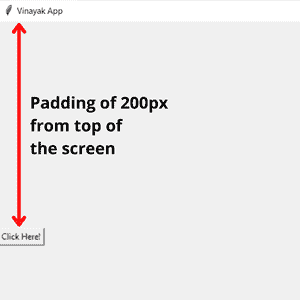
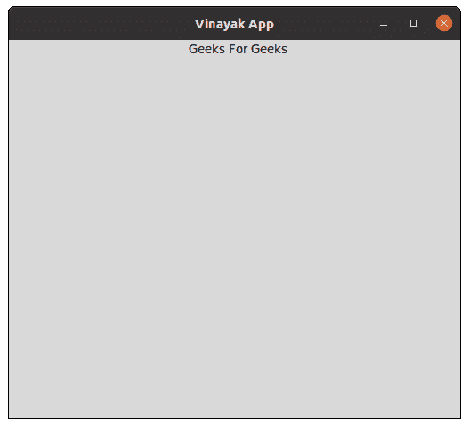
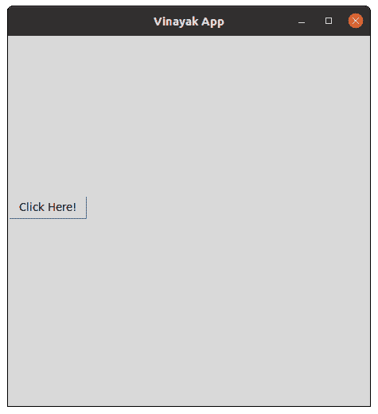

# 如何只在一侧给 tkinter 小部件添加填充？

> 原文:[https://www . geeksforgeeks . org/如何将填充添加到仅在一侧的 tkinter 小部件/](https://www.geeksforgeeks.org/how-to-add-padding-to-a-tkinter-widget-only-on-one-side/)

在本文中，我们将讨论仅在一侧向 this 小部件添加填充的过程。这里，我们创建一个小部件，并使用 tkinter 中的 widget.grid()方法填充小部件的内容。例如，让我们创建一个标签并使用 label.grid()方法。下面给出了语法:

```py
label1 = Widget_Name(app, text="text_to_be_written_in_label")
label1.grid(
    padx=(padding_from_left_side, padding_from_right_side), 
    pady=(padding_from_top, padding_from_bottom))
```

**所需步骤:**

*   首先，导入库 tkinter

```py
from tkinter import *
```

*   现在，使用 tkinter 创建一个 GUI 应用程序

```py
app= Tk()
```

*   接下来，给这个应用一个标题。

```py
app.title(“Name of GUI app”)
```

*   然后，通过将**#小部件名称**替换为小部件的名称(如标签、按钮等)来创建小部件。).

```py
l1 =Widget_Name(app, text="Text we want to give in widget")
```

*   此外，把填料放在我们想放的地方。

```py
l1.grid(padx=(padding from left side, padding from right side),
    pady=(padding from top, padding from bottom))
```

*   例如，如果我们只想从顶部填充，那么在指定的位置输入填充值，剩下的部分为零。它将仅从一侧(即顶部)向小部件提供填充。

```py
l1.grid(padx=(0, 0), pady=(200, 0))
```

*   最后，循环在屏幕上显示图形用户界面应用程序。

```py
app.mainloop( )
```

*   它将给出如下输出:



**示例 1:** 小部件左侧的填充

## 计算机编程语言

```py
# Python program to add padding
# to a widget only on left-side

# Import the library tkinter
from tkinter import *

# Create a GUI app
app = Tk()

# Give title to your GUI app
app.title("Vinayak App")

# Maximize the window screen
width = app.winfo_screenwidth()
height = app.winfo_screenheight()
app.geometry("%dx%d" % (width, height))

# Construct the label in your app
l1 = Label(app, text='Geeks For Geeks')

# Give the leftmost padding
l1.grid(padx=(200, 0), pady=(0, 0))

# Make the loop for displaying app
app.mainloop()
```

**输出:**



**示例 2:** 从顶部填充到小部件

## 计算机编程语言

```py
# Python program to add padding
# to a widget only from top

# Import the library tkinter
from tkinter import *

# Create a GUI app
app = Tk()

# Give title to your GUI app
app.title("Vinayak App")

# Maximize the window screen
width = app.winfo_screenwidth()
height = app.winfo_screenheight()
app.geometry("%dx%d" % (width, height))

# Construct the button in your app
b1 = Button(app, text='Click Here!')

# Give the topmost padding
b1.grid(padx=(0, 0), pady=(200, 0))

# Make the loop for displaying app
app.mainloop()
```

**输出:**

