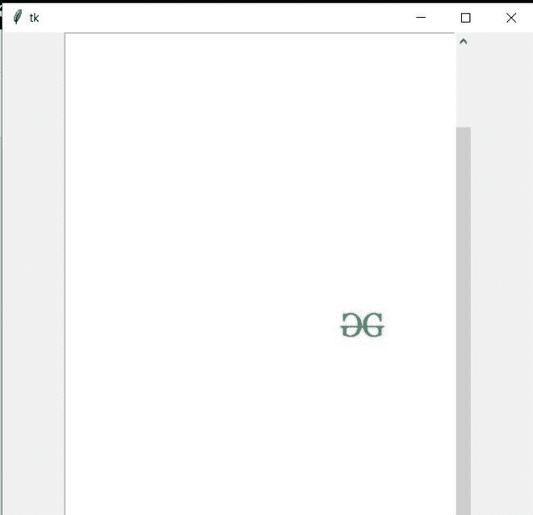

# 如何在 Tkinter GUI Python 中添加 PDF？

> 原文:[https://www . geesforgeks . org/how-add-pdf-in-tkinter-GUI-python/](https://www.geeksforgeeks.org/how-to-add-pdf-in-tkinter-gui-python/)

在本文中，我们将看到如何添加一个 PDF 文件 Tkinter GUI，为此，我们没有一个直接的小部件来做这件事。为此，我们需要 python 或更高版本。并且需要安装“[**【tkPDFViewer】**](https://pypi.org/project/tkPDFViewer/)”库。这个库允许你将 PDF 文件嵌入到你的 Tkinter GUI 中。

**安装:**

要安装此库，您只需键入:

```py
pip install tkPDFViewer
```

### 方法:

*   初始化我们的图形用户界面的 tk 和几何图形。
*   金额 tkPDFViewer.
*   从 tkPDFViewer 中制作类 ShowPdf()的对象。
*   使用来自 ShowPdf()的 pdf_view 方法放置我们的 pdf。
*   在图形用户界面中打包 pdf_view。

### 方法 pdf_view 的参数:

<figure class="table">

| 争论 | 使用 |
| --- | --- |
| pdf_location =“您的 pdf 的位置” | 添加您的 PDF 位置。 |
| 宽度= 0 | 设置 PDF 框架的宽度。 |
| 高度= 0 | 设置 PDF 框架的高度。 |
| 条=真或假 | 隐藏或取消隐藏加载栏。 |
| 负载=之后或之前 | 决定你的 pdf 对象何时转换。 |

</figure>

**下面是实现:**

我们使用此 pdf 进行演示:


**代码:**

## 计算机编程语言

```py
# Importing tkinter to make gui in python
from tkinter import*

# Importing tkPDFViewer to place pdf file in gui.
# In tkPDFViewer library there is
# an tkPDFViewer module. That I have imported as pdf
from tkPDFViewer import tkPDFViewer as pdf

# Initializing tk
root = Tk()

# Set the width and height of our root window.
root.geometry("550x750")

# creating object of ShowPdf from tkPDFViewer.
v1 = pdf.ShowPdf()

# Adding pdf location and width and height.
v2 = v1.pdf_view(root,
                 pdf_location = r"location", 
                 width = 50, height = 100)

# Placing Pdf in my gui.
v2.pack()
root.mainloop()
```

**输出:**

