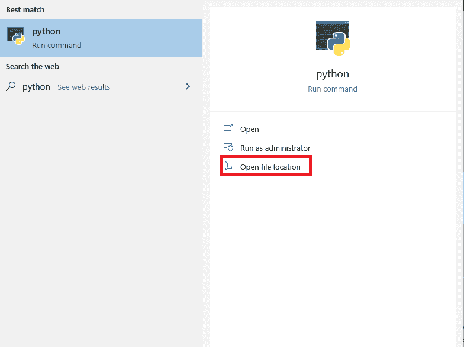
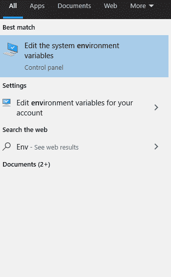
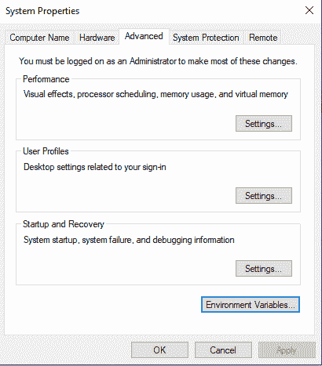
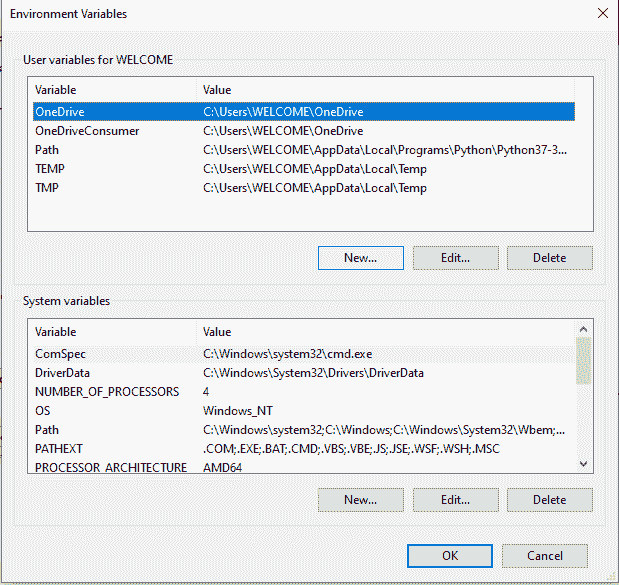
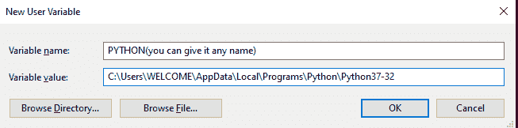
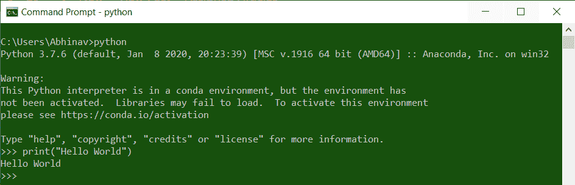

# 如何在 Windows PATH 中添加 Python？

> 原文:[https://www . geesforgeks . org/如何将 python 添加到 windows-path/](https://www.geeksforgeeks.org/how-to-add-python-to-windows-path/)

**Python** 是一门很棒的语言！但是，它没有预装在 Windows 中。因此我们下载它来解释我们编写的 [Python](http://geeksforgeeks.org/python-programming-language/) 代码。但是等等，windows 不知道你在哪里安装了 Python，所以当你尝试任何 Python 代码时，你都会得到一个错误。

在本文中，我们将使用 Windows10 和 python3。(对于 windows 或 python 的任何其他版本，大部分内容都是相同的)

## 将 Python 添加到窗口路径

首先，我们需要在下载 python 后找到它的安装位置。按下 WINDOWS 键，搜索“Python”，会得到如下内容:

如果没有结果出现，那么您的机器上没有安装 Python，请在继续下一步之前下载它。点击打开文件的位置，你会在一个安装了 Python 的位置，通过点击从顶部复制位置路径。

现在，我们必须添加上面复制的路径作为变量，以便 windows 可以识别。搜索“环境变量”，你会看到如下内容:

点击那个

现在点击“环境变量”按钮

将有两个类别，即“用户”和“系统”，我们必须在“用户”中添加它，单击“用户”部分中的“新建”按钮。现在，添加我们之前复制的变量名和路径，然后单击确定。就这样，完成！

**检查环境变量是否设置**

现在，在将 Python 添加到环境变量之后，让我们检查 Python 是否在窗口中的任何地方运行。为此，请打开 CMD 并键入 Python。如果设置了环境变量，那么 Python 命令将会运行，否则不会运行。

